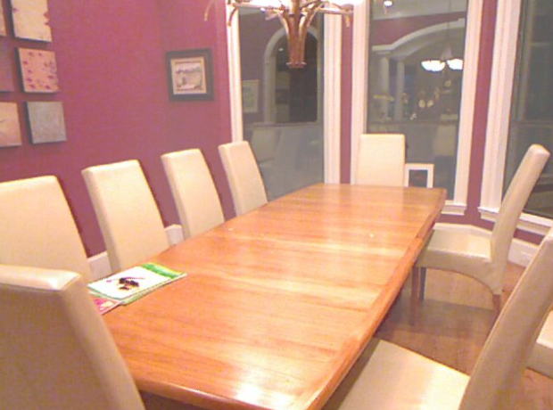
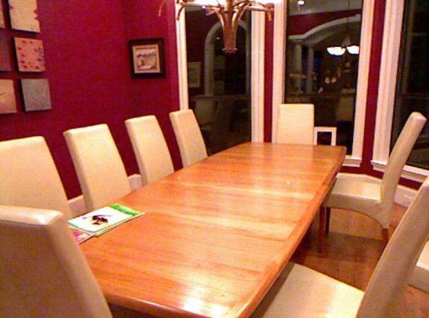
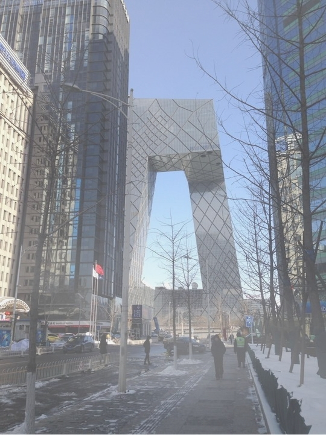
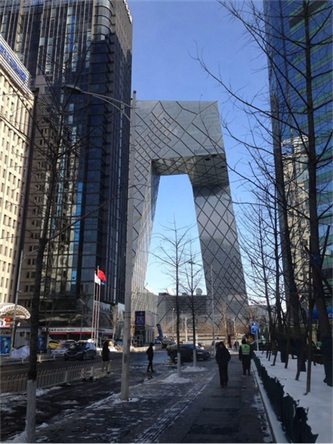

##  [FFA-Net: Feature Fusion Attention Network for Single Image Dehazing](https://arxiv.org/abs/1911.07559) (AAAI 2020)
 Official implementation.

---

by Xu Qin, Zhilin Wang et al.    Peking University and Beijing University of Aeronautics & Astronautics.

### Paddle模型复现

by Jiaming Cai.    Beijing Institute of Technology

### 依赖的库和资源

* python3
* Paddle
* NVIDIA GPU+CUDA
* numpy
* matplotlib

### 数据集准备

Dataset website:[RESIDE](https://sites.google.com/view/reside-dehaze-datasets/) (use [RESIDE-Standard](https://sites.google.com/view/reside-dehaze-datasets/reside-standard)); Paper arXiv version:[[RESIDE: A Benchmark for Single Image Dehazing](https://www.google.com/url?q=https%3A%2F%2Farxiv.org%2Fpdf%2F1712.04143.pdf&sa=D&sntz=1&usg=AFQjCNHzdt3kMDsvuJ7Ef6R4ev59OFeRYA)]

<details>
<summary> 文件结构 </summary>


```
    PaddleVideo-develop\data\FFA
    	|-- README_FFA.md
    	|-- data
            |-- FFA-data
                |-- ITS
                    |-- hazy
                        |-- *.png
                    |-- clear
                        |-- *.png
                |-- OTS
                    |-- hazy
                        |-- *.jpg
                    |-- clear
                        |-- *.jpg
                |-- SOTS
                    |-- indoor
                        |-- hazy
                            |-- *.png
                        |-- clear
                            |-- *.png
                    |-- outdoor
                        |-- hazy
                            |-- *.jpg
                        |-- clear
                            |-- *.png
```


**模型参数下载**

从以下链接下载作者提供的预训练模型的模型参数，和vgg16预训练模型的模型参数，并放到项目根目录下的data文件夹下，这样data

下有个FFA文件夹，FFA文件夹下包含三个模型参数文件：

链接：https://pan.baidu.com/s/1G1hsTiQDuW_3HjVn0Nln1A ，提取码：dqaz


### 使用

#### 1. 数据集

从 [RESIDE](https://sites.google.com/view/reside-dehaze-datasets/) 下载数据集(室内数据集需下载 [RESIDE-Standard](https://sites.google.com/view/reside-dehaze-datasets/reside-standard) ) ,并改变配置文件configs/FFA-cfg.yaml 中的文件路径为你的文件路径。


#### 2. 训练

在 `ITS` 数据集上训练时，在控制台输入以下代码：

 ```shell
 python main.py -c configs/FFA_cfg.yaml --validate
 ```


如果你想要在 `OTS` 数据集上训练网络，在 configs/FFA-cfg.yaml 中修改数据集的路径，同时要注意 suffix 参数与你的数据集图片**后缀**是否一致，不一致要相应修改。

如果要修改模型的参数，修改configs/FFA-cfg.yaml中MODEL下的参数。

如果要改变训练的epochs，需要同时改变configs/FFA-cfg.yaml中OPTIMIZER下的**max_epoch**参数，**max_epoch**需与**epochs**一致。为了训练出更好的结果，请至少训练80个epoch。

该模型训练时所需的显存过大，不要尝试增加**batchsize**。如显存不足可以调小**batchsize**和PIPELINE/train/decode/**crop_size**。

configs/FFA-cfg.yaml 中 backbone 下的 **gps** 和 **blocks**参数与模型深度相关。

configs/FFA-cfg.yaml 中 head 下的 **perloss** 与模型的loss有关，默认为False，如要改为True则需要下载的上面链接中的vgg16预训练模型参数文件到相应位置，为了获得更好的训练结果，建议下载相应文件，并将该参数改为True。如果选择False，则表示仅使用生成图像和清晰图像之间的 l1 loss作为loss值。

- `--validate` 参数指定训练时运行validation
- `-c` 参数指定配置文件路径
- `-o`: 指定重写参数，例如： `-o DATASET.batch_size=16` 用于重写train时batch size大小


#### 3. 恢复训练

如果训练任务终止，可以加载断点权重文件(优化器-学习率参数，断点文件)继续训练。 需要指定`-o resume_epoch`参数，该参数表示从`resume_epoch`轮开始继续训练。 需要指定`-w `参数，该参数表示从该路径加载模型参数开始继续训练。

```python
python main.py -c configs/FFA_cfg.yaml --validate -o resume_epoch=6
```

想要了解更多使用方法，请查看paddle[官方文档](https://github.com/PaddlePaddle/PaddleVideo/blob/develop/docs/zh-CN/usage.md#1)。


#### 4. 测试

对模型进行测试时，在控制台输入以下代码，下面代码中使用上面提到的下载的模型参数：

 ```shell
 python main.py --test -c configs/FFA_cfg.yaml -w data/FFA/ITS_3_19_article_pretrained.pdparams
 ```
如果要测试你自己准备的图像，请更改 configs/FFA-cfg.yaml 中 DATASET/test 的 file_path参数 ,  同时注意文件后缀是否一致与 suffix 参数一致。

如果要在模型上进行测试，请将模型的路径放在 -w 后面。

论文作者提供的室内模型在 data/FFA/ITS_3_19_article_pretrained.pdparams，室外模型在data/FFA/OTS_3_19_article_pretrained.pdparams。


### Samples

<p align='center'>




</div>

<p align='center'>



</div>
