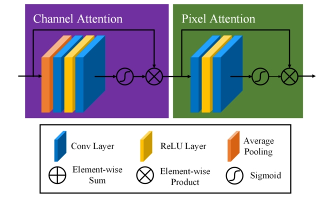
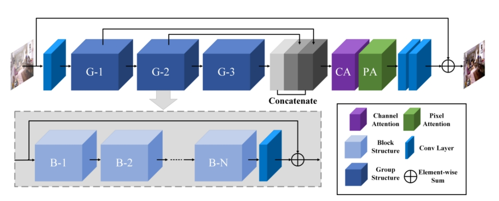
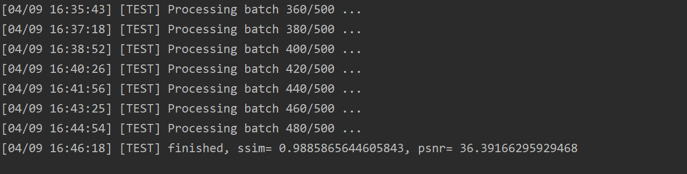

## 论文名称

##  [FFA-Net: Feature Fusion Attention Network for Single Image Dehazing](https://arxiv.org/abs/1911.07559) (AAAI 2020)

---

by Xu Qin, Zhilin Wang et al.    Peking University and Beijing University of Aeronautics & Astronautics.

## 目录

[TOC]

## 1、简介

**论文：**FFA-Net: Feature Fusion Attention Network for Single Image Dehazing

**参考repo:**https://github.com/zhilin007/FFA-Net

在此非常感谢：[zhilin007](https://github.com/zhilin007)贡献的FFA-NET repo，提高了本repo复现论文的效率。


该模型是图像去雾领域的一个顶尖模型之一。该模型要实现的目标是图像去雾，最大的特点就是基于注意力块的大型卷积块结构。注意力块的结构如下图所示：



作者使用了两种注意力块，达到两种不同的目的。一种是通道注意力块，如图1左上所示，假设该注意力块输入特征层尺寸为(1,64,256,256)，经过层池化、卷积等操作，最后进行Sigmoid激活，输出一个尺寸为(1,64,1,1)的中间结果，之后与输入相乘，得到该注意力块的输出，这样就对每个通道乘以了不同的权重(0-1之间)，产生了注意力效果。另一种是像素注意力块，假设该注意力块输入特征层尺寸为(1,64,256,256)，与通道注意力块不同，没有经过层池化，并且输中间结果的通道数为1，(1,1,256,256)，之后与输入相乘，得到该注意力块的输出，这样就对输入的每一个像素乘以不同的权重，产生了注意力效果。

将这两个块与卷积操作组合，就得到了模型的一个基本单元Block。添加多个Block，并在最后添加一个卷积层，就组合成了模型中一个较大的单元Group。模型输入经过初步卷积后，经过三个group，并将三个group的输出都Concat起来，就得到了重要的中间输出，其中，作者使用的每个group包含19个Block，但是对于模型来说，Group和Block的个数都是可调参数。中间输出再经过通道注意力块、像素注意力块、两层卷积，得到修正值，与总的输入相加就得到了去雾后的图像。模型总的框架如下图所示。



**示例**

<p align='center'>


</div>

<p align='center'>


</div>


## 2、数据集说明及复现精度

**数据集网址:**[RESIDE](https://sites.google.com/view/reside-dehaze-datasets/) (请选用网址中的 [RESIDE-Standard数据集](https://sites.google.com/view/reside-dehaze-datasets/reside-standard))，数据集及复现精度具体情况如下表所示，由于我训练的轮次只有作者论文里提到的4/5所以评估指标上有些许差距。

|         | train dataset : amount | val dataset: amount | ssim/psnr(paper) | ssim/psnr(repo) |
| ------- | ---------------------- | ------------------- | ---------------- | --------------- |
| indoor  | ITS: 13990             | SOTS/indoor: 500    | 0.9886/36.39     | 0.9885/35.42    |
| outdoor | OTS: 313960            | SOTS/outdoor: 1000  | 0.9840/33.57     |                 |

**数据集下载地址：**

**ITS (Indoor Training Set)：**http://tinyurl.com/yaohd3yv                                    **Passward**:  g0s6

**OTS：**  https://pan.baidu.com/s/1c2rW4hi                                                             **Passward**:  5vss

**SOTS ：** https://pan.baidu.com/share/init?surl=SSVzR058DX5ar5WL5oBTLg  **Passward**:  s6tu


**模型参数文件及训练日志下载地址：**

链接：https://pan.baidu.com/s/1Q9RQI5bC35FUF2dhIqKamg   提取码：gzao

<details>
<summary> 文件结构 </summary>

```
    PaddleVideo/data/FFA
        |-- vgg16_pretrained_weight.pdparams       #模型损失函数使用perloss时需用到的VGG16预训练模型的参数文件
        |-- ITS2_3_19_400000_transform.pdparams    #复现的模型经过400000step训练后得到的室内去雾模型的参数文件
        |-- ITS_3_19_article_pretrained.pdparams   #作者提供的室内去雾模型的参数文件
        |-- OTS_3_19_article_pretrained.pdparams   #作者提供的室外去雾模型的参数文件
        |-- logs                                   #训练日志文件夹
        	|-- train.log                          #完整的训练日志文件
            |-- step 1-48000.ipynb                 #1-48000step复现训练的notebook文件
            |-- step 48000-400000.ipynb            #48000-400000step复现训练的notebook文件
```


## 3、准备数据与环境

### 3.1 准备环境

* python3

* Paddle

* NVIDIA GPU+CUDA

  （该模型需要的显存很大，batchsize为1的情况下也需要6-7GB的显存，对算力的需求也很大，建议用GPU来训练）

* numpy

* matplotlib

  注：能正常运行paddleVideo即可正常运行本模型


### 3.2 准备数据

数据集网址:[RESIDE](https://sites.google.com/view/reside-dehaze-datasets/) (请选用网址中的 [RESIDE-Standard数据集](https://sites.google.com/view/reside-dehaze-datasets/reside-standard))，相关信息见文档第二部分。数据集下载后按如下相对路径存放，并根据自己数据集存放的位置，修改配置文件 configs/FFA-cfg.yaml 中的数据集路径参数。

<details>
<summary> 文件结构 </summary>

```
    PaddleVideo-develop\data\FFA
    	|-- README_FFA.md
    	|-- data
            |-- FFA-data
                |-- ITS
                    |-- hazy
                        |-- *.png
                    |-- clear
                        |-- *.png
                |-- OTS
                    |-- hazy
                        |-- *.jpg
                    |-- clear
                        |-- *.jpg
                |-- SOTS
                    |-- indoor
                        |-- hazy
                            |-- *.png
                        |-- clear
                            |-- *.png
                    |-- outdoor
                        |-- hazy
                            |-- *.jpg
                        |-- clear
                            |-- *.png
```


### 3.3 准备模型

从第二部分的链接下载预训练模型的模型参数，和vgg16预训练模型的模型参数，并放到项目根目录下的data文件夹下，这样data下有个FFA文件夹，FFA文件夹下包含四个模型参数文件.


## 4、开始使用

### 4.1 数据集

从 [RESIDE](https://sites.google.com/view/reside-dehaze-datasets/) 下载数据集(室内数据集需下载 [RESIDE-Standard](https://sites.google.com/view/reside-dehaze-datasets/reside-standard) ) ,并改变配置文件configs/FFA-cfg.yaml 中的文件路径为你的文件路径。


### 4.2 模型训练

在 `ITS` 数据集上训练时，在控制台输入以下代码：

 ```shell
 python main.py -c configs/FFA_cfg.yaml --validate
 ```


如果你想要在 `OTS` 数据集上训练网络，在 configs/FFA-cfg.yaml 中修改数据集的路径，同时要注意 suffix 参数与你的数据集图片**后缀**是否一致，不一致要相应修改。

如果要修改模型的参数，修改configs/FFA-cfg.yaml中MODEL下的参数。

如果要改变训练的epochs，需要同时改变configs/FFA-cfg.yaml中OPTIMIZER下的**max_epoch**参数，**max_epoch**需与**epochs**一致。为了训练出更好的结果，请至少训练80个epoch。

该模型训练时所需的显存过大，不要尝试增加**batchsize**。如显存不足可以调小**batchsize**和PIPELINE/train/decode/**crop_size**。

configs/FFA-cfg.yaml 中 backbone 下的 **gps** 和 **blocks**参数与模型深度相关。

configs/FFA-cfg.yaml 中 head 下的 **perloss** 与模型的loss有关，默认为False，如要改为True则需要下载的上面链接中的vgg16预训练模型参数文件到相应位置，为了获得更好的训练结果，建议下载相应文件，并将该参数改为True。如果选择False，则表示仅使用生成图像和清晰图像之间的 l1 loss作为loss值。

- `--validate` 参数指定训练时运行validation
- `-c` 参数指定配置文件路径
- `-o`: 指定重写参数，例如： `-o DATASET.batch_size=16` 用于重写train时batch size大小


### 4.3 恢复训练

该模型所需训练时间较长，单卡情况下可能要合计训练10天左右才能达到论文提到的精度。如果中途训练任务终止，可以加载断点权重文件(优化器-学习率参数，断点文件)继续训练。 需要指定`-o resume_epoch`参数，该参数表示从`resume_epoch`轮开始继续训练。 需要指定`-w `参数，该参数表示从该路径加载模型参数开始继续训练。

```python
python main.py -c configs/FFA_cfg.yaml --validate -o resume_epoch=6
```

想要了解更多使用方法，请查看paddle[官方文档](https://github.com/PaddlePaddle/PaddleVideo/blob/develop/docs/zh-CN/usage.md#1)。


### 4.4 模型评估

对模型进行评估时，在控制台输入以下代码，下面代码中使用上面提到的下载的模型参数：

 ```shell
 ###对作者提供的模型进行评估###
 python main.py --test -c configs/FFA_cfg.yaml -w data/FFA/ITS_3_19_article_pretrained.pdparams

 ###对我复现的模型进行评估###
 python main.py --test -c configs/FFA_cfg.yaml -w data/FFA/ITS2_3_19_400000_transform.pdparams
 ```


如果要测试你自己准备的图像，请更改 configs/FFA-cfg.yaml 中 DATASET/test 的 file_path参数 ,  同时注意文件后缀是否一致与 suffix 参数一致。

如果要在自己提供的模型上进行测试，请将模型的路径放在 -w 后面。

论文作者提供的室内模型在 data/FFA/ITS_3_19_article_pretrained.pdparams，室外模型在data/FFA/OTS_3_19_article_pretrained.pdparams。

数据集、模型成功准备后，用以上示例第一条命令进行评估，正确评估后结果应如下图所示，模型进行完整的评估可能会花费较长的时间：




## 5、代码结构说明

<details>
<summary> 代码结构 </summary>

```
    PaddleVideo
    	|-- figs #存放说明文档中用到的图片
    	|-- README_FFA_ch.md #复现模型的中文说明文档
    	|-- README_FFA_ch.md #复现模型的英文说明文档
    	|-- cofigs/FFA_cfg.yaml #复现模型的配置文件
        |-- paddlevideo
            |-- loader
                |-- dataset
                	|-- __init__.py      #添加了与ffa_dataset.py的关联
                	|-- ffa_dataset.py   #数据集加载模块
                |-- pipelines
                	|-- __init__.py      #添加了与ffa_pipelines.py的关联
                	|-- ffa_pipelines.py #数据集加载模块中用到的图片预处理模块
            |-- metrics
                |-- __init__.py      #添加了与ffa_metric.py的关联
                |-- ffa_metric.py    #测试时用到的评估模块
            |-- utils
            	|-- record.py		 #新增了验证过程中对framework名为FFANet的ssim和psnr指标的检测
            |-- modeling
                |-- backbones
                	|-- __init__.py 	 #添加了与ffa_net.py的关联
                    |-- ffa_net.py       #定义了FFA-NET模型的结构
                |-- framework
                    |-- generator
                    	|-- __init__.py        #建立套件与ffa_metrics.py和ffanet_framwork.py的关联
                    	|-- ffa_metrics.py     #定义了验证和测试评估时用到的指标的计算方法
                    	|-- ffanet_framwork.py #定义了模型如何传播，训练、验证、测试时的步骤怎么进行
                    |-- __init__.py      #添加了与generator中文件的关联
                |-- heads
                	|-- __init__.py      #添加了与ffa_head.py的关联
                	|-- ffa_head.py      #计算损失函数的模块
                |-- builder.py           #添加了与modeling文件夹下新增文件的关联
                |-- registry.py          #添加了与modeling文件夹下新增文件的关联

```


## 6. LICENSE

本项目的发布受[Apache 2.0 license](https://github.com/PaddlePaddle/models/blob/release/2.2/community/repo_template/LICENSE)许可认证。


## 7、参考文献与链接

论文地址：https://arxiv.org/abs/1911.07559

参考repo FFA-NET Github：https://github.com/zhilin007/FFA-Net

论文复现指南-CV方向：https://github.com/PaddlePaddle/models/blob/release%2F2.2/tutorials/article-implementation/ArticleReproduction_CV.md

如何将代码集成到paddlevideo：https://github.com/PaddlePaddle/PaddleVideo/blob/develop/docs/zh-CN/contribute/add_new_algorithm.md

readme文档模板：https://github.com/PaddlePaddle/models/blob/release/2.2/community/repo_template/README.md
