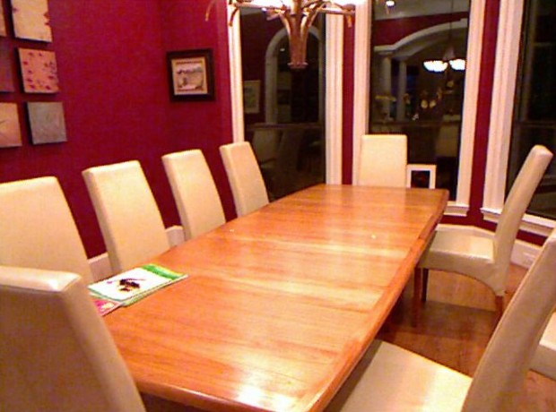
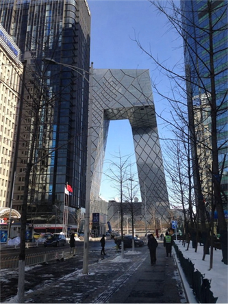

##  [FFA-Net: Feature Fusion Attention Network for Single Image Dehazing](https://arxiv.org/abs/1911.07559) (AAAI 2020)
 Official implementation.

---

by Xu Qin, Zhilin Wang et al.    Peking University and Beijing University of Aeronautics & Astronautics.


### Paddle Model reproduction

by Jiaming Cai.    Beijing Institute of Technology

### Dependencies and Installation

* python3
* Paddle
* NVIDIA GPU+CUDA
* numpy
* matplotlib

### Datasets Preparation

Dataset website:[RESIDE](https://sites.google.com/view/reside-dehaze-datasets/) (use [RESIDE-Standard](https://sites.google.com/view/reside-dehaze-datasets/reside-standard)); Paper arXiv version:[[RESIDE: A Benchmark for Single Image Dehazing](https://www.google.com/url?q=https%3A%2F%2Farxiv.org%2Fpdf%2F1712.04143.pdf&sa=D&sntz=1&usg=AFQjCNHzdt3kMDsvuJ7Ef6R4ev59OFeRYA)]

<details>
<summary> FILE STRUCTURE </summary>

```
    PaddleVideo-develop\data\FFA
    	|-- README_FFA.md
    	|-- data
            |-- FFA-data
                |-- ITS
                    |-- hazy
                        |-- *.png
                    |-- clear
                        |-- *.png
                |-- OTS
                    |-- hazy
                        |-- *.jpg
                    |-- clear
                        |-- *.jpg
                |-- SOTS
                    |-- indoor
                        |-- hazy
                            |-- *.png
                        |-- clear
                            |-- *.png
                    |-- outdoor
                        |-- hazy
                            |-- *.jpg
                        |-- clear
                            |-- *.png
```


**Model parameters download**

Download the model parameters of the pre-training model provided by the author and the model parameters of the vgg16 pre-training model from the following link, and put them in the data folder in the project root directory, so that there is an FFA folder under the data, and the FFA folder contains Three model parameter files:

Link: https://pan.baidu.com/s/1G1hsTiQDuW_3HjVn0Nln1A,  extraction code: dqaz


### Usage

#### 1. Dataset

Download the [RESIDE](https://sites.google.com/view/reside-dehaze-datasets/) (the indoor dataset should use [RESIDE-Standard](https://sites.google.com/view/reside-dehaze-datasets/reside-standard) ) dataset, and change the dataset path in configs/FFA-cfg.yaml to your dataset path.


#### 2. Train

Train network on `ITS` dataset

 ```shell
 python main.py -c configs/FFA_cfg.yaml --validate
 ```


If you want to train network on `OTS` dataset，change the file_path of train dataset in configs/FFA-cfg.yaml and note the **suffix** parameter.

If you want to modify the parameters of the model, modify the parameters under MODEL in configs/FFA-cfg.yaml.

If you want to change the training epochs,  you need to change the **max_epoch** parameter under OPTIMIZER in configs/FFA-cfg.yaml at the same time, **max_epoch** must be consistent with **epochs**. For better results, train for at least 80 epochs.

The video memory required for this model training is too large, do not try to increase the **batchsize**.  If the video memory is insufficient, you can reduce the **batchsize** and PIPELINE/train/decode/**crop_size**.

The **gps** and **blocks** undel backbone related to the depth of the model.

The **perloss** under head related to the loss of the model, the default is False. If you want to change it to True, you need to download the vgg16 pre-training model parameter file in the link above to the corresponding location. In order to obtain better training results, it is recommended to download the corresponding file and change the parameter to True.. If you choose False，it means that only the l1 loss between the generated image and the clear image is used as the loss value.

- `--validate` parameter specifies to run validation when training
- `-c` parameter specifies the configuration file path
- `-o`: Specify rewrite parameters, for example: `-o DATASET.batch_size=16` is used to rewrite the batch size of train


#### 3. Resume training

If the training task is terminated, the breakpoint weight file (optimizer-learning rate parameter, breakpoint file) can be loaded to continue training. The `-o resume_epoch` parameter needs to be specified, which means to resume training from the `resume_epoch` round. You need to specify the `-w` parameter, which indicates that the model parameters are loaded from this path to continue training.

```python
python main.py -c configs/FFA_cfg.yaml --validate -o resume_epoch=6
```

For more usage, please check the [official document](https://github.com/PaddlePaddle/PaddleVideo/blob/develop/docs/zh-CN/usage.md#1) of paddle.


#### 4. Test

When testing the model, enter the following code in the console,  the downloaded model parameters mentioned above are used in the following code:

 ```shell
 python main.py --test -c configs/FFA_cfg.yaml -w data/FFA/ITS_3_19_article_pretrained.pdparams
 ```
If you want to test your images, change the file_path of test dataset in configs/FFA-cfg.yaml,  and pay attention to whether the suffix is consistent.

If you want to test on your model, put the path of your model after -w.

The indoor model provided by the authors of the paper is in data/FFA/ITS_3_19_article_pretrained.pdparams，and theoutdoor  model is in data/FFA/OTS_3_19_article_pretrained.pdparams.

### Samples

<p align='center'>




</div>

<p align='center'>


</div>

