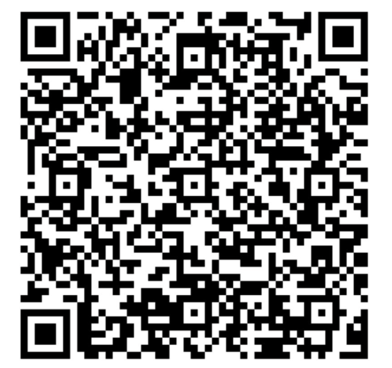
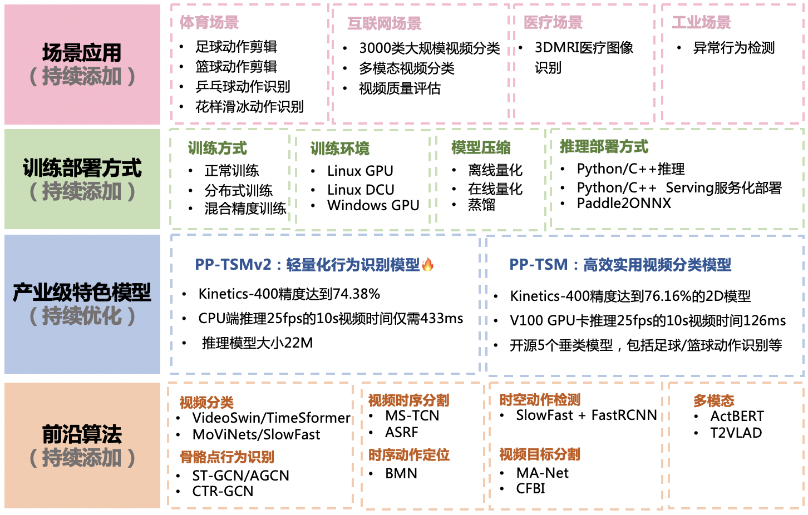

[English](README_en.md) | 中文

# PaddleVideo

 

## 简介

PaddleVideo旨在打造一套丰富、领先且实用的Video工具库，旨在帮助开发者更好的进行视频领域的学术研究和产业实践。

   

## 近期更新

- 开源视频标注工具🌟[BILS](./docs/zh-CN/annotation_tools.md)，欢迎下载安装包体验～
- 发布轻量化行为识别模型**🔥[PP-TSMv2](./docs/zh-CN/model_zoo/recognition/pp-tsm_v2.md)**, Kinetics-400精度75.16%，25fps的10s视频cpu推理时间仅需456ms.各模型性能对比[benchmark](./docs/zh-CN/benchmark.md).
- 新增[知识蒸馏](./docs/zh-CN/distillation.md)功能.
- 新增基于transformer的行为识别模型[TokenShift](https://github.com/PaddlePaddle/PaddleVideo/blob/develop/docs/zh-CN/model_zoo/recognition/tokenshift_transformer.md).
- 新增基于骨骼点的行为识别模型[2s-ACGN](https://github.com/PaddlePaddle/PaddleVideo/blob/develop/docs/zh-CN/model_zoo/recognition/agcn2s.md)、[CTR-GCN](./docs/zh-CN/model_zoo/recognition/ctrgcn.md).
- 新增单阶段时空动作检测模型[YOWO](./docs/zh-CN/model_zoo/localization/yowo.md).

👀 🌟  **《产业级视频技术与应用案例》系列课程回放链接**:  https://aistudio.baidu.com/aistudio/course/introduce/6742 🌟

​																	  💖 **欢迎大家扫码入群讨论** 💖

  

- 添加成功后回复【视频】加入交流群

## 特性

支持多种Video相关前沿算法，在此基础上打造产业级特色模型[PP-TSM](docs/zh-CN/model_zoo/recognition/pp-tsm.md)和[PP-TSMv2](docs/zh-CN/model_zoo/recognition/pp-tsm_v2.md)，并打通数据生产、模型训练、压缩、预测部署全流程。

    

## 快速开始

- 一行命令快速使用: [快速开始](./docs/zh-CN/quick_start.md)

## 场景应用

PaddleVideo场景应用覆盖体育、互联网、工业、医疗行业，在PP-TSM的基础能力之上，以案例的形式展示利用场景数据微调、模型优化方法、数据增广等内容，为开发者实际落地提供示范与启发。详情可查看[应用](./applications/)。

## 文档教程

- [快速开始](./docs/zh-CN/quick_start.md)
- [安装说明](./docs/zh-CN/install.md)
- [训练/测试/推理全流程使用指南](./docs/zh-CN/usage.md)
- [PP-TSM行为识别🔥](./docs/zh-CN/model_zoo/recognition/pp-tsm.md)
  - [模型库](./docs/zh-CN/model_zoo/recognition/pp-tsm.md#7)
  - [模型训练](./docs/zh-CN/model_zoo/recognition/pp-tsm.md#4)
  - [模型压缩](./deploy/slim/)
      - [模型量化](./deploy/slim/readme.md)
      - [知识蒸馏](./docs/zh-CN/distillation.md)
  - [推理部署](./deploy/)
      - [基于Python预测引擎推理](./docs/zh-CN/model_zoo/recognition/pp-tsm.md#62)
      - [基于C++预测引擎推理](./deploy/cpp_infer/readme.md)
      - [服务端部署](./deploy/python_serving/readme.md)
      - [Paddle2ONNX模型转化与预测](./deploy/paddle2onnx/readme.md)
      - [Benchmark](./docs/zh-CN/benchmark.md)
- [前沿算法与模型](./docs/zh-CN/model_zoo/README.md)🚀
- [数据集](./docs/zh-CN/dataset/README.md)
- [场景应用](./applications/README.md)
- [数据标注](./docs/zh-CN/annotation_tools.md)
- [赛事支持](./docs/zh-CN/competition.md)
- [贡献代码](./docs/zh-CN/contribute/README.md)

## 许可证书

本项目的发布受[Apache 2.0 license](LICENSE)许可认证。
