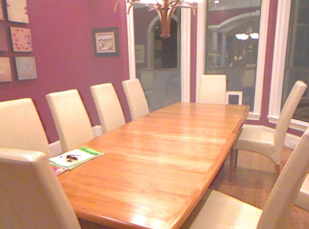

##  [FFA-Net: Feature Fusion Attention Network for Single Image Dehazing](https://arxiv.org/abs/1911.07559) (AAAI 2020)
---

by Xu Qin, Zhilin Wang et al.    Peking University and Beijing University of Aeronautics & Astronautics.

[TOC]

## 1、 Introduction

**paper：** FFA-Net: Feature Fusion Attention Network for Single Image Dehazing

**Reference repo:** https://github.com/zhilin007/FFA-Net

I would like to thank: [zhilin007](https://github.com/zhilin007) for the contribution of the FFA-NET repo, which improves the efficiency of this repo to reproduce the paper.


This model is one of the top models in the field of image dehazing. The goal of this model is to dehaze the image, and the biggest feature is the large-scale convolution block structure based on the attention block. The structure of the attention block is shown in the following figure:


The authors use two attention blocks for two different purposes. One is the channel attention block, as shown in the upper left of Figure 1, assuming that the input feature layer size of the attention block is (1, 64, 256, 256), after layer pooling, convolution and other operations, and finally sigmoid activation, the output size is The intermediate result of (1,64,1,1) is then multiplied with the input to obtain the output of the attention block, so that each channel is multiplied by different weights (between 0-1), resulting in attention force effect. The other is the pixel attention block. It is assumed that the input feature layer size of the attention block is (1, 64, 256, 256). Unlike the channel attention block, it has not undergone layer pooling, and the number of channels for the intermediate result is 1, (1 , 1, 256, 256), and then multiplied with the input to obtain the output of the attention block, so that each pixel of the input is multiplied by different weights, resulting in an attention effect.

Combining these two blocks with the convolution operation results in a basic unit of the model, Block. Adding multiple blocks and adding a convolutional layer at the end forms a larger unit group in the model. After the initial convolution of the model input, after three groups and concat the outputs of the three groups, an important intermediate output is obtained. Among them, each group used by the author contains 19 blocks, but for the model , the number of Group and Block are adjustable parameters. The intermediate output is then passed through the channel attention block, the pixel attention block, and the two-layer convolution to obtain the corrected value, which is added to the total input to obtain the dehazed image. The general framework of the model is shown in the figure below.


**Samples**

<p align='center'>



</div>

<p align='center'>


</div>


## 2、Data set description and reproduction accuracy

**Dataset address:**[RESIDE](https://sites.google.com/view/reside-dehaze-datasets/) (Please select the [RESIDE-Standard dataset](https://sites.google.com/view/reside-dehaze-datasets/reside-standard) in the URL), the details of the data set and reproduction accuracy are shown in the following table, since my training rounds are only 4/5 mentioned in the author's paper, there is a slight gap in the evaluation indicators.

|         | train dataset : amount | val dataset: amount | ssim/psnr(paper) | ssim/psnr(repo) |
| ------- | ---------------------- | ------------------- | ---------------- | --------------- |
| indoor  | ITS: 13990             | SOTS/indoor: 500    | 0.9886/36.39     | 0.9885/35.42    |
| outdoor | OTS: 313960            | SOTS/outdoor: 1000  | 0.9840/33.57     |                 |

**Dataset download address：**

**ITS (Indoor Training Set)：**http://tinyurl.com/yaohd3yv                                    **Passward**:  g0s6

**OTS：**  https://pan.baidu.com/s/1c2rW4hi                                                             **Passward**:  5vss

**SOTS ：** https://pan.baidu.com/share/init?surl=SSVzR058DX5ar5WL5oBTLg  **Passward**:  s6tu


**Model parameter file and training log download address：**

Link：https://pan.baidu.com/s/1Q9RQI5bC35FUF2dhIqKamg   Code：gzao

file structure：

```
    PaddleVideo/data/FFA
        |-- vgg16_pretrained_weight.pdparams       #The parameter file of the VGG16 pre-training model 														used when the model loss function uses perloss
        |-- ITS2_3_19_400000_transform.pdparams    #The parameter file of the indoor dehazing model 														obtained by the reproduced model after 400000 steps 													of training
        |-- ITS_3_19_article_pretrained.pdparams   #The parameter file of the indoor dehazing model 														provided by the author
        |-- OTS_3_19_article_pretrained.pdparams   #The parameter file of the outdoor dehazing model 														provided by the author
        |-- logs                                   #training log folder
        	|-- train.log                          #full training log file
            |-- step 1-48000.ipynb                 #1-48000step reproduction training notebook file
            |-- step 48000-400000.ipynb            #48000-400000step to reproduce the training notebook 													file
```


## 3、Prepare data and environment

### 3.1 Prepare the environment

* python3

* Paddle

* NVIDIA GPU+CUDA

  (This model requires a lot of video memory. When the batch size is 1, it also needs 6-7GB of video memory, and the demand for computing power is also very large. It is recommended to use GPU for training)

* numpy

* matplotlib

Note: This model can be run normally if paddleVideo can run normally

### 3.2 Prepare data

Dataset URL: [RESIDE](https://sites.google.com/view/reside-dehaze-datasets/) (Please select the [RESIDE-Standard dataset](https://sites.google.com /view/reside-dehaze-datasets/reside-standard)), see the second part of the document for related information. After the data set is downloaded, it is stored in the following relative path, and the data set path parameters in the configuration file configs/FFA-cfg.yaml are modified according to the location where the data set is stored.

file structure：

```
    PaddleVideo-develop\data\FFA
    	|-- README_FFA.md
    	|-- data
            |-- FFA-data
                |-- ITS
                    |-- hazy
                        |-- *.png
                    |-- clear
                        |-- *.png
                |-- OTS
                    |-- hazy
                        |-- *.jpg
                    |-- clear
                        |-- *.jpg
                |-- SOTS
                    |-- indoor
                        |-- hazy
                            |-- *.png
                        |-- clear
                            |-- *.png
                    |-- outdoor
                        |-- hazy
                            |-- *.jpg
                        |-- clear
                            |-- *.png
```


### 3.3 Prepare the model

Download the model parameters of the pre-training model and the model parameters of the vgg16 pre-training model from the link in the second part, and put them in the data folder in the project root directory, so that there is an FFA folder under the data, and the FFA folder contains Four model parameter files.


## 4、start using

### 4.1 data set

Download the [RESIDE](https://sites.google.com/view/reside-dehaze-datasets/) (the indoor dataset should use [RESIDE-Standard](https://sites.google.com/view/reside-dehaze-datasets/reside-standard) ) dataset, and change the dataset path in configs/FFA-cfg.yaml to your dataset path.

### 4.2 model training

Train network on `ITS` dataset

 ```shell
python main.py -c configs/FFA_cfg.yaml --validate
 ```


If you want to train network on `OTS` dataset，change the file_path of train dataset in configs/FFA-cfg.yaml and note the **suffix** parameter.

If you want to modify the parameters of the model, modify the parameters under MODEL in configs/FFA-cfg.yaml.

If you want to change the training epochs,  you need to change the **max_epoch** parameter under OPTIMIZER in configs/FFA-cfg.yaml at the same time, **max_epoch** must be consistent with **epochs**. For better results, train for at least 80 epochs.

The video memory required for this model training is too large, do not try to increase the **batchsize**.  If the video memory is insufficient, you can reduce the **batchsize** and PIPELINE/train/decode/**crop_size**.

The **gps** and **blocks** undel backbone related to the depth of the model.

The **perloss** under head related to the loss of the model, the default is False. If you want to change it to True, you need to download the vgg16 pre-training model parameter file in the link above to the corresponding location. In order to obtain better training results, it is recommended to download the corresponding file and change the parameter to True.. If you choose False，it means that only the l1 loss between the generated image and the clear image is used as the loss value.

- `--validate` parameter specifies to run validation when training
- `-c` parameter specifies the configuration file path
- `-o`: Specify rewrite parameters, for example: `-o DATASET.batch_size=16` is used to rewrite the batch size of train


### 4.3 resume training

If the training task is terminated, the breakpoint weight file (optimizer-learning rate parameter, breakpoint file) can be loaded to continue training. The `-o resume_epoch` parameter needs to be specified, which means to resume training from the `resume_epoch` round. You need to specify the `-w` parameter, which indicates that the model parameters are loaded from this path to continue training.

```python
python main.py -c configs/FFA_cfg.yaml --validate -o resume_epoch=6
```

For more usage, please check the [official document](https://github.com/PaddlePaddle/PaddleVideo/blob/develop/docs/zh-CN/usage.md#1) of paddle.


### 4.4 Model evaluation

When testing the model, enter the following code in the console,  the downloaded model parameters mentioned above are used in the following code:

 ```shell
###Evaluate the model provided by the author###
python main.py --test -c configs/FFA_cfg.yaml -w data/FFA/ITS_3_19_article_pretrained.pdparams

###Evaluate my reproduced model估###
python main.py --test -c configs/FFA_cfg.yaml -w data/FFA/ITS2_3_19_400000_transform.pdparams
 ```

If you want to test your images, change the file_path of test dataset in configs/FFA-cfg.yaml,  and pay attention to whether the suffix is consistent.

If you want to test on your model, put the path of your model after -w.

The indoor model provided by the authors of the paper is in data/FFA/ITS_3_19_article_pretrained.pdparams，and theoutdoor  model is in data/FFA/OTS_3_19_article_pretrained.pdparams.

At the end of the model evaluation, an error will be encountered for unknown reasons, but the correct evaluation result will be output above the error part.

After the data set and model are successfully prepared, use the first command of the above example to evaluate. After correct evaluation, the result should be as shown in the following figure. It may take a long time to complete the evaluation of the model:


## 5、Code structure description

code structure：

```
    PaddleVideo
    	|-- figs #Store pictures used in documentation
    	|-- README_FFA_ch.md #Chinese documentation for the reproduction model
    	|-- README_FFA_ch.md #English documentation of the reproduction model
    	|-- cofigs/FFA_cfg.yaml #Reproduce the model's configuration file
        |-- paddlevideo
            |-- loader
                |-- dataset
                	|-- __init__.py      #Added link to ffa_dataset.py
                	|-- ffa_dataset.py   #Dataset Loading Module
                |-- pipelines
                	|-- __init__.py      #Added link to ffa_pipelines.py
                	|-- ffa_pipelines.py #Image preprocessing module used in the dataset loading module
            |-- metrics
                |-- __init__.py      #Added link to ffa_metric.py
                |-- ffa_metric.py    #TEST metric Module
            |-- utils
            	|-- record.py      	 #Added the detection of the ssim and psnr indicators of the 											 framework named FFANet during the verification process
            |-- modeling
                |-- backbones
                	|-- __init__.py 	 #Added link to ffa_net.py
                    |-- ffa_net.py       #Defines the structure of the FFA-NET model
                |-- framework
                    |-- generator
                    	|-- __init__.py        #Establish the association of the suite with 															ffa_metrics.py and ffanet_framwork.py
                    	|-- ffa_metrics.py     #Defines the calculation method of metrics used in 														validation and test evaluation
                    	|-- ffanet_framwork.py #Defines how the model is propagated, and how the 														training, validation, and testing steps are performed
                    |-- __init__.py      #Added association to files in generator
                |-- heads
                	|-- __init__.py      #Added link to ffa_head.py
                	|-- ffa_head.py      #A module that computes the loss function
                |-- builder.py           #Added association with newly added files under modeling folder
                |-- registry.py          #Added association with newly added files under modeling folder

```


## 6、LICENSE

This project is released under the [Apache 2.0 license](https://github.com/PaddlePaddle/models/blob/release/2.2/community/repo_template/LICENSE) license.


## 7、References and Links

Paper address：https://arxiv.org/abs/1911.07559

Reference repoFFA-NET Github：https://github.com/zhilin007/FFA-Net

Thesis Reproduction Guide - CV Directionhttps://github.com/PaddlePaddle/models/blob/release%2F2.2/tutorials/article-implementation/ArticleReproduction_CV.md

How to integrate code into paddlevideo:https://github.com/PaddlePaddle/PaddleVideo/blob/develop/docs/zh-CN/contribute/add_new_algorithm.md

Readme document template：https://github.com/PaddlePaddle/models/blob/release/2.2/community/repo_template/README.md


