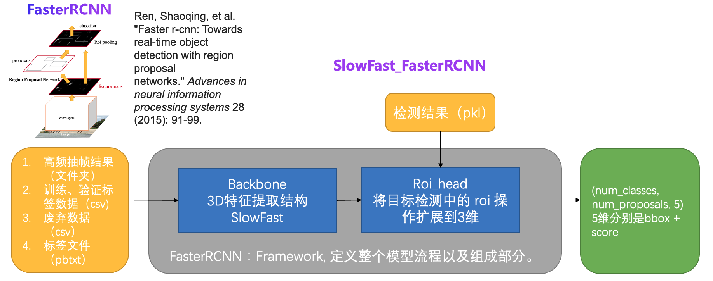

# 异常行为识别

## 内容
- [模型简介](#模型简介)
- [数据准备](#数据准备)
- [模型训练](#模型训练)
- [模型评估](#模型评估)
- [模型推理](#模型推理)
- [模型部署](#模型部署)
- [参考论文](#参考论文)


## 模型简介
该代码库用于异常行为检测, 基于paddle2.2版本开发，结合PaddleVideo中的SlowFast+FasterRCNN模型实现7个异常行为的检测。
主要框架如下：
<div align="center">
  <br>
</div>

AIStudio项目: [基于时空信息的异常行为检测](https://aistudio.baidu.com/aistudio/projectdetail/3431613)

## 数据准备

### Step1 稀疏抽取视频帧
首先稀疏抽取视频帧用于检测每帧中人的位置：

```
cd data/ava/script && bash extract_video_frames.sh abnormal_action_videos abnormal_action_frames 2
```

* 第一个参数abnormal_action_videos：被抽帧的视频根目录；
* 第二个参数abnormal_action_frames：抽取的视频帧存放目录；
* 第三个参数2：抽帧帧率。

### Step2 目标检测
用成熟的可检测人的目标检测模型检测上述步骤抽得的视频帧中的人。如PaddleDetection套件中的基于coco数据集训练得到的[PP-YOLOv2](https://github.com/PaddlePaddle/PaddleDetection/tree/develop/configs/ppyolo)模型。

### Step3 生成pkl文件
将上述步骤得到的每个视频帧的检测结果进行转化，得到SlowFast_FasterRCNN模型需要的输入格式。注意我们只需要人的检测结果，其他目标不需要。
SlowFast_FasterRCNN模型需要的proposals是pkl格式文件，该文件以字典形式存储检测结果，字典的key是视频帧的索引（video_id+frame_id拼接得到），value是一个list，每个元素是检测得到的人的位置信息和置信度。

```
{
    打架,0001:
        [[0.036    0.098    0.55     0.979    0.995518] # x1,y1,x2,y2,score
        [0.443    0.04     0.99     0.989    0.977824]]
}
```

### Step4 密集抽取视频帧
对视频数据进行密集抽帧。
SlowFast_FasterRCNN输入的视频帧是密集帧，因此需要再次对视频进行抽帧。具体命令如下：
```
cd data/ava/script && bash extract_video_frames.sh abnormal_action_videos abnormal_action_frames_30fps 30
```

具体参数同步骤1，只不过次数抽帧率为30fps。

### Step5 准备标签数据
标签数据以pbtxt文件个数存储，本案例具体如下（注意行为标签id从1开始）：
```
item {
  name: "挥棍"
  id: 1
}
item {
  name: "打架"
  id: 2
}
item {
  name: "踢东西"
  id: 3
}
item {
  name: "追逐"
  id: 4
}
item {
  name: "争吵"
  id: 5
}
item {
  name: "快速奔跑"
  id: 6
}
item {
  name: "摔倒"
  id: 7
}
```

## 模型训练
异常行为检测模型基于在AVA数据集上训练得到模型进行迁移学习。具体训练命令如下：
```
python main.py --validate -w AVA_SlowFast_FastRcnn_best.pdparams \
 -c configs/abnoraml_action.yaml
```

 - w 预训练模型路径
 - c 配置文件路径

## 模型评估
```
python main.py --test \
   -w abnormal_action_SlowFast_FastRcnn.pdparams \
   -c configs/abnoraml_action.yaml
```

## 模型推理
基于动态图的推理：
```
python tools/ava_predict.py \
  -c configs/abnoraml_action.yaml \
  -w abnormal_action_SlowFast_FastRcnn.pdparams \
  --video_path data/wave_9.mp4 \
  --detection_model_name 'faster_rcnn/faster_rcnn_r50_fpn_1x_coco' \
  --detection_model_weights 'faster_rcnn_r50_fpn_1x_coco.pdparams'
```

- video_path 视频路径
- detection_model_name 检测模型名称
- detection_model_weights 检测模型权重路径

基于静态图模型进行推理：

导出模型，动态图模型转换为静态图模型：

```
python tools/export_model.py \
  -c configs/abnoraml_action.yaml \
  -o inference_output \
  -p abnormal_action_SlowFast_FastRcnn.pdparams
```

- o 导出模型存放文件夹
- p 被导出模型路径

基于导出的模型做推理：
```
python tools/predict.py \
    -c configs/abnoraml_action.yaml \
    --input_file "data/wave_9.mp4" \
    --model_file "inference_output/abnormal_action_SlowFast_FastRcnn.pdmodel" \
    --params_file "inference_output/abnormal_action_SlowFast_FastRcnn.pdiparams" \
    --use_gpu=True \
    --use_tensorrt=False
```

## 模型部署
请参考[Paddle Inference示例](https://paddle-inference.readthedocs.io/en/latest/quick_start/python_demo.html)

## 参考论文
- [SlowFast Networks for Video Recognition](https://arxiv.org/pdf/1812.03982.pdf), Christoph Feichtenhofer, Haoqi Fan, Jitendra Malik, Kaiming He
