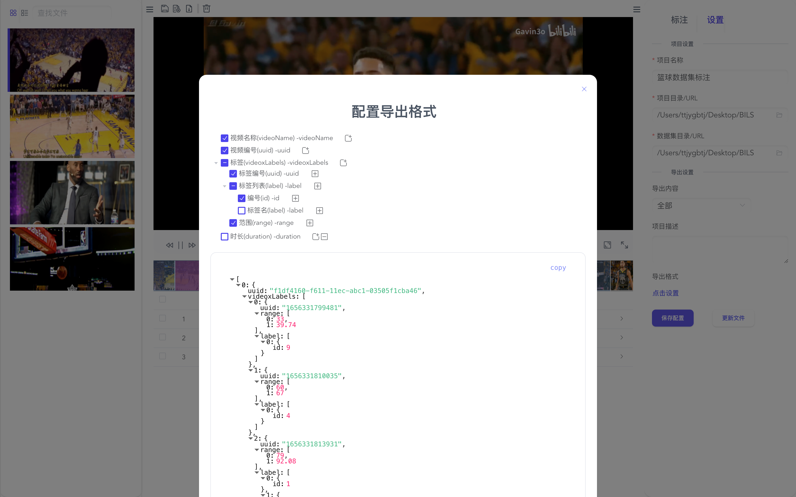
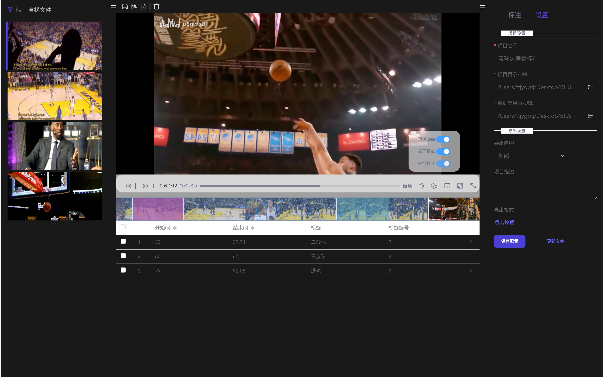

# BILS

## 简介

BILS (Baidu Intelligent Labeling System) 是一款支持时间轴打标签的视频标注软件，可被用于视频事件定位 、短视频分类等任务的标注工作。


带有缩略图，打标签支持快捷键（按1,2,3……依次对应从上到下）


标签高度自定义，双击改名

 

缩略图可放大缩小和调整宽度


打开片选菜单，支持全屏打标签


导出可自定义，可实时预览



两套主题可切换，亮、暗，视频播放支持画中画，镜像，循环，倍速，音量调整，网页全屏



项目配置，并支持导入配置


## 运行方式

开发版本

```
cd frontend
npm install
npm run dev
```


## 常见问题

1. 上传代码时需要一起上传package-lock.json文件，以锁定版本号。因为库在实时更新，可能下一个版本就会出现兼容性问题，所以必须在锁定时锁定版本号。注意，cnpm不会生成package-lock.json文件
   1. 案例：rollup库出现版本问题，解决方式：用npm i安装完package.json后，卸载rollup，然后再安装指定版本即可。
      
   ```shell
    npm i
    npm uninstall rollup
    npm install rollup@v2.70.0
   ```
   如果还是不行，确保node版本是否是v16
2. 安装electron镜像问题报错
    
   
   ```shell
    npm config set electron_mirror "https://npm.taobao.org/mirrors/electron/"
   ```
3. mac下ffmpeg问题报错
    
    ```shell
   npm install --save @ffprobe-installer/ffprobe
   npm install --save @ffmpeg-installer/ffmpeg
   ```
