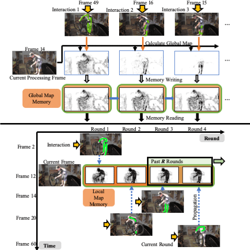

[English](README.md) | 简体中文

# Ma-Net视频切分模型

## 内容

- [模型简介](#模型简介)
- [数据准备](#数据准备)
- [模型训练](#模型训练)
- [模型测试](#模型测试)
- [模型推理](#模型推理)


## 模型简介

这是CVPR2020论文"[Memory aggregation networks for efficient interactive video object segmentation](https://arxiv.org/abs/2003.13246)"的Paddle实现。



此代码目前支持在 DAVIS 数据集上进行模型测试和模型训练，并且将在之后提供对任何给定视频的模型推理。


## 数据准备

DAVIS数据下载及准备请参考[DAVIS2017数据准备](dataloaders/DAVIS2017_cn.md)


## 模型训练与测试
- 您可以下载[paddle版本的stage1预训练模型](https://videotag.bj.bcebos.com/PaddleVideo-release2.2/DeeplabV3_coco.pdparams) 解压缩它以用于训练的第一阶段。
  
- 您可以下载[stage1训练结果模型](https://videotag.bj.bcebos.com/PaddleVideo-release2.2/MaNet_davis2017_stage1.pdparams) 解压缩它以直接训练的第二阶段跳过第一阶段的训练。
  
  ```bash
  sh run.sh
  ```
  
- 您可以下载[我们的模型](https://videotag.bj.bcebos.com/PaddleVideo-release2.2/MANet_davis2017.pdparams) 解压缩它以用于测试。


在 DAVIS2017上的测试精度:

| J@60  |  AUC  |
| :---: | :---: |
| 0.761 | 0.749 |
