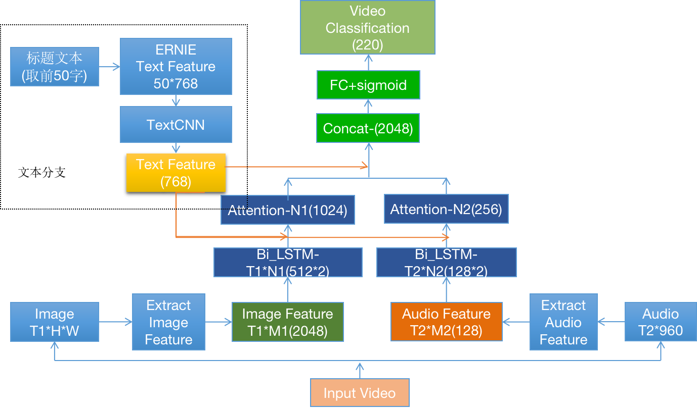
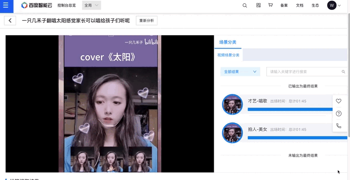

# MutimodalVideoTag 多模态视频分类模型
---
## 内容
- [模型简介](#模型简介)
- [数据准备](#数据准备)
- [模型训练](#模型训练)
- [模型评估](#模型评估)
- [模型推理](#模型推理)
- [模型优化](#模型优化)
- [模型部署](#模型部署)
- [参考论文](#参考论文)


## 模型简介

该代码库用于多模态场景下视频分类任务，基于paddle2.0版本开发，模型基于真实短视频业务数据，融合文本、视频图像、音频三种模态进行视频多模标签分类，相比纯视频图像特征，显著提升高层语义标签效果。其原理示意如下图所示。

<p align="center">
 <br />
MutimodalVideoTag 多模态视频分类模型示意图
</p>

- 数据处理：分别对视频三个模态的数据进行处理，对视频进行抽帧，获得图像序列；抽取视频的音频pcm 文件；收集视频标题，简单进行文本长度截断，一般取50个字。
- 特征抽取：使用预训练的 ResNet 对图像抽取高层语义特征；使用预训练的VGGish网络抽取音频特征；文本方面使用[ERNIE 1.0](https://github.com/PaddlePaddle/ERNIE)抽取文本特征，无需预先抽取，支持视频分类模型finetune
- 序列学习：分别使用独立的LSTM 对图像特征和音频特征进行序列学习，文本方面预训练模型对字符序列进行建模，在ernie 后接入一个textcnn 网络做下游任务的迁移学习。
- 多模融合：文本具有显式的高层语义信息，将文本特征引入到LSTM pooling 过程指导图像和音频时序权重分配，进行交叉融合，最后将文本、音频、视频特征拼接。
- 预测结果：分类器选用sigmoid 多标签分类器，支持视频多标签输出。

## 数据准备
数据方面提供已经抽取好图像、音频特征的特征文件，以及标题和标签信息，模型方面提供训练好checkpoint 文件，可进行finetune、模型评估、预测。
```
sh download.sh
```
数据文件包括抽取好特征的文件夹 `feature_files`，以及记录划分的txt 文件，格式如下
```
文件名 \t 标题 \t 标签
18e9bf08a2fc7eaa4ee9215ab42ea827.mp4 叮叮来自肖宇梁肖宇梁rainco的特别起床铃声 拍人-帅哥,拍人-秀特效,明星周边-其他明星周边
```

##  模型训练
模型训练过程有如下可调模式，可在根据数据集情况进行调整，在`conf/conf.txt` 文件中
- ernie_freeze: 用于控制文本提特征的ernie 网络是否进行finetune，因为ernie 复杂度远大于图像、视频序列学习网络，因此在某些数据集上不好训练。
- lstm_pool_mode: 用于控制lstm 序列池化的方式，默认是"text_guide"表示利用文本加强池化注意力权重，如果设置为空，则默认为自注意力的权重。

```
sh train.sh 
```
##  模型评估
模型对测试集进行评估，同时支持将checkpoint 模型转为inference 模型， 可用参数'save_only' 选项控制，设置即只用于做模型转换，得到inference 模型
```
sh eval_and_save_model.sh
```
##  模型推理
通过上一步得到的inference 模型进行预测，结果默认阈值为0.5，存储到json 文件中，在`conf/conf.txt` 文件 `threshold` 参数进行控制多标签输出的阈值。
```
sh inference.sh
```
## 模型优化
模型方面，主要在文本分支进行了实验，实验结果显示ERNIE 在多分支下不微调，而是使用后置网络进行微调，训练速度快，且稳定，同时attention 方面使用文本信息增强图像、音频的attention 学习能一定程度提升模型效果。

| 模型                                                         | Hit@1 | Hit@2 |
| ------------------------------------------------------------ | ----- | ----- |
| 文本分支ERNIE 不finetune +self-attention                     | 71.07 | 83.72 |
| 文本分支ERNIE 不finetune +textcnn finetune + self-attention  | 72.66 | 85.01 |
| 文本分支ERNIE 不finetune +extcnn finetune + text-guide-attention | 73.29 | 85.59 |

## 模型部署

<div align="center">
  <br>
</div>


## 参考论文
- [Attention Clusters: Purely Attention Based Local Feature Integration for Video Classification](https://arxiv.org/abs/1711.09550), Xiang Long, Chuang Gan, Gerard de Melo, Jiajun Wu, Xiao Liu, Shilei Wen
- [YouTube-8M: A Large-Scale Video Classification Benchmark](https://arxiv.org/abs/1609.08675), Sami Abu-El-Haija, Nisarg Kothari, Joonseok Lee, Paul Natsev, George Toderici, Balakrishnan Varadarajan, Sudheendra Vijayanarasimhan
- [Ernie: Enhanced representation through knowledge integration](https://arxiv.org/abs/1904.09223), Sun, Yu and Wang, Shuohuan and Li, Yukun and Feng, Shikun and Chen, Xuyi and Zhang, Han and Tian, Xin and Zhu, Danxiang and Tian, Hao and Wu, Hua
