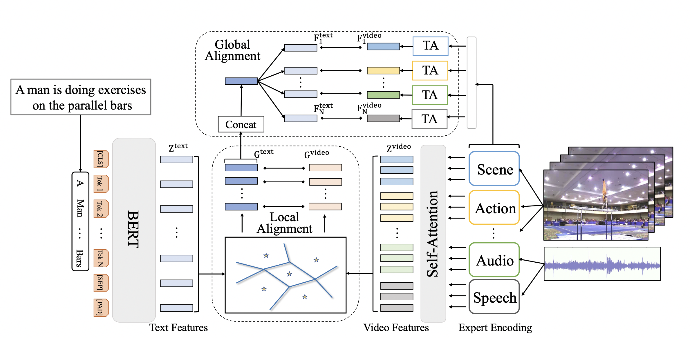

[English](./README_en.md) | 简体中文

# T2VLAD: 基于局部全局对齐的文本视频检索

---
## 内容

- [模型简介](#模型简介)
- [数据准备](#数据准备)
- [模型训练](#模型训练)
- [模型测试](#模型测试)
- [参考论文](#参考论文)

在开始使用之前，您需要按照以下命令安装额外的依赖包：
```bash
python -m pip install paddlenlp
```
同时确保paddle版本为2.2.2。

## 模型简介

T2VLAD是百度在CVPR2021提出的文本视频检索模型。文本视频检索是一项具有挑战的任务，旨在基于自然语言处理描述搜索相关视频内容。这个问题的关键是在联合嵌入空间中测量文本-视频的相似性。T2VLAD设计了一种有效的全局-局部对齐方法，在三个标准的文本视频检索基准上取得了一致的改进，并以明显的优势超越了最先进的技术。

<div align="center">
 <br />
</div>


## 数据准备

MSR-VTT数据下载及准备请参考 [MSR-VTT数据准备](../../docs/zh-CN/dataset/msrvtt.md)

## 模型训练

### MSR-VTT数据集训练

下载数据并添加到 `data/MSRVTT` 文件夹下。

#### 开始训练

- 训练启动命令如下:

```bash
export CUDA_VISIBLE_DEVICES=0
python3.7 train.py --config ./configs/msrvtt_transformers.json
```

T2VLAD在训练时使用了Ranger优化器，这里我们暂时没有支持Ranger优化器到的实现，目前可以使用AdamW优化器来完成训练。


## 模型测试

- 对下游任务：文本-视频检索，在MSR-VTT数据集上评估性能，评估脚本启动方式如下：

```bash
export CUDA_VISIBLE_DEVICES=0
python3.7 test.py --config ./configs/msrvtt_transformers.json --resume ./T2VLAD_msrvtt.pdparams
```

MSR-VTT数据集测试精度:
Text $\rightarrow$ Video
| R@1  | R@5  | R@10 | Median R |                         checkpoints                          |
| :--: | :--: | :--: | :------: | :----------------------------------------------------------: |
| 29.5 | 59.0 | 70.1 |   4      | [T2VLAD.pdparams](https://videotag.bj.bcebos.com/PaddleVideo-release2.2/T2VLAD_msrvtt.pdparams) |

Video $\rightarrow$ Text
| R@1  | R@5  | R@10 | Median R |
| :--: | :--: | :--: | :------: |
| 26.1 | 54.7 | 68.1 |   4      |


## 参考论文

- [T2VLAD: Global-Local Sequence Alignment for Text-Video Retrieval
](https://arxiv.org/pdf/2104.10054.pdf), Xiaohan Wang, Linchao Zhu, Yi Yang
