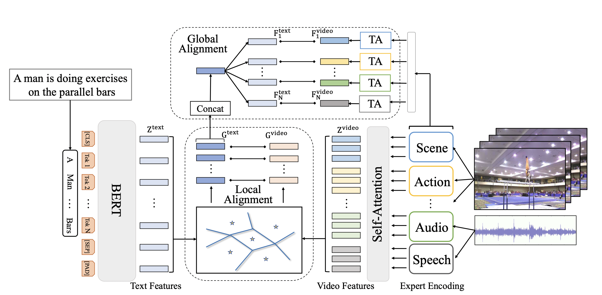

[简体中文](./README.md) | English

# T2VLAD

---
## Contents

- [Introduction](#Introduction)
- [Data](#Data)
- [Train](#Train)
- [Test](#Test)
- [Reference](#Reference)

Before getting started, you need to install additional dependencies as follows:
```bash
python -m pip install paddlenlp
```

## Introduction
T2VLAD is proposed by Baidu in CVPR2021 for text-video retrieval. Text-video retrieval is a challenging task that aims to search relevant video contents based on natural language descriptions. The key to this problem is to measure text- video similarities in a joint embedding space. T2VLAD designs an efficient global-local alignment method. This model achieves consistent improvements on three standard text-video retrieval benchmarks and outperform the state- of-the-art by a clear margin.

<div align="center">
 <br />
</div>


## Data
Please refer to MSR-VTT data download and preparation doc [MSR-VTT data](../../docs/en/dataset/msrvtt.md)

## Train
### Train on MSR-VTT
Download data then move to `data/MSRVTT` folder.

#### Start training

- Train T2VLAD on MSRVTT scripts:

```bash
export CUDA_VISIBLE_DEVICES=0
python3.7 train.py --config ./configs/msrvtt_transformers.json
```

T2VLAD uses the Ranger optimizer during training. We haven't supported the implementation of Ranger optimizer, for now, the AdamW optimizer can be used to complete the training.


## Test

- Evaluation performs on downstream task, i.e. text-video clip retrieval on MSR-VTT dataset, test accuracy can be obtained using scripts:

```bash
export CUDA_VISIBLE_DEVICES=0
python3.7 test.py --config ./configs/msrvtt_transformers.json --resume ./T2VLAD_msrvtt.pdparams
```

Accuracy on MSR-VTT:
Text $\rightarrow$ Video
| R@1  | R@5  | R@10 | Median R |                         checkpoints                          |
| :--: | :--: | :--: | :------: | :----------------------------------------------------------: |
| 29.5 | 59.0 | 70.1 |   4      | [T2VLAD.pdparams](https://videotag.bj.bcebos.com/PaddleVideo-release2.2/T2VLAD_msrvtt.pdparams) |

Video $\rightarrow$ Text
| R@1  | R@5  | R@10 | Median R |
| :--: | :--: | :--: | :------: |
| 26.1 | 54.7 | 68.1 |   4      |

## Reference

- [T2VLAD: Global-Local Sequence Alignment for Text-Video Retrieval
](https://arxiv.org/pdf/2104.10054.pdf), Xiaohan Wang, Linchao Zhu, Yi Yang
