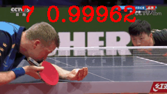

# 乒乓球动作识别模型


## 内容
- [模型简介](#模型简介)
- [数据准备](#数据准备)
- [模型训练](#模型训练)
- [模型推理](#模型推理)
- [模型优化](#模型优化)
- [模型部署](#模型部署)
- [参考论文](#参考论文)

在开始使用之前，您需要按照以下命令安装额外的依赖包：
```bash
python -m pip install imageio
```

## 模型简介
该代码库用于乒乓球动作识别, 基于paddle2.2版本开发，结合PaddleVideo中的VideoSwinTransformer模型，对给定的乒乓球视频进行动作分类。
主要分为如下几步
 - 图像特征抽取，SwinTransformer3D
 - 动作分类，I3DHead


## 数据准备

TODO

## 模型训练
主要代码来自VideoSwin模型：[VideoSwin](../../../docs/zh-CN/model_zoo/recognition/videoswin.md)

1. 使用VideoSwin在K400上的预训练模型基础上进行finetune，因此首先下载K400的预训练模型并放置到`data`目录下
    ```bash
    wget -P data/ https://videotag.bj.bcebos.com/PaddleVideo-release2.2/VideoSwin_k400.pdparams
    ```

2. 使用`TableTennis/ActionRecognition/configs/videoswin_tabletennis.yaml`配置文件进行训练
    训练启动命令如下：
    ```bash
    # 单卡
    python3.7 -u main.py --amp --validate -c applications/TableTennis/ActionRecognition/configs/videoswin_tabletennis.yaml
    # 多卡
    python3.7 -u -B -m paddle.distributed.launch --gpus="0,1,2,3,4,5,6,7" --log_dir=log_videoswin_tabletennis main.py --amp --validate -c applications/TableTennis/ActionRecognition/configs/videoswin_tabletennis.yaml
    ```

## 模型评估

```bash
python3.7 -B -m paddle.distributed.launch --gpus="0,1,2,3,4,5,6,7"  --log_dir=log_videoswin_tabletennis  main.py  --test -c configs/recognition/video_swin_transformer/videoswin_tabletennis.yaml -w "output/VideoSwin_TableTennis/VideoSwin_TableTennis_best.pdparams"
```

## 模型推理

我们提供了一个在乒乓球数据集上训练好的模型以及一个乒乓球样例的视频pkl文件，以供测试
```
wget -P data/ https://videotag.bj.bcebos.com/PaddleVideo-release2.2/VideoSwin_tennis.pdparams # 下载乒乓球数据集上训练好的模型
wget -P data/ https://videotag.bj.bcebos.com/Data/example_tennis.pkl # 下载乒乓球样例输入视频pkl文件
```

### 导出推理模型
```
python3.7 tools/export_model.py -c applications/TableTennis/ActionRecognition/configs/videoswin_tabletennis.yaml \
                                -p output/VideoSwin_TableTennis/VideoSwin_TableTennis_best.pdparams \
                                -o inference/VideoSwin_TableTennis
```
上述命令会根据传入的`.pdparams`模型，在`inference/VideoSwin_TableTennis`文件夹下生成推理模型，主要包括3个文件：`VideoSwin_TableTennis.pdiparams`、`VideoSwin_TableTennis.pdmodel`、`VideoSwin_TableTennis.info`

### 使用推理模型
测试文件使用`.pkl`文件，其包含了已抽取的用于预测的乒乓球视频帧。
运行预测代码
```bash
python3.7 tools/predict.py --input_file data/example_tennis_7.pkl \
                           --config applications/TableTennis/ActionRecognition/configs/videoswin_tabletennis.yaml \
                           --model_file inference/VideoSwin_TableTennis/VideoSwin_TableTennis.pdmodel \
                           --params_file inference/VideoSwin_TableTennis/VideoSwin_TableTennis.pdiparams \
                           --use_gpu=True \
                           --use_tensorrt=False
```
执行以上命令会产出一个原视频叠加预测结果文本(Top1类别+概率)的gif图片，保存在本目录的results文件夹下，gif文件名与输入的pkl文件名相同。
效果如下图：




## 模型优化
在实际使用场景中可根据视频内容尝试优化策略
- 可根据动作持续时间的长短，调整采样的段数num_seg和段内采样的帧数seg_len
- 可以根据数据集大小调整模型训练的超参数，包括权重衰减、DropOut概率、学习率、更换优化器等，以获得更优的结果。
- 本代码的backbone部分可以作为视频特征提取模块，代替其它的动作识别backbone，以获得表征能力更强的视频特征，以提升整体任务的精度。


## 模型部署
TODO


## 参考论文

- [Video Swin Transformer](https://arxiv.org/pdf/2106.13230.pdf), Ze Liu, Jia Ning, Yue Cao, Yixuan Wei
