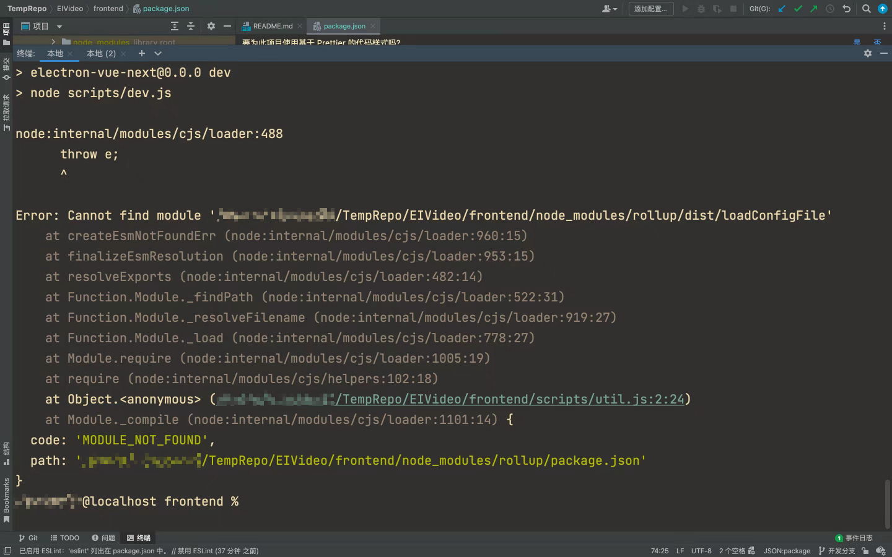
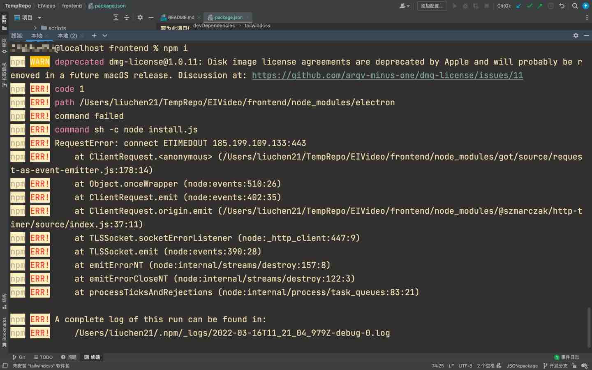
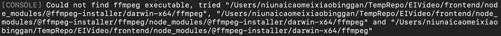

# TempRepo

# 2022年02月26日 - 2022年03月05日

todo: 
目标，完成1.0版本发布

- 前端自动通过 Github 打包形成 exe文件
- 视频打开播放功能
- 标注保存为 json 功能
## 常见问题
1. 上传代码时需要一起上传package-lock.json文件，以锁定版本号。因为库在实时更新，可能下一个版本就会出现兼容性问题，所以必须在锁定时锁定版本号。注意，cnpm不会生成package-lock.json文件
   1. 案例：rollup库出现版本问题，解决方式：用npm i安装完package.json后，卸载rollup，然后再安装指定版本即可。
      
   ```shell
    npm i
    npm uninstall rollup
    npm install rollup@v2.70.0
    ```
2. 安装electron镜像问题报错
    
   ```shell
    npm config set electron_mirror "https://npm.taobao.org/mirrors/electron/"
    ```
3. mac下ffmpeg问题报错
    
    ```shell
   npm install --save @ffprobe-installer/ffprobe
   npm install --save @ffmpeg-installer/ffmpeg
    ```
