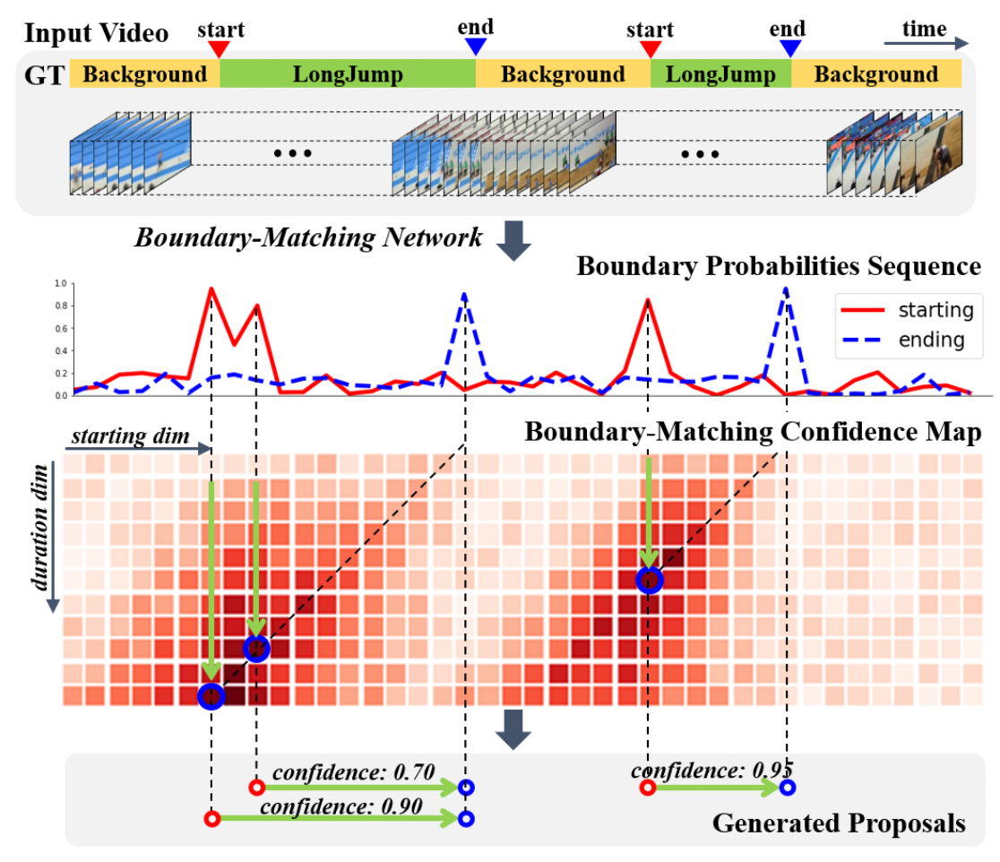

[简体中文 ](../../../zh-CN/model_zoo/localization/bmn.md) | English

# BMN

---
## Contents

- [Introduction](#Introduction)
- [Data](#Data)
- [Train](#Train)
- [Test](#Test)
- [Inference](#Inference)
- [Reference](#Reference)


## Introduction

BMN model contains three modules: Base Module handles the input feature sequence, and out- puts feature sequence shared by the following two modules; Temporal Evaluation Module evaluates starting and ending probabilities of each location in video to generate boundary probability sequences; Proposal Evaluation Module con- tains the BM layer to transfer feature sequence to BM fea- ture map, and contains a series of 3D and 2D convolutional layers to generate BM confidence map.

<p align="center">
 <br />
BMN Overview
</p>


## Data

We use ActivityNet dataset to train this model，data preparation please refer to [ActivityNet dataset](../../dataset/ActivityNet.md).


## Train

You can start training by such command：

```bash
export CUDA_VISIBLE_DEVICES=0,1,2,3

python -B -m paddle.distributed.launch --gpus="0,1,2,3"  --log_dir=log_bmn main.py  --validate -c configs/localization/bmn.yaml
```


## Test

You can start testing by such command：

```bash
python main.py --test -c configs/localization/bmn.yaml -w output/BMN/BMN_epoch_00009.pdparams -o DATASET.test_batch_size=1
```

- For now, we only support testing with **single card** and `batch_size=1`.

-  Please download [activity\_net\_1\_3\_new.json](https://paddlemodels.bj.bcebos.com/video_detection/activity_net_1_3_new.json) label file and specify the path to `METRIC.ground_truth_filename` in config file.

-  Args `-w` is used to specifiy the model path，you can download our model in [BMN.pdparams](https://videotag.bj.bcebos.com/PaddleVideo/BMN/BMN.pdparams)


Test accuracy in ActivityNet1.3:

| AR@1 | AR@5 | AR@10 | AR@100 | AUC |
| :---: | :---: | :---: | :---: | :---: |
| 33.26 | 49.48 | 56.86 | 75.19 | 67.23% |


## Inference

### export inference model

 To get model architecture file `BMN.pdmodel` and parameters file `BMN.pdiparams`, use: 

```bash
python3.7 tools/export_model.py -c configs/localization/bmn.yaml \
                                -p data/BMN.pdparams \
                                -o inference/BMN
```

- Args usage please refer to [Model Inference](https://github.com/PaddlePaddle/PaddleVideo/blob/release/2.0/docs/zh-CN/start.md#2-%E6%A8%A1%E5%9E%8B%E6%8E%A8%E7%90%86).

### infer

```bash
python3.7 tools/predict.py --input_file data/example_feat.list \
                           --config configs/localization/bmn.yaml \
                           --model_file inference/BMN/BMN.pdmodel \
                           --params_file inference/BMN/BMN.pdiparams \
                           --use_gpu=True \
                           --use_tensorrt=False
```

example of logs:

```
BMN Inference results of data/example_feat.npy :
{'score': 0.7968077063560486, 'segment': [0.0, 122.9877]}
{'score': 0.49097609519958496, 'segment': [12.423000000000002, 124.23]}
{'score': 0.21395835280418396, 'segment': [39.7536, 122.9877]}
{'score': 0.2106524258852005, 'segment': [0.0, 109.3224]}
{'score': 0.06876271963119507, 'segment': [23.6037, 114.2916]}
```

Inference results are saved in `data/bmn/BMN_INFERENCE_results`. 

## Reference

- [BMN: Boundary-Matching Network for Temporal Action Proposal Generation](https://arxiv.org/abs/1907.09702), Tianwei Lin, Xiao Liu, Xin Li, Errui Ding, Shilei Wen.
