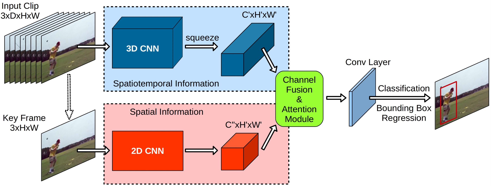
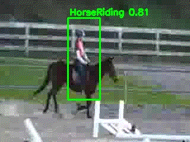

[简体中文](../../../zh-CN/model_zoo/localization/yowo.md) | English

# YOWO

## Content

- [Introduction](#Introduction)
- [Data](#DATA)
- [Train](#Train)
- [Test](#Test)
- [Inference](#Inference)
- [Reference](#Reference)


## Introduction

YOWO is a single-stage network with two branches. One branch extracts spatial features of key frames (i.e., the current frame) via 2D-CNN, while the other branch acquires spatio-temporal features of clips consisting of previous frames via 3D-CNN. To accurately aggregate these features, YOWO uses a channel fusion and attention mechanism that maximizes the inter-channel dependencies. Finally, the fused features are subjected to frame-level detection.


<div align="center">

</div>


## Data

UCF101-24 data download and preparation please refer to [UCF101-24 data preparation](../../dataset/ucf24.md)


## Train

### UCF101-24 data set training

#### Download and add pre-trained models

1. Download the pre-training model [resnext-101-kinetics](https://videotag.bj.bcebos.com/PaddleVideo-release2.3/resnext101_kinetics.pdparams) 和 [darknet](https://videotag.bj.bcebos.com/PaddleVideo-release2.3/darknet.pdparam) as Backbone initialization parameters, or download through the wget command

   ```bash
    wget -nc https://videotag.bj.bcebos.com/PaddleVideo-release2.3/darknet.pdparam
    wget -nc https://videotag.bj.bcebos.com/PaddleVideo-release2.3/resnext101_kinetics.pdparams
   ```

2. Open `PaddleVideo/configs/localization/yowo.yaml`, and fill in the downloaded weight storage path below `pretrained_2d:` and `pretrained_3d:` respectively

    ```yaml
    MODEL:
        framework: "YOWOLocalizer"
        backbone:
            name: "YOWO"
            num_class: 24
            pretrained_2d: fill in the path of 2D pre-training model here
            pretrained_3d: fill in the path of 3D pre-training model here
    ```

#### Start training

- The UCF101-24 data set uses 1 card for training, and the start command of the training method is as follows:

    ```bash
    python3 main.py -c configs/localization/yowo.yaml --validate --seed=1
    ```

- Turn on amp mixed-precision training to speed up the training process. The training start command is as follows:

    ```bash
    python3 main.py --amp -c configs/localization/yowo.yaml --validate --seed=1
    ```

- In addition, you can customize and modify the parameter configuration to achieve the purpose of training/testing on different data sets. It is recommended that the naming method of the configuration file is `model_dataset name_file format_data format_sampling method.yaml` , Please refer to [config](../../tutorials/config.md) for parameter usage.


## Test

- The YOWO model is verified synchronously during training. You can find the keyword `best` in the training log to obtain the model test accuracy. The log example is as follows:

  ```
  Already save the best model (fsocre)0.8779
  ```

- Since the verification index of the YOWO model test mode is **Frame-mAP (@ IoU 0.5)**, which is different from the **fscore** used in the verification mode during the training process, so the verification index recorded in the training log, called `fscore `, does not represent the final test score, so after the training is completed, you can use the test mode to test the best model to obtain the final index, the command is as follows:

  ```bash
  python3 main.py -c configs/localization/yowo.yaml --test --seed=1 -w 'output/YOWO/YOWO_epoch_00005.pdparams'
  ```


  When the test configuration uses the following parameters, the test indicators on the validation data set of UCF101-24 are as follows:


  | Model    | 3D-CNN backbone | 2D-CNN backbone | Dataset  |Input    | Frame-mAP <br>(@ IoU 0.5)    |   checkpoints  |
  | :-----------: | :-----------: | :-----------: | :-----------: | :-----------: | :-----------: | :-----------: |
  | YOWO | 3D-ResNext-101 | Darknet-19 | UCF101-24 | 16-frames, d=1 | 80.94 | [YOWO.pdparams](https://videotag.bj.bcebos.com/PaddleVideo-release2.3/YOWO_epoch_00005.pdparams) |


## Inference

### Export inference model

```bash
python3 tools/export_model.py -c configs/localization/yowo.yaml -p 'output/YOWO/YOWO_epoch_00005.pdparams'
```

The above command will generate the model structure file `YOWO.pdmodel` and the model weight file `YOWO.pdiparams` required for prediction.

- For the meaning of each parameter, please refer to [Model Reasoning Method](../../usage.md#2-infer)

### Use prediction engine inference

```bash
python3 tools/predict.py -c configs/localization/yowo.yaml -i 'data/ucf24/HorseRiding.avi' --model_file ./inference/YOWO.pdmodel --params_file ./inference/YOWO.pdiparams
```

The output example is as follows（Visualization）:

<div align="center">
  
</div>

It can be seen that using the YOWO model trained on UCF101-24 to predict `data/ucf24/HorseRiding.avi`, the category of each frame output is HorseRiding with a confidence level of about 0.80.

## Reference

- [You Only Watch Once: A Unified CNN Architecture for Real-Time Spatiotemporal Action Localization](https://arxiv.org/pdf/1911.06644.pdf), Köpüklü O, Wei X, Rigoll G.