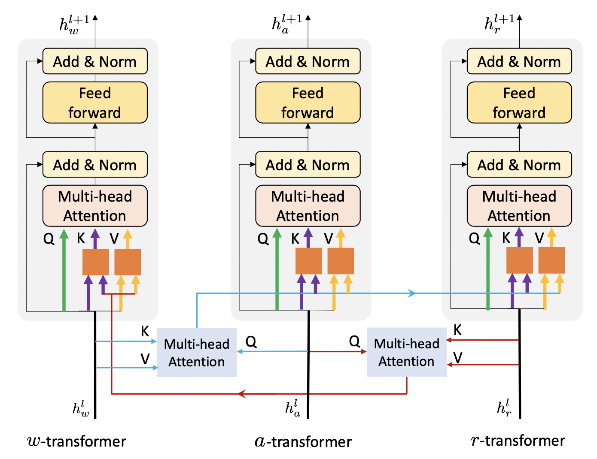

[简体中文](../../../zh-CN/model_zoo/multimodal/actbert.md) | English

# ActBERT

---
## Contents

- [Introduction](#Introduction)
- [Data](#Data)
- [Train](#Train)
- [Test](#Test)
- [Reference](#Reference)

Before getting started, you need to install additional dependencies as follows:
```bash
python -m pip install paddlenlp
python -m pip install lmdb
```

## Introduction

Actbert is proposed by Baidu in CVPR2020 for multimodal pretrain task. It leverage global action information to cat- alyze mutual interactions between linguistic texts and local regional objects.  This method introduce a TaNgled Transformer block (TNT) to encode three sources of information, i.e., global actions, local regional objects, and linguistic descriptions. ActBERT significantly outperforms the state- of-the-art in five downstream video-and-language tasks, i.e., text-video clip retrieval, video captioning, video question answering, action segmentation, and action step localization.

<div align="center">
 <br />
</div>


## Data

Please refer to Kinetics400 data download and preparation doc [HowTo100M-data](../../dataset/howto100m.md)

Please refer to MSR-VTT data download and preparation doc [MSR-VTT-data](../../dataset/umsrvtt.md)


## Train

### Train on HowTo100M

#### download pretrain-model

Please download [bert-base-uncased](https://videotag.bj.bcebos.com/PaddleVideo-release2.2/bert-base-uncased.pdparams) as pretraind model:

```bash
wget https://videotag.bj.bcebos.com/PaddleVideo-release2.2/bert-base-uncased.pdparams
```

and add path to `MODEL.framework.backbone.pretrained` in config file as：

```yaml
MODEL:
    framework: "ActBert"
    backbone:
        name: "BertForMultiModalPreTraining"
        pretrained: your weight path
```

- We provide training option on small data, config file is for reference only.

#### Start training

- Train ActBERT on HowTo100M scripts:

```bash
python3.7 -B -m paddle.distributed.launch --gpus="0,1,2,3,4,5,6,7"  --log_dir=log_actbert  main.py  --validate -c configs/multimodal/actbert/actbert.yaml
```

- AMP is useful for speeding up training:

```bash
export FLAGS_conv_workspace_size_limit=800 #MB
export FLAGS_cudnn_exhaustive_search=1
export FLAGS_cudnn_batchnorm_spatial_persistent=1

python3.7 -B -m paddle.distributed.launch --gpus="0,1,2,3,4,5,6,7"  --log_dir=log_actbert  main.py  --amp --validate -c configs/multimodal/actbert/actbert.yaml
```


## Test

- Evaluation performs on downstream task, i.e. text-video clip retrieval on MSR-VTT dataset, test accuracy can be obtained using scripts:

```bash
python3.7 main.py --test -c configs/multimodal/actbert/actbert_msrvtt.yaml -w Actbert.pdparams
```


Metrics on MSR-VTT:

| R@1 | R@5 | R@10 | Median R | Mean R | checkpoints |
| :------: | :----------: | :----: | :----: | :----: | :----: |
| 8.6 | 31.2 | 45.5 | 13.0 | 28.5 | [ActBERT.pdparams](https://videotag.bj.bcebos.com/PaddleVideo-release2.2/ActBERT.pdparams) |


## Reference

- [ActBERT: Learning Global-Local Video-Text Representations
](https://arxiv.org/abs/2011.07231), Linchao Zhu, Yi Yang
