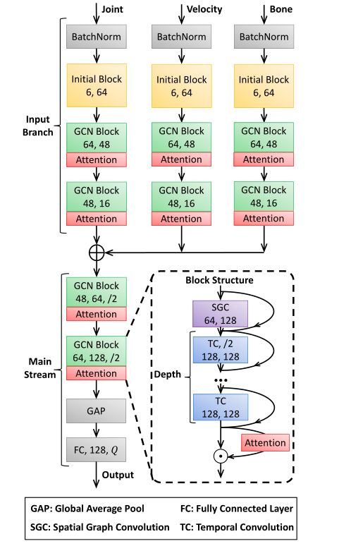

[English](../../../zh-CN/model_zoo/recognition/efficientgcn.md)  | English

# EfficientGCN

---

## Contents

- [Introduction](#Introduction)
- [Data](#Data)
- [Train](#Train)
- [Test](#Test)
- [Inference](#Inference)
- [Reference](#Reference)

## Introduction



[EfficientGCNv1](https://arxiv.org/pdf/2106.15125v2.pdf) a skeleton recognition based network is divided into input branch and main stream. Input branch is used to extract multimodal features of skeleton data. After feature fusion is completed by concat and other operations, the extracted features will be input into the main stream to classify predicted actions.

## Data

Data download and processing are consistent with ST-GCN. For details, please refer to [NTU-RGBD Data Preparation](../../dataset/ntu-rgbd.md)

##Train

### Train on NTU-RGBD

Train EfficientGCNv1 on NTU-RGBD scripts using single gpu：

```bash
# train cross subject
python main.py --validate -c configs/recognition/efficientgcn/efficientgcn2001.yaml --seed 1
# train cross view
python main.py --validate -c configs/recognition/efficientgcn/efficientgcn2002.yaml --seed 1
```

## Test

### Test on NTU-RGBD

config file `configs/recognition/efficientgcn/` corresponding to the config of EfficientGCN on NTU-RGB+D dataset with cross-subject splits.

```bash
# test cross subject
python main.py --test -c configs/recognition/efficientgcn/efficientgcn2001.yaml -w data/efficientgcn2001.pdparams
# test cross view
python main.py --test -c configs/recognition/efficientgcn/efficientgcn2002.yaml -w data/efficientgcn2002.pdparams
```

* Specify the config file with `-c`, specify the weight path with `-w`.

Accuracy on NTU-RGB+D dataset:

|                |  x-sub  |   x-view   |
| :------------: | :---: | :----: |
| EfficientGCNv1 | 90.2% | 94.9% |

Train log：[log](https://github.com/Wuxiao85/paddle_EfficientGCNv/blob/main/workdir/)

checkpoints

|      | x-sub                                                        | x-view                                                        |
| ---- | ------------------------------------------------------------ | ------------------------------------------------------------ |
| download | [x-sub](https://github.com/Wuxiao85/paddle_EfficientGCNv/tree/main/pretrain_model/xsub.pdparams) | [x-view](https://github.com/Wuxiao85/paddle_EfficientGCNv/tree/main/pretrain_model/xsub.pdparams)|

## Inference

### export inference model

```bash
python3.7 tools/export_model.py -c configs/recognition/efficientgcn/efficientgcn2001.yaml \
                                -p data/efficientgcn2001.pdparams \
                                -o inference/efficientgcn2001
```

To get model architecture file `efficientgcn2001.pdmodel` and parameters file `efficientgcn2001.pdiparams`.

- Args usage please refer to [Model Inference](https://github.com/PaddlePaddle/PaddleVideo/blob/release/2.0/docs/zh-CN/start.md#2-%E6%A8%A1%E5%9E%8B%E6%8E%A8%E7%90%86)

### infer

```bash
python3.7 tools/predict.py --input_file data/example_NTU-RGB-D_sketeton.npy \
                           --config configs/recognition/efficientgcn/efficientgcn2001.yaml \
                           --model_file inference/efficientgcn2001/efficientgcn2001.pdmodel \
                           --params_file inference/efficientgcn2001/efficientgcn2001.pdiparams \
                           --use_gpu=True \
                           --use_tensorrt=False
```


## Reference

- [EfficientGCN: Constructing Stronger and Faster Baselines for Skeleton-based Action Recognition ](https://arxiv.org/pdf/2106.15125v2.pdf)
