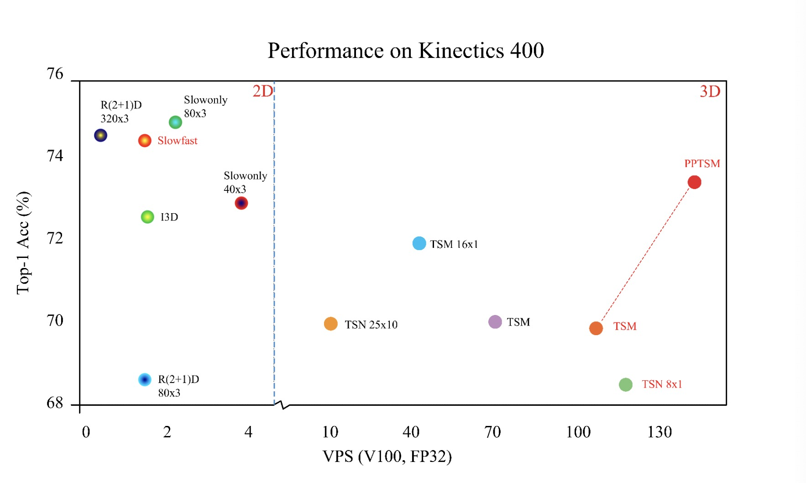

[简体中文](../../../zh-CN/model_zoo/recognition/pp-tsm.md) | English

# PPTSM

---
## Contents

- [Introduction](#Introduction)
- [Data](#Data)
- [Train](#Train)
- [Test](#Test)
- [Inference](#Inference)
- [Reference](#Reference)

## Introduction

We optimized TSM model and proposed **PPTSM** in this paper. Without increasing the number of parameters, the accuracy of TSM was significantly improved in UCF101 and Kinetics-400 datasets. Please refer to [Tricks on ppTSM](../../tutorials/pp-tsm.md) for more details.

<p align="center">
 <br />
PPTSM improvement
</p>

## Data

Please refer to Kinetics400 data download and preparation doc [k400-data](../../dataset/K400.md)

Please refer to UCF101 data download and preparation doc [ucf101-data](../../dataset/ucf101.md)


## Train

### download pretrain-model 

Please download [ResNet50_vd_ssld_v2](https://videotag.bj.bcebos.com/PaddleVideo/PretrainModel/ResNet50_vd_ssld_v2_pretrained.pdparams) as pretraind model: 

```bash
wget https://videotag.bj.bcebos.com/PaddleVideo/PretrainModel/ResNet50_vd_ssld_v2_pretrained.pdparams
```

and add path to `MODEL.framework.backbone.pretrained` in config file as：

```yaml
MODEL:
    framework: "Recognizer2D"
    backbone:
        name: "ResNet"
        pretrained: your weight path
```

### Start training

You can start training with different dataset using different config file. For UCF-101 dataset, we use 4 cards to train:

```bash
python -B -m paddle.distributed.launch --gpus="0,1,2,3"  --log_dir=log_pptsm  main.py  --validate -c configs/recognition/tsm/pptsm.yaml
```

For Kinetics400 dataset， we use 8 cards to train:

```bash
python -B -m paddle.distributed.launch --gpus="0,1,2,3,4,5,6,7"  --log_dir=log_pptsm  main.py  --validate -c configs/recognition/tsm/pptsm_k400.yaml
```

- Args `-c` is used to specify config file.

- For finetune please download our trained model [ppTSM.pdparams](https://videotag.bj.bcebos.com/PaddleVideo/ppTSM/ppTSM.pdparams)，and specify file path with `--weights`.

- For the config file usage，please refer to [config](../../tutorials/config.md).

## Test

```bash
python3 main.py --test -c configs/recognition/tsm/pptsm.yaml -w output/ppTSM/ppTSM_best.pdparams
```

- Download the published model [ppTSM.pdparams](https://videotag.bj.bcebos.com/PaddleVideo/ppTSM/ppTSM.pdparams), then you need to set the `--weights` for model testing


Accuracy on Kinetics400:

| seg\_num | target\_size | Top-1 |
| :------: | :----------: | :----: |
| 8 | 224 | 0.735 |

Accuracy on UCF101：

| seg\_num | target\_size | Top-1 |
| :------: | :----------: | :----: |
| 8 | 224 | 0.8997 |

## Inference

### export inference model

 To get model architecture file `ppTSM.pdmodel` and parameters file `ppTSM.pdiparams`, use: 

```bash
python3 tools/export_model.py -c configs/recognition/tsm/pptsm_k400.yaml \
                              -p output/ppTSM/ppTSM_best.pdparams \
                              -o inference/ppTSM
```

- Args usage please refer to [Model Inference](https://github.com/PaddlePaddle/PaddleVideo/blob/release/2.0/docs/zh-CN/start.md#2-%E6%A8%A1%E5%9E%8B%E6%8E%A8%E7%90%86).

### infer

```bash
python3 tools/predict.py --video_file data/example.avi \
                         --model_file inference/ppTSM/ppTSM.pdmodel \
                         --params_file inference/ppTSM/ppTSM.pdiparams \
                         --use_gpu=True \
                         --use_tensorrt=False
```

example of logs:

```
Current video file: data/example.avi
	top-1 class: 5
	top-1 score: 0.9621570706367493
```

we can get the class name using class id and map file `data/k400/Kinetics-400_label_list.txt`. The top1 prediction of `data/example.avi` is `archery`. 

## Reference

- [TSM: Temporal Shift Module for Efficient Video Understanding](https://arxiv.org/pdf/1811.08383.pdf), Ji Lin, Chuang Gan, Song Han
- [Distilling the Knowledge in a Neural Network](https://arxiv.org/abs/1503.02531), Geoffrey Hinton, Oriol Vinyals, Jeff Dean
