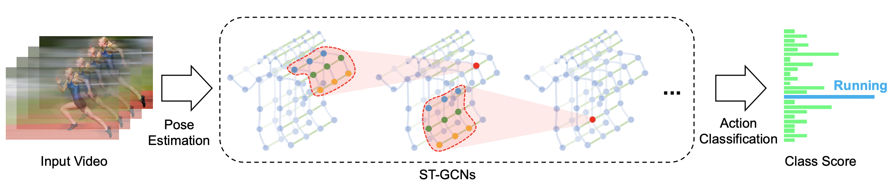

[简体中文](../../../zh-CN/model_zoo/recognition/stgcn.md) | English

# ST-GCN

---
## Contents

- [Introduction](#Introduction)
- [Data](#Data)
- [Train](#Train)
- [Test](#Test)
- [Inference](#Inference)
- [Reference](#Reference)


## Introduction

ST-GCN is skeleton-based action recognition model proposed in AAAI 2018.

<div align="center">
 <br />
</div>


## Data

Please refer to FSD-10 data download and preparation doc [FSD-10](../../dataset/fsd10.md)

Please refer to NTU-RGBD data download and preparation doc [NTU-RGBD](../../dataset/ntu-rgbd.md)


## Train

### Train on FSD-10

- Train ST-GCN on FSD-10 scripts:

```bash
python3.7 main.py -c configs/recognition/stgcn/stgcn_fsd.yaml
```

- Turn off `valid` when training, as validation dataset is not available for the competition.

### Train on NTU-RGBD

- Train ST-GCN on NTU-RGBD scripts:

```bash
python3.7 -B -m paddle.distributed.launch --gpus="0,1,2,3"  --log_dir=log_stgcn  main.py  --validate -c configs/recognition/stgcn/stgcn_ntucs.yaml
```

- config file `stgcn_ntucs.yaml` corresponding to the config of ST-GCN on NTU-RGB+D dataset with cross-subject splits.


## Test

### Test on FSD-10

- Test scripts：

```bash
python3.7 main.py --test -c configs/recognition/stgcn/stgcn_fsd.yaml -w output/STGCN/STGCN_epoch_00030.pdparams
```

- Specify the config file with `-c`, specify the weight path with `-w`.

- Evaluation results will be saved in `submission.csv` file, final score can be obtained in [competition website](https://aistudio.baidu.com/aistudio/competition/detail/115).

Accuracy on FSD-10 dataset:

Test_Data| Top-1 | checkpoints |
| :----: | :----: | :---- |
| Test_A | 86.66 | [STGCN_fsd.pdparams](https://videotag.bj.bcebos.com/PaddleVideo-release2.2/STGCN_fsd.pdparams) |


### Test on NTU-RGB+D

- Test scripts：

```bash
python3.7 main.py --test -c configs/recognition/stgcn/stgcn_ntucs.yaml -w output/STGCN/STGCN_best.pdparams
```

- Specify the config file with `-c`, specify the weight path with `-w`.


Accuracy on NTU-RGB+D dataset:

| split | Top-1 | checkpoints |
| :----: | :----: | :---- |
| cross-subject | 82.28 | [STGCN_ntucs.pdparams](https://videotag.bj.bcebos.com/PaddleVideo-release2.2/STGCN_ntucs.pdparams) |


## Inference

### export inference model

 To get model architecture file `STGCN.pdmodel` and parameters file `STGCN.pdiparams`, use:

```bash
python3.7 tools/export_model.py -c configs/recognition/stgcn/stgcn_fsd.yaml \
                                -p data/STGCN_fsd.pdparams \
                                -o inference/STGCN
```

- Args usage please refer to [Model Inference](https://github.com/PaddlePaddle/PaddleVideo/blob/release/2.0/docs/zh-CN/start.md#2-%E6%A8%A1%E5%9E%8B%E6%8E%A8%E7%90%86).

### infer

```bash
python3.7 tools/predict.py --input_file data/fsd10/example_skeleton.npy \
                           --config configs/recognition/stgcn/stgcn_fsd.yaml \
                           --model_file inference/STGCN/STGCN.pdmodel \
                           --params_file inference/STGCN/STGCN.pdiparams \
                           --use_gpu=True \
                           --use_tensorrt=False
```

example of logs:

```
Current video file: data/fsd10/example_skeleton.npy
        top-1 class: 0
        top-1 score: 0.9847044944763184
```

## Reference

- [Spatial Temporal Graph Convolutional Networks for Skeleton-Based Action Recognition](https://arxiv.org/abs/1801.07455), Sijie Yan, Yuanjun Xiong, Dahua Lin
