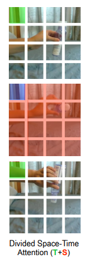

[简体中文](../../../zh-CN/model_zoo/recognition/timesformer.md) | English

# TimeSformer

## Content

- [Introduction](#Introduction)
- [Data](#DATA)
- [Train](#Train)
- [Test](#Test)
- [Inference](#Inference)
- [Reference](#Reference)


## Introduction

TimeSformer is a video classification model based on vision transformer, which has the characteristics of no convolution, global receptive field, and strong time series modeling ability. At present, it has achieved SOTA accuracy on the Kinetics-400 data set, surpassing the classic CNN-based video classification models TSN, TSM and Slowfast, and has a shorter training time (the Kinetics-400 data set training time is 39 hourss). **This code implements the time-space separated attention cascade network in the paper**.

<div align="center">

</div>


## Data

K400 data download and preparation please refer to [Kinetics-400 data preparation](../../dataset/k400.md)

UCF101 data download and preparation please refer to [UCF-101 data preparation](../../dataset/ucf101.md)


## Train

### Kinetics-400 data set training

#### Download and add pre-trained models

1. Download the image pre-training model [ViT_base_patch16_224](https://paddle-imagenet-models-name.bj.bcebos.com/dygraph/ViT_base_patch16_224_pretrained.pdparams) as Backbone initialization parameters, or download through the wget command

   ```bash
   wget https://paddle-imagenet-models-name.bj.bcebos.com/dygraph/ViT_base_patch16_224_pretrained.pdparams
   ```

2. Open `PaddleVideo/configs/recognition/timesformer/timesformer_k400_videos.yaml`, and fill in the downloaded weight storage path below `pretrained:`

    ```yaml
    MODEL:
        framework: "RecognizerTransformer"
        backbone:
            name: "VisionTransformer"
            pretrained: fill in the path here
    ```

#### Start training

- The Kinetics400 data set uses 8 cards for training, and the start command of the training method is as follows:

```bash
# videos data format
python3.7 -B -m paddle.distributed.launch --gpus="0,1,2,3,4,5,6,7" --log_dir=log_timesformer main.py --validate -c configs/recognition/ timesformer/timesformer_k400_videos.yaml
```

- Turn on amp mixed-precision training to speed up the training process. The training start command is as follows:

```bash
export FLAGS_conv_workspace_size_limit=800 # MB
export FLAGS_cudnn_exhaustive_search=1
export FLAGS_cudnn_batchnorm_spatial_persistent=1
# videos data format
python3.7 -B -m paddle.distributed.launch --gpus="0,1,2,3,4,5,6,7" --log_dir=log_timesformer main.py --amp --validate -c configs/recognition/ timesformer/timesformer_k400_videos.yaml
```

- In addition, you can customize and modify the parameter configuration to achieve the purpose of training/testing on different data sets. It is recommended that the naming method of the configuration file is `model_dataset name_file format_data format_sampling method.yaml` , Please refer to [config](../../tutorials/config.md) for parameter usage.


## Test

- The TimeSformer model is verified synchronously during training. You can find the keyword `best` in the training log to obtain the model test accuracy. The log example is as follows:

  ```
  Already save the best model (top1 acc)0.7258
  ```

- Since the sampling method of the TimeSformer model test mode is **UniformCrop** with a slower speed but higher accuracy, which is different from the **RandomCrop** used in the verification mode during the training process, so the verification index recorded in the training log is `topk Acc `Does not represent the final test score, so after the training is completed, you can use the test mode to test the best model to obtain the final index, the command is as follows:

  ```bash
  python3.7 -B -m paddle.distributed.launch --gpus="0,1,2,3,4,5,6,7" --log_dir=log_timesformer main.py --test -c configs/recognition/ timesformer/timesformer_k400_videos.yaml -w "output/TimeSformer/TimeSformer_best.pdparams"
  ```


  When the test configuration uses the following parameters, the test indicators on the validation data set of Kinetics-400 are as follows:
  

  | backbone | Sampling method | num_seg | target_size | Top-1 | checkpoints |
  | :----------------: | :-----: | :-----: | :---------: | :----: | :----------------------------------------------------------: |
  | Vision Transformer | UniformCrop | 8 | 224 | 77.29 | [TimeSformer_k400.pdparams](https://videotag.bj.bcebos.com/PaddleVideo-release2.2/TimeSformer_k400.pdparams) |


- During the test, the TimeSformer video sampling strategy is to use Linspace sampling: in time sequence, num_seg sparse sampling points are uniformly generated from the video sequence to be sampled; in space, select the two ends of the long side and the middle position (left middle right or top middle bottom) 3 regions are sampled. A total of 1 clip is sampled for 1 video.

## Inference

### Export inference model

```bash
python3.7 tools/export_model.py -c configs/recognition/timesformer/timesformer_k400_videos.yaml \
                                -p data/TimeSformer_k400.pdparams \
                                -o inference/TimeSformer
```

The above command will generate the model structure file `TimeSformer.pdmodel` and the model weight file `TimeSformer.pdiparams` required for prediction.

- For the meaning of each parameter, please refer to [Model Reasoning Method](../../start.md#2-infer)

### Use prediction engine inference

```bash
python3.7 tools/predict.py --input_file data/example.avi \
                           --config configs/recognition/timesformer/timesformer_k400_videos.yaml \
                           --model_file inference/TimeSformer/TimeSformer.pdmodel \
                           --params_file inference/TimeSformer/TimeSformer.pdiparams \
                           --use_gpu=True \
                           --use_tensorrt=False
```

The output example is as follows:

```
Current video file: data/example.avi
    top-1 class: 5
    top-1 score: 0.9999722242355347
```

It can be seen that using the TimeSformer model trained on Kinetics-400 to predict `data/example.avi`, the output top1 category id is `5`, and the confidence is 0.99. By consulting the category id and name correspondence table `data/k400/Kinetics-400_label_list.txt`, it can be seen that the predicted category name is `archery`.

## Reference

- [Is Space-Time Attention All You Need for Video Understanding?](https://arxiv.org/pdf/2102.05095.pdf), Gedas Bertasius, Heng Wang, Lorenzo Torresani
