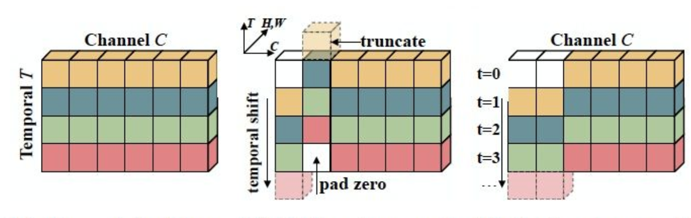

[简体中文](../../../zh-CN/model_zoo/recognition/tsm.md) | English

# TSM

---
## Contents

- [Introduction](#Introduction)
- [Data](#Data)
- [Train](#Train)
- [Test](#Test)
- [Inference](#Inference)
- [Reference](#Reference)


## Introduction

Temporal Shift Module (TSM) is a popular model that attracts more attention at present. 
The method of moving through channels greatly improves the utilization ability of temporal information without increasing any additional number of parameters and calculation amount. 
Moreover, due to its lightweight and efficient characteristics, it is very suitable for industrial landing.

<div align="center">
 <br />
</div>

This code implemented single RGB stream of TSM networks. Backbone is ResNet-50.

Please refer to the ICCV 2019 paper for details [TSM: Temporal Shift Module for Efficient Video Understanding](https://arxiv.org/pdf/1811.08383.pdf)

## Data

Please refer to K400 data download and preparation [k400 data preparation](../../dataset/K400.md)

Please refer to UCF101 data download and preparation [ucf101 data preparation](../../dataset/ucf101.md)


## Train

### download pretrain-model

- Please download [ResNet50_pretrain.pdparams](https://videotag.bj.bcebos.com/PaddleVideo/PretrainModel/ResNet50_pretrain.pdparams) as pretraind model:

```bash
wget https://videotag.bj.bcebos.com/PaddleVideo/PretrainModel/ResNet50_vd_ssld_v2_pretrained.pdparams
```

and add path to MODEL.framework.backbone.pretrained in config file as：
```yaml
MODEL:
    framework: "Recognizer2D"
    backbone:
        name: "ResNet"
        pretrained: your weight path
```

### Start training

You can start training with different dataset using different config file. For UCF-101 dataset, we use 4 cards to train:

```bash
python -B -m paddle.distributed.launch --gpus="0,1,2,3"  --log_dir=log_tsm  main.py  --validate -c configs/recognition/tsm/tsm.yaml
```

- Args -c is used to specify config file.

- For finetune please download our trained model [TSM.pdparams]()<sup>coming soon</sup>，and specify file path with --weights.

- For the config file usage，please refer to [config](../../tutorials/config.md).

## Test

```bash
python3 main.py --test -c configs/recognition/tsm/tsm.yaml -w output/TSM/TSM_best.pdparams
```

- Download the published model [TSM.pdparams]()<sup>coming soon</sup>, then you need to set the `--weights` for model testing


Accuracy on Kinetics400:

| seg\_num | target\_size | Top-1 |
| :------: | :----------: | :----: |
| 8 | 224 | 0.70 |

## Inference

### export inference model

 To get model architecture file `TSM.pdmodel` and parameters file `TSM.pdiparams`, use: 

```bash
python3 tools/export_model.py -c configs/recognition/tsm/tsm.yaml \
                              -p output/TSM/TSM_best.pdparams \
                              -o inference/TSM
```

- Args usage please refer to [Model Inference](https://github.com/PaddlePaddle/PaddleVideo/blob/release/2.0/docs/zh-CN/start.md#2-%E6%A8%A1%E5%9E%8B%E6%8E%A8%E7%90%86).

### infer

```bash
python3 tools/predict.py --video_file data/example.avi \
                         --model_file inference/TSM/TSM.pdmodel \
                         --params_file inference/TSM/TSM.pdiparams \
                         --use_gpu=True \
                         --use_tensorrt=False
```

## Reference

- [TSM: Temporal Shift Module for Efficient Video Understanding](https://arxiv.org/pdf/1811.08383.pdf), Ji Lin, Chuang Gan, Song Han
