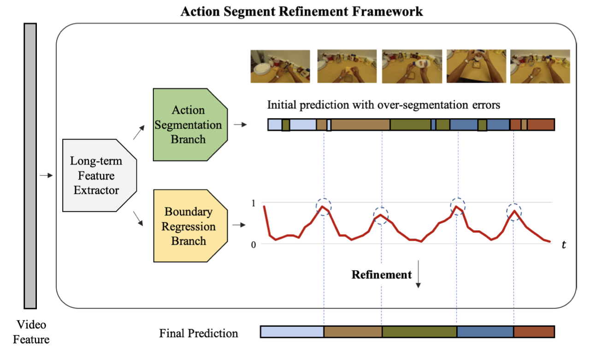

[简体中文](../../../zh-CN/model_zoo/segmentation/asrf.md) | English

# ASRF : Video Action Segmentation Model

---
## Contents

- [Introduction](#Introduction)
- [Data](#Data)
- [Train](#Train)
- [Test](#Test)
- [Inference](#Inference)
- [Reference](#Reference)

## Introduction

ASRF model is an improvement on the video motion segmentation model ms-tcn, which was published on WACV in 2021. We reproduce the officially implemented pytorch code and obtain approximate results in paddlevideo.

<p align="center">
 <br />
MS-TCN Overview
</p>

## Data

ASRF can choose 50salads, breakfast, gtea as trianing set. Please refer to Video Action Segmentation dataset download and preparation doc [Video Action Segmentation dataset](../../dataset/SegmentationDataset.md)

Unlike MS-TCN, ASRF model requires additional data construction. The script process is as follows
```bash
python data/50salads/prepare_asrf_data.py --dataset_dir data/
```

## Train

After prepare dataset, we can run sprits.

```bash
# gtea dataset
export CUDA_VISIBLE_DEVICES=3
python3.7 main.py  --validate -c configs/segmentation/asrf/asrf_gtea.yaml
```

- Start the training by using the above command line or script program. There is no need to use the pre training model. The video action segmentation model is usually a full convolution network. Due to the different lengths of videos, the `DATASET.batch_size` of the video action segmentation model is usually set to `1`, that is, batch training is not required. At present, only **single sample** training is supported.

## Test

Test MS-TCN on dataset scripts:

```bash
python main.py  --test -c configs/segmentation/asrf/asrf_gtea.yaml --weights=./output/ASRF/ASRF_split_1.pdparams
```

- The specific implementation of the index is to calculate ACC, edit and F1 scores by referring to the test script[evel.py](https://github.com/yabufarha/ms-tcn/blob/master/eval.py) provided by the author of ms-tcn.

The reproduction of pytorch comes from the official [code base](https://github.com/yiskw713/asrf)

- The evaluation method of data set adopts the folding verification method in ms-tcn paper, and the division method of folding is the same as that in ms-tcn paper.

Accuracy on Breakfast dataset(4 folding verification):

| Model | Acc | Edit | F1@0.1 | F1@0.25 | F1@0.5 |
| :---: | :---: | :---: | :---: | :---: | :---: |
| paper | 67.6% | 72.4% | 74.3% | 68.9% | 56.1% |
| pytorch | 65.8% | 71.0% | 72.3% | 66.5% | 54.9% |
| paddle | 66.1% | 71.9% | 73.3% | 67.9% | 55.7% |

Accuracy on 50salads dataset(5 folding verification):

| Model | Acc | Edit | F1@0.1 | F1@0.25 | F1@0.5 |
| :---: | :---: | :---: | :---: | :---: | :---: |
| paper | 84.5% | 79.3% | 82.9% | 83.5% | 77.3% |
| pytorch | 81.4% | 75.6% | 82.7% | 81.2% | 77.2% |
| paddle | 81.6% | 75.8% | 83.0% | 81.5% | 74.8% |

Accuracy on gtea dataset(4 folding verification):

| Model | Acc | Edit | F1@0.1 | F1@0.25 | F1@0.5 |
| :---: | :---: | :---: | :---: | :---: | :---: |
| paper | 77.3% | 83.7% | 89.4% | 87.8% | 79.8% |
| pytorch | 76.3% | 79.6% | 87.3% | 85.8% | 74.9% |
| paddle | 77.1% | 83.3% | 88.9% | 87.5% | 79.1% |

Model weight for gtea
Test_Data| F1@0.5 | checkpoints |
| :----: | :----: | :---- |
| gtea_split1 | 72.4409 | [ASRF_gtea_split_1.pdparams](https://videotag.bj.bcebos.com/PaddleVideo-release2.2/ASRF_gtea_split_1.pdparams) |
| gtea_split2 | 76.6666 | [ASRF_gtea_split_2.pdparams](https://videotag.bj.bcebos.com/PaddleVideo-release2.2/ASRF_gtea_split_2.pdparams) |
| gtea_split3 | 84.5528 | [ASRF_gtea_split_3.pdparams](https://videotag.bj.bcebos.com/PaddleVideo-release2.2/ASRF_gtea_split_3.pdparams) |
| gtea_split4 | 82.6771 | [ASRF_gtea_split_4.pdparams](https://videotag.bj.bcebos.com/PaddleVideo-release2.2/ASRF_gtea_split_4.pdparams) |
## Infer

### export inference model

```bash
python3.7 tools/export_model.py -c configs/segmentation/asrf/asrf_gtea.yaml \
                                -p data/ASRF_gtea_split_1.pdparams \
                                -o inference/ASRF
```

To get model architecture file `ASRF.pdmodel` and parameters file `ASRF.pdiparams`, use:

- Args usage please refer to [Model Inference](https://github.com/PaddlePaddle/PaddleVideo/blob/release/2.0/docs/zh-CN/start.md#2-%E6%A8%A1%E5%9E%8B%E6%8E%A8%E7%90%86).

### infer

Input file are the file list for infering, for example:
```
S1_Cheese_C1.npy
S1_CofHoney_C1.npy
S1_Coffee_C1.npy
S1_Hotdog_C1.npy
...
```

```bash
python3.7 tools/predict.py --input_file data/gtea/splits/test.split1.bundle \
                           --config configs/segmentation/asrf/asrf_gtea.yaml \
                           --model_file inference/ASRF/ASRF.pdmodel \
                           --params_file inference/ASRF/ASRF.pdiparams \
                           --use_gpu=True \
                           --use_tensorrt=False
```

example of logs:

```bash
result write in : ./inference/infer_results/S1_Cheese_C1.txt
result write in : ./inference/infer_results/S1_CofHoney_C1.txt
result write in : ./inference/infer_results/S1_Coffee_C1.txt
result write in : ./inference/infer_results/S1_Hotdog_C1.txt
result write in : ./inference/infer_results/S1_Pealate_C1.txt
result write in : ./inference/infer_results/S1_Peanut_C1.txt
result write in : ./inference/infer_results/S1_Tea_C1.txt
```


## Reference

- [Alleviating Over-segmentation Errors by Detecting Action Boundaries](https://arxiv.org/pdf/2007.06866v1.pdf), Yuchi Ishikawa, Seito Kasai, Yoshimitsu Aoki, Hirokatsu Kataoka
