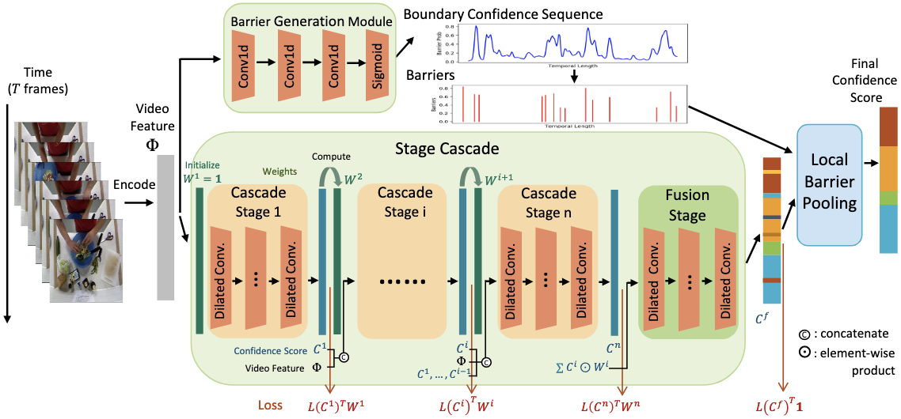
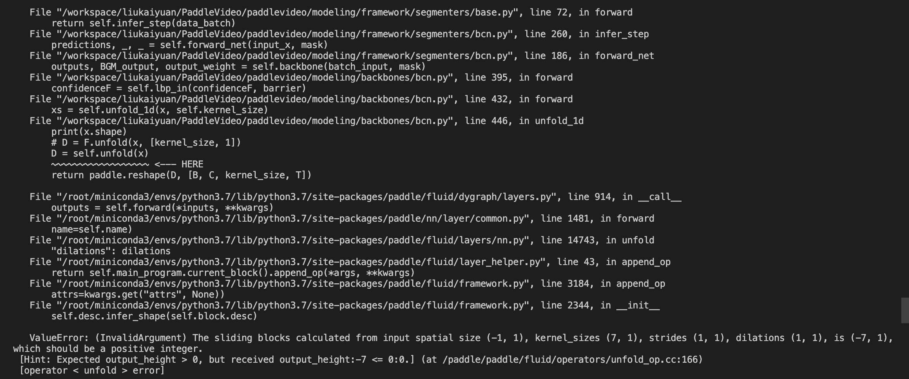

[简体中文](../../../zh-CN/model_zoo/segmentation/bcn.md) | English

# BCN Video action segmentation model

---
## Contents

- [Introduction](#Introduction)
- [Data](#Data)
- [Train&Test](#Train&Test)
- [Inference](#Inference)
- [Reference](#Reference)

## Introduction

BCN model is an improvement on the video motion segmentation model ms-tcn, which was published on WACV in 2021. We reproduce the officially implemented pytorch code and obtain approximate results in paddlevideo.


<p align="center">
 <br />
BCN Overview
</p>

## Data

BCN can choose 50salads, breakfast, GTEA as trianing set. Please refer to Video Action Segmentation dataset download and preparation doc [Video Action Segmentation dataset](../../dataset/SegmentationDataset.md)

## Train&Test

BCN is a two-stage model that requires the barrier Generation Module (BGM) to be trained first, and then the BGM and the main model to be trained together.

All the following **DS** is **breakfast, 50salads or gtea**, and **SP** is the split number **1-5** for 50salads and **1-4** for the other two datasets.
e.g.
```bash
python main.py --validate -c configs/segmentation/bcn/bgm/[DS]/full/split[SP].yaml
```
Can be replaced with:
```bash
python main.py --validate -c configs/segmentation/bcn/bgm/gtea/full/split1.yaml
```

### 1. Train and test the full-resolution barrier generation module

```bash
export CUDA_VISIBLE_DEVICES=3
python main.py --validate -c configs/segmentation/bcn/bgm/[DS]/full/split[SP].yaml
python main.py --test  -c configs/segmentation/bcn/bgm/[DS]/full/split[SP].yaml \
                       -w output/BCN/[DS]/split[SP]/BcnBgmFull/BcnBgmFull_epoch_00001.pdparams
```

### 2. Train and test the resized-resolution barrier generation module

```bash
export CUDA_VISIBLE_DEVICES=3
python main.py --validate -c configs/segmentation/bcn/bgm/[DS]/resized/split[SP].yaml
python main.py --test  -c configs/segmentation/bcn/bgm/[DS]/resized/split[SP].yaml \
                       -w output/BCN/[DS]/split[SP]/BcnBgmResized/BcnBgmResized_epoch_00001.pdparams
```

### 3. Train and test the BCN

```bash
export CUDA_VISIBLE_DEVICES=3
python3.7 main.py --validate  -c configs/segmentation/bcn/model/[DS]/split[SP].yaml
python3.7 main.py --test  -c configs/segmentation/bcn/model/[DS]/split[SP].yaml \
                          -w output/BCN/[DS]/split[SP]/BcnModel/BcnModel_epoch_00001.pdparams
```

The results of the measurement are saved in:
```
output/BCN/[DS]/split[SP]/BcnModel/metric.csv
```

### Results in paddle

- Start the training by using the above command line or script program. There is no need to use the pre training model. The video action segmentation model is usually a full convolution network. Due to the different lengths of videos, the `DATASET.batch_size` of the video action segmentation model is usually set to `1`, that is, batch training is not required. At present, only **single sample** training is supported.

- The reproduction of pytorch comes from the official [code base](https://github.com/MCG-NJU/BCN)

Metrics on Breakfast dataset:

| Model | Acc | Edit | F1@0.1 | F1@0.25 | F1@0.5 |
| :---: | :---: | :---: | :---: | :---: | :---: |
| paper | 70.4% | 66.2% | 68.7% | 65.5% | 55.0% |
| pytorch | 70.9% | 66.7% | 68.5% | 65.9% | 55.8% |
| paddle | 70.8% | 66.4% | 68.9% | 65.9% | 56.0% |

Metrics on 50salads dataset:

| Model | Acc | Edit | F1@0.1 | F1@0.25 | F1@0.5 |
| :---: | :---: | :---: | :---: | :---: | :---: |
| paper | 84.4% | 74.3% | 82.1% | 81.3% | 74.0% |
| pytorch | 84.5% | 76.8% | 83.3% | 81.3% | 73.5% |
| paddle | 85.0% | 75.4% | 83.0% | 81.5% | 73.8% |

Metrics on gtea dataset:

| Model | Acc | Edit | F1@0.1 | F1@0.25 | F1@0.5 |
| :---: | :---: | :---: | :---: | :---: | :---: |
| paper | 79.8% | 84.4% | 88.5% | 87.1% | 77.3% |
| pytorch | 78.8% | 82.8% | 87.3% | 85.0% | 75.1% |
| paddle | 78.9% | 82.6% | 88.9% | 86.4% | 73.8% |


## Inference

### 1. Export inference full-resolution barrier generation module

```bash
python3.7 tools/export_model.py \
    -c configs/segmentation/bcn/bgm/[DS]/full/split[SP].yaml \
    --p output/BCN/[DS]/split[SP]/BcnBgmFull/BcnBgmFull_best.pdparams \
    -o ./inference
```

### 2. Infer, taking gtea/ Features/s1_cheese_C1.npy as an example

```bash
python3.7 tools/predict.py --input_file data/gtea/features/S1_Cheese_C1.npy  
                           --config configs/segmentation/bcn/bgm/gtea/full/split1.yaml  
                           --model_file inference/BcnBgmFull.pdmodel  
                           --params_file inference/BcnBgmFull.pdiparams                            --use_gpu=True  
                           --use_tensorrt=False
```

### 3. Export inference resized-resolution barrier generation module

```bash
python3.7 tools/export_model.py \
    -c configs/segmentation/bcn/bgm/[DS]/resized/split[SP].yaml \
    --p output/BCN/[DS]/split[SP]/BcnBgmResized/BcnBgmResized_best.pdparams \
    -o ./inference
```

### 4. Infer, taking gtea/ Features/s1_cheese_C1.npy as an example

```bash
python3.7 tools/predict.py --input_file data/gtea/features/S1_Cheese_C1.npy  
                           --config configs/segmentation/bcn/bgm/gtea/resized/split1.yaml  
                           --model_file inference/BcnBgmResized.pdmodel  
                           --params_file inference/BcnBgmResized.pdiparams                            --use_gpu=True  
                           --use_tensorrt=False
```

### 5. Export inference bcn model

None

Since BCN uses the Unfold function, when generating the static model, the input will contain the variable dimension -1. Unfold is temporarily unable to process the input that contains -1 from Shape.

<p align="center">
 <br />
BCN Error
</p>

- Args usage please refer to [Model Inference](https://github.com/PaddlePaddle/PaddleVideo/blob/release/2.0/docs/zh-CN/start.md#2-%E6%A8%A1%E5%9E%8B%E6%8E%A8%E7%90%86).

## Reference

- [Boundary-Aware Cascade Networks for Temporal Action Segmentation](https://github.com/MCG-NJU/BCN/blob/master/demo/ECCV20-BCN.pdf), Zhenzhi Wang, Ziteng Gao, Limin Wang, Zhifeng Li, Gangshan Wu
