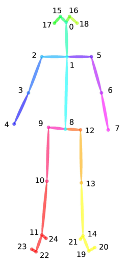

[English]() | 简体中文

# FSD-10 数据准备

- [数据集介绍](#数据集介绍)
- [数据下载](#数据下载)
- [参考文献](#参考文献)

---


## 数据集介绍

数据集Figure Skating Dataset (FSD-10)旨在通过花样滑冰研究人体的运动。在花样滑冰运动中，人体姿态和运动轨迹相较于其他运动呈现复杂性强、类别多的特点，有助于细粒度图深度学习新模型、新任务的研究。


在FSD-10 中，所有的视频素材从2017 到2018 年的花样滑冰锦标赛中采集。源视频素材中视频的帧率被统一标准化至每秒30 帧，并且图像大小是1080 * 720 来保证数据集的相对一致性。之后我们通过2D姿态估计算法Open Pose对视频进行逐帧骨骼点提取，最后以.npy格式保存数据集。

训练数据集与测试数据集的目录结构如下所示：

```txt
train_data.npy        # 1400
train_label.npy       # 1400
test_A_data.npy       # 300
test_B_data.npy       # 300
```

其中train_label.npy通过np.load()读取后会得到一个一维张量，每一个元素为一个值在0-9之间的整形变量代表动作的标签；data.npy文件通过np.load()读取后，会得到一个形状为N×C×T×V×M的五维张量，每个维度的具体含义如下：

| 维度符号 | 维度值大小 | 维度含义	| 补充说明 | 
| :---- | :----: | :----: | :---- |
| N	| 样本数	| 代表N个样本 | 	无 |
| C | 3	| 分别代表每个关节点的x, y坐标和置信度 |	每个x，y均被放缩至-1到1之间 |
| T	| 1500 |	代表动作的持续时间长度，共有1500帧	| 有的动作的实际长度可能不足1500，例如可能只有500的有效帧数，我们在其后重复补充0直到1500帧，来保证T维度的统一性 |
| V |	25 |	代表25个关节点 |	具体关节点的含义可看下方的骨架示例图 |
| M |	1	| 代表1个运动员个数	| 无 |

骨架示例图：


<div align="left">
  <br>
</div>


## 数据下载

数据集即将开放下载~

> 由于版权原因，RGB数据暂不开放。

## 参考文献

- [FSD-10: A Dataset for Competitive Sports Content Analysis](https://arxiv.org/abs/2002.03312), Shenlan Liu, Xiang Liu, Gao Huang, Lin Feng.


