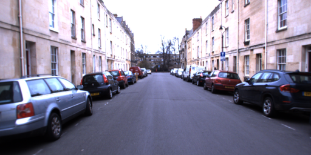

[English](../../../en/model_zoo/estimation/adds.md) | 简体中文

# ADDS-DepthNet模型

## 内容

- [模型简介](#模型简介)
- [数据准备](#数据准备)
- [模型训练](#模型训练)
- [模型测试](#模型测试)
- [模型推理](#模型推理)
- [参考论文](#参考论文)

在开始使用之前，您需要按照以下命令安装额外的依赖包：
```bash
python -m pip install scikit-image
python -m pip install matplotlib
```

## 模型简介

本模型以百度机器人与自动驾驶实验室的**ICCV 2021论文 [Self-supervised Monocular Depth Estimation for All Day Images using Domain Separation](https://arxiv.org/abs/2108.07628)** 为参考，
复现了基于白天和夜晚图像的自监督单目深度估计模型，其利用了白天和夜晚的图像数据互补性质，减缓了昼夜图像较大的域偏移以及照明变化对深度估计的精度带来的影响，在具有挑战性的牛津RobotCar数据集上实现了全天图像的最先进的深度估计结果。


## 数据准备

Oxford RobotCar dataset数据下载及准备请参考[Oxford RobotCar dataset数据准备](../../dataset/Oxford_RobotCar.md)


## 模型训练

### Oxford RobotCar dataset数据集训练

#### 下载并添加预训练模型

1. 下载图像预训练模型[resnet18.pdparams](https://videotag.bj.bcebos.com/PaddleVideo-release2.2/Resnet18_Imagenet.pdparams)作为Backbone初始化参数，或通过wget命令下载

   ```bash
   wget -P ./data https://videotag.bj.bcebos.com/PaddleVideo-release2.2/Resnet18_Imagenet.pdparams
   ```

2. 打开`PaddleVideo/configs/estimation/adds/adds.yaml`，将下载好的权重存放路径填写到下方`pretrained:`之后

    ```yaml
    MODEL: #MODEL field
        framework: "DepthEstimator" #Mandatory, indicate the type of network, associate to the 'paddlevideo/modeling/framework/' .
        backbone: #Mandatory, indicate the type of backbone, associate to the 'paddlevideo/modeling/backbones/' .
            name: 'ADDS_DepthNet'
            pretrained: 将路径填写到此处
    ```

#### 开始训练

- Oxford RobotCar dataset数据集使用单卡训练，训练方式的启动命令如下：

    ```bash
    python3.7 main.py --validate -c configs/estimation/adds/adds.yaml --seed 20
    ```


## 模型测试

- ADDS-DepthNet模型在训练时同步进行验证（只对白天或者夜晚的数据进行验证），您可以通过在训练日志中查找关键字`best`获取模型测试精度，日志示例如下:

  ```bash
  Already save the best model (rmse)8.5531
  ```

- 由于模型暂时一次只能测试yaml文件中给定路径的一个白天或者夜晚的数据集，因此若要得到本文档开头处的完整测试分数，需要运行4次测试命令并分别记录下它们的指标（白天40m、白天60m、夜晚40m、夜晚60m）

- 训练好的模型下载地址：[ADDS_car.pdparams](https://videotag.bj.bcebos.com/PaddleVideo-release2.2/ADDS_car.pdparams)

- 测试命令如下：

  ```bash
  # 夜晚40m
  python3.7 main.py --test -c configs/estimation/adds/adds.yaml -w "output/ADDS/ADDS_best.pdparams" -o DATASET.test.file_path="data/oxford/splits/oxford_day/val_night_files.txt" -o MODEL.head.max_gt_depth=40

  # 夜晚60m
  python3.7 main.py --test -c configs/estimation/adds/adds.yaml -w "output/ADDS/ADDS_best.pdparams" -o DATASET.test.file_path="data/oxford/splits/oxford_day/val_night_files.txt" -o MODEL.head.max_gt_depth=60

  # 白天40m
  python3.7 main.py --test -c configs/estimation/adds/adds.yaml -w "output/ADDS/ADDS_best.pdparams" -o DATASET.test.file_path="data/oxford/splits/oxford_day/val_day_files.txt" -o MODEL.head.max_gt_depth=40

  # 白天60m
  python3.7 main.py --test -c configs/estimation/adds/adds.yaml -w "output/ADDS/ADDS_best.pdparams" -o DATASET.test.file_path="data/oxford/splits/oxford_day/val_day_files.txt" -o MODEL.head.max_gt_depth=60
  ```

    在Oxford RobotCar dataset的validation数据集上的测试指标如下：

  | version     | Max Depth | Abs Rel | Sq Rel | RMSE  | RMSE log |  |  |  |
  | ----------- | --------- | ------- | ------ | ----- | -------- | ----------------- | ------------------- | ------------------- |
  | ours(night) | 40        | 0.209   | 1.741  | 6.031 | 0.243    | 0.708             | 0.923               | 0.975               |
  | ours(night) | 60        | 0.207   | 2.052  | 7.888 | 0.258    | 0.686             | 0.909               | 0.970               |
  | ours(day)   | 40        | 0.114   | 0.574  | 3.411 | 0.157    | 0.860             | 0.977               | 0.993               |
  | ours(day)   | 60        | 0.119   | 0.793  | 4.842 | 0.173    | 0.838             | 0.967               | 0.991               |

## 模型推理

### 导出inference模型

```bash
python3.7 tools/export_model.py -c configs/estimation/adds/adds.yaml -p data/ADDS_car.pdparams -o inference/ADDS
```

上述命令将生成预测所需的模型结构文件`ADDS.pdmodel`和模型权重文件`ADDS.pdiparams`以及`ADDS.pdiparams.info`文件，均存放在`inference/ADDS/`目录下

上述bash命令中各个参数含义可参考[模型推理方法](https://github.com/PaddlePaddle/PaddleVideo/blob/release/2.0/docs/zh-CN/start.md#2-%E6%A8%A1%E5%9E%8B%E6%8E%A8%E7%90%86)

### 使用预测引擎推理

```bash
python3.7 tools/predict.py --input_file data/example.png \
                           --config configs/estimation/adds/adds.yaml \
                           --model_file inference/ADDS/ADDS.pdmodel \
                           --params_file inference/ADDS/ADDS.pdiparams \
                           --use_gpu=True \
                           --use_tensorrt=False
```

推理结束会默认以伪彩的方式保存下模型估计出的深度图。

以下是样例图片和对应的预测深度图：




## 参考论文

- [Self-supervised Monocular Depth Estimation for All Day Images using Domain Separation](https://arxiv.org/abs/2108.07628), Liu, Lina and Song, Xibin and Wang, Mengmeng and Liu, Yong and Zhang, Liangjun
