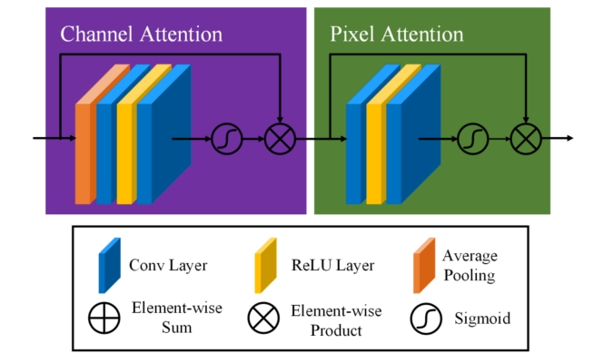
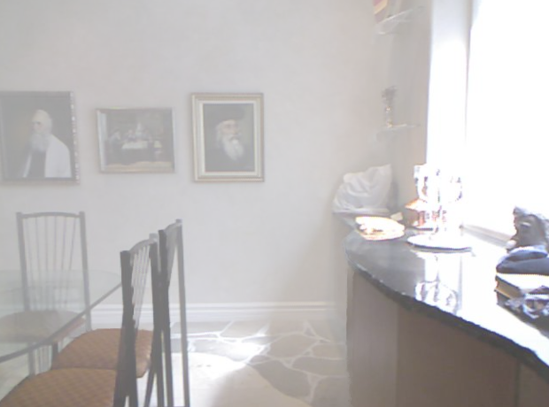
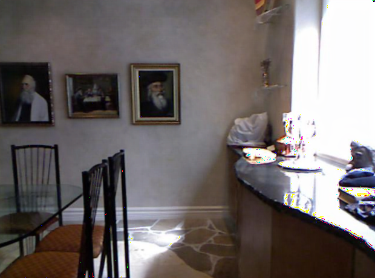

[English](../../../en/model_zoo/estimation/ffa_en.md) | 中文

## FFA-Net 图像去雾模型

## 目录
[TOC]


## 1、简介

该模型是图像去雾领域的一个顶尖模型之一。该模型要实现的目标是图像去雾，最大的特点就是基于注意力块的大型卷积块结构。注意力块的结构如下图所示：



作者使用了两种注意力块，达到两种不同的目的。一种是通道注意力块，能够实现自动对每个通道乘以了不同的权重(0-1之间)，得到该注意力块的输出；另一种是像素注意力块，能够实现自动对输入的每一个像素乘以不同的权重，得到该注意力块的输出。通过权重相乘来体现注意力的效果。该模型在RESIDE数据集上得到的去雾图像与真实无雾图像间的 ssim 和 psnr 值要明显优于其他模型。


## 2、数据集准备

RESIDE-Standard数据集下载及准备请参考[RESIDE-Standard数据集下载及准备](../../dataset/RESIDE.md)。


## 3、模型训练

### 3.1 数据准备及模型参数准备

参考第二部分内容下载数据集, 并改变配置文件configs/FFA-cfg.yaml 中的文件路径为你的文件路径。


**模型参数文件及训练日志下载地址：**

链接：https://pan.baidu.com/s/1Q9RQI5bC35FUF2dhIqKamg   提取码：gzao

从链接中下载预训练模型的模型参数，和vgg16预训练模型的模型参数，并放到项目根目录下的data文件夹下，这样data下有个FFA文件夹，FFA文件夹下包含四个模型参数文件，具体文件结构如下所示：

**文件结构**


```
    PaddleVideo/data/FFA
        |-- vgg16_pretrained_weight.pdparams       #模型损失函数使用perloss时需用到的VGG16预训练模型的参数文件
        |-- ITS2_3_19_400000_transform.pdparams    #复现的模型经过400000step训练后得到的室内去雾模型的参数文件
        |-- ITS_3_19_article_pretrained.pdparams   #作者提供的室内去雾模型的参数文件
        |-- OTS_3_19_article_pretrained.pdparams   #作者提供的室外去雾模型的参数文件
        |-- logs                                   #训练日志文件夹
        	|-- train.log                          #完整的训练日志文件
            |-- step 1-48000.ipynb                 #1-48000step复现训练的notebook文件
            |-- step 48000-400000.ipynb            #48000-400000step复现训练的notebook文件
```


### 3.2 开始训练

在 `ITS` 数据集上训练时，在控制台输入以下代码：

 ```shell
 python main.py -c configs/estimation/adds/FFA_cfg.yaml --validate
 ```


如果你想要在 `OTS` 数据集上训练网络，在 configs/FFA-cfg.yaml 中修改数据集的路径，同时要注意 suffix 参数与你的数据集图片**后缀**是否一致，不一致要相应修改。

如果要修改模型的参数，修改configs/FFA-cfg.yaml中MODEL下的参数。

如果要改变训练的epochs，需要同时改变configs/FFA-cfg.yaml中OPTIMIZER下的**max_epoch**参数，**max_epoch**需与**epochs**一致。为了训练出更好的结果，请至少训练80个epoch。

该模型训练时所需的显存过大，不要尝试增加**batchsize**。如显存不足可以调小**batchsize**和PIPELINE/train/decode/**crop_size**。

configs/FFA-cfg.yaml 中 backbone 下的 **gps** 和 **blocks**参数与模型深度相关。

configs/FFA-cfg.yaml 中 head 下的 **perloss** 与模型的loss有关，默认为False，如要改为True则需要下载的上面链接中的vgg16预训练模型参数文件到相应位置，为了获得更好的训练结果，建议下载相应文件，并将该参数改为True。如果选择False，则表示仅使用生成图像和清晰图像之间的 l1 loss作为loss值。


### 3.3 模型评估

对模型进行评估时，在控制台输入以下代码，下面代码中使用上面提到的下载的模型参数：

 ```shell
 ###对作者提供的模型进行评估###
 python main.py --test -c configs/estimation/adds/FFA_cfg.yaml -w data/FFA/ITS_3_19_article_pretrained.pdparams

 ###对我复现的模型进行评估###
 python main.py --test -c configs/estimation/adds/FFA_cfg.yaml -w data/FFA/ITS2_3_19_400000_transform.pdparams
 ```


如果要测试你自己准备的图像，请更改 configs/FFA-cfg.yaml 中 DATASET/test 的 file_path参数 ,  同时注意文件后缀是否一致与 suffix 参数一致。

如果要在自己提供的模型上进行测试，请将模型的路径放在 -w 后面。

论文作者提供的室内模型在 data/FFA/ITS_3_19_article_pretrained.pdparams，室外模型在data/FFA/OTS_3_19_article_pretrained.pdparams。

数据集、模型成功准备后，用以上示例第一条命令进行评估，模型进行完整的评估可能会花费较长的时间。

RESIDE数据集测试精度：

| Backbone | Train dataset    | Test dataset        | SSIM   | PSNR  | checkpoints                          |
| -------- | ---------------- | ------------------- | ------ | ----- | ------------------------------------ |
| FFA      | RESIDE/ITS/train | RESIDE/SOTS/Indoor  | 0.9885 | 35.42 | ITS2_3_19_400000_transform.pdparams  |
| FFA      | RESIDE/ITS/train | RESIDE/SOTS/Indoor  | 0.9886 | 36.39 | ITS_3_19_article_pretrained.pdparams |
| FFA      | RESIDE/OTS/train | RESIDE/SOTS/outdoor | 0.9840 | 33.57 | OTS_3_19_article_pretrained.pdparams |


## 4. Tipc

### 4.1 导出inference模型

```bash
python tools/export_model.py -c configs/estimation/adds/FFA_cfg.yaml -p data/FFA/ITS2_3_19_400000_transform.pdparams -o inference/FFA
```

上述命令将生成预测所需的模型结构文件`FFA.pdmodel`和模型权重文件`FFA.pdiparams`以及`FFA.pdiparams.info`文件，均存放在`inference/FFA/`目录下。


### 4.2 使用预测引擎推理

```bash
python tools/predict.py --input_file data/FFA/infer_example/ --config configs/estimation/adds/FFA_cfg.yaml --model_file inference/FFA/FFA.pdmodel --params_file inference/FFA/FFA.pdiparams --use_gpu=True --use_tensorrt=False
```

推理结束会默认保存下模型生成的去雾图像，并输出测试得到的ssim和psnr值。

以下是样例图片和对应的预测(去雾)图：

<p align='center'>



输出示例如下:

```
Current input image: 1440_6.png
pred dehazed image saved to: data/FFA/1440_6_dehazed.png
        ssim: 0.9845477233316967
        psnr: 33.88653046111545
```


### 4.3 调用脚本两步完成训推一体测试

测试基本训练预测功能的`lite_train_lite_infer`模式，运行：

```shell
# 准备数据
bash test_tipc/prepare.sh ./test_tipc/configs/FFA/train_infer_python.txt 'lite_train_lite_infer'
# 运行测试
bash test_tipc/test_train_inference_python.sh ./test_tipc/configs/FFA/train_infer_python.txt 'lite_train_lite_infer'
```


## 5. LICENSE

本项目的发布受[Apache 2.0 license](https://github.com/PaddlePaddle/models/blob/release/2.2/community/repo_template/LICENSE)许可认证。


## 6、参考文献与链接

论文地址：https://arxiv.org/abs/1911.07559

参考repo FFA-NET Github：https://github.com/zhilin007/FFA-Net

论文复现指南-CV方向：https://github.com/PaddlePaddle/models/blob/release%2F2.2/tutorials/article-implementation/ArticleReproduction_CV.md

如何将代码集成到paddlevideo：https://github.com/PaddlePaddle/PaddleVideo/blob/develop/docs/zh-CN/contribute/add_new_algorithm.md

readme文档模板：https://github.com/PaddlePaddle/models/blob/release/2.2/community/repo_template/README.md
