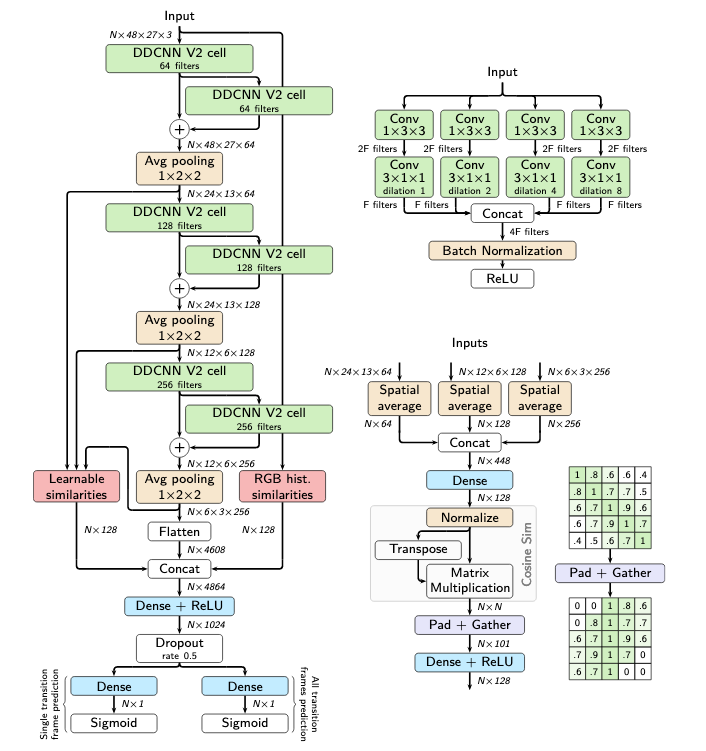

[English](../../../en/model_zoo/partition/transnetv2.md) | 简体中文

# TransNetV2视频切分模型

## 内容

- [模型简介](#模型简介)
- [数据准备](#数据准备)
- [模型训练](#模型训练)
- [模型测试](#模型测试)
- [模型推理](#模型推理)
- [参考论文](#参考论文)

在开始使用之前，您需要按照以下命令安装额外的依赖包：
```bash
python -m pip install ffmpeg-python==0.2.0
```

## 模型简介

TransNetV2是一种基于深度学习的视频切分模型，通过DDCNN V2结构进行特征学习，并加入RGB颜色直方图、视频帧相似度进行更有效的特征提取，最终获取每一帧是否是镜头边界帧的概率，从而完成视频切分。该算法效果较好，且计算高效，十分适合工业落地。



本代码当前仅支持模型推理，模型的训练和测试将在后续提供。


## 数据准备

coming soon


## 模型训练

coming soon


## 模型测试

coming soon


## 模型推理

下载在ClipShots和TRECVID IACC.3上训练好的TransNetV2模型参数 [TransNetV2_shots.pdparams](https://videotag.bj.bcebos.com/PaddleVideo-release2.2/TransNetV2_shots.pdparams)，也可以通过命令行下载

```bash
wget https://videotag.bj.bcebos.com/PaddleVideo-release2.2/TransNetV2_shots.pdparams
```

### 导出inference模型

```bash
python3.7 tools/export_model.py -c configs/partitioners/transnetv2/transnetv2.yaml -p data/TransNetV2_shots.pdparams -o inference/TransNetV2
```

上述命令将生成预测所需的模型结构文件`TransNetV2.pdmodel`和模型权重文件`TransNetV2.pdiparams`以及`TransNetV2.pdiparams.info`文件，均存放在`inference/TransNetV2/`目录下

上述bash命令中各个参数含义可参考[模型推理方法](https://github.com/PaddlePaddle/PaddleVideo/blob/release/2.0/docs/zh-CN/start.md#2-%E6%A8%A1%E5%9E%8B%E6%8E%A8%E7%90%86)

### 使用预测引擎推理

```bash
python3.7 tools/predict.py --input_file data/example.avi \
                           --config configs/partitioners/transnetv2/transnetv2.yaml \
                           --model_file inference/TransNetV2/TransNetV2.pdmodel \
                           --params_file inference/TransNetV2/TransNetV2.pdiparams \
                           --use_gpu=True \
                           --use_tensorrt=False
```

通过定义配置文件`transnetv2.yaml`中`output_path`参数，可以将每帧的预测概率输出到`{output_path}/example_predictions.txt`中，预测得到的镜头边界输出到`{output_path}/example_scenes.txt`中。
通过定义配置文件`transnetv2.yaml`中`visualize`参数为True，可以将预测结果可视化，可视化结果保存至`{output_path}/example_vis.png`。

输出示例如下:

```bash
Current video file: data/example.avi
      Shot Boundarys: [[  0 130]]
```

可以看到，使用TransNetV2模型对`data/example.avi`进行预测，输出的视频镜头边界帧为[0,130]。
## 参考论文

- [TransNet V2: An effective deep network architecture for fast shot transition detection](https://arxiv.org/abs/2008.04838), Tomáš Souček, Jakub Lokoč
