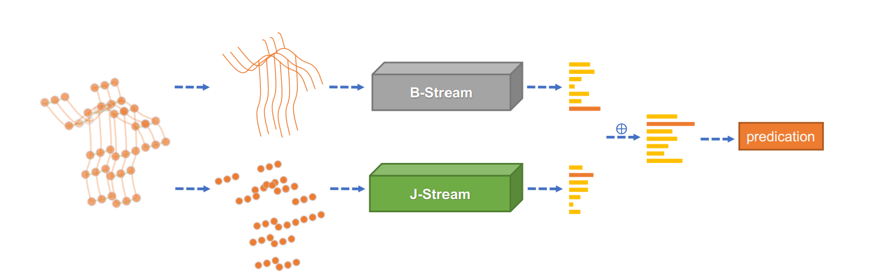
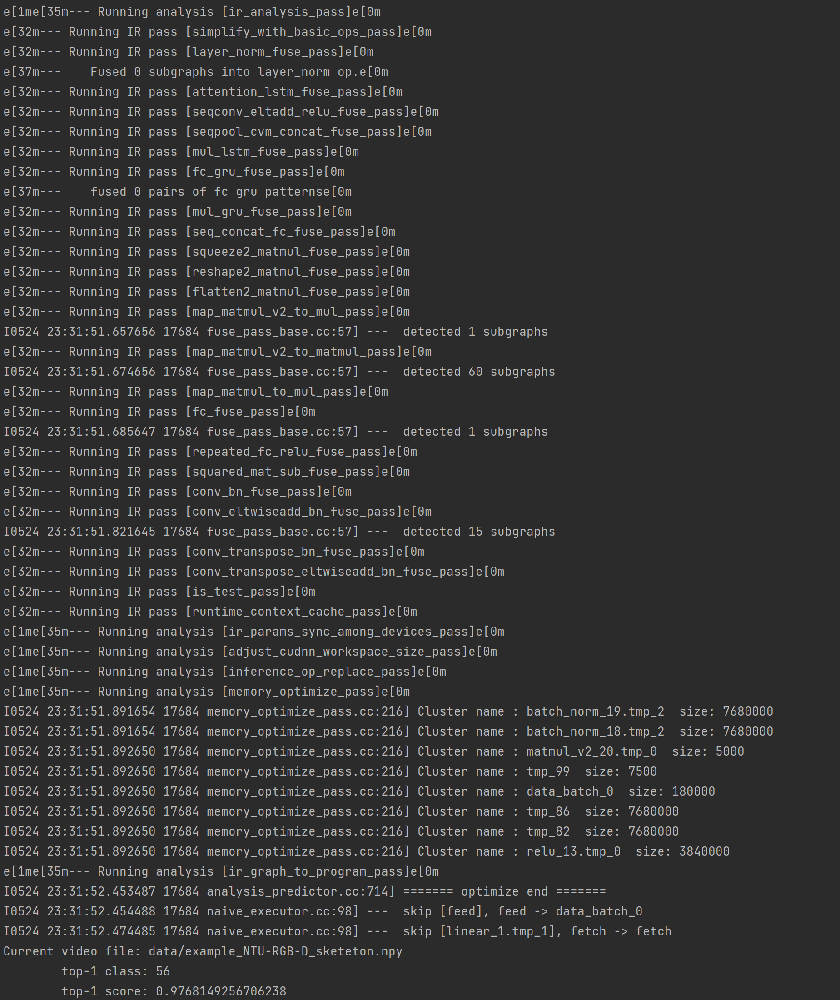

[English](../../../en/model_zoo/recognition/agcn2s.md)  | 简体中文

# 2s-AGCN基于骨骼的行为识别模型

## 内容

- [模型简介](#模型简介)
- [数据准备](#数据准备)
- [模型训练](#模型训练)
- [模型测试](#模型测试)
- [模型推理](#模型推理)
- [参考论文](#参考论文)

## 模型简介



[2s-AGCN](https://openaccess.thecvf.com/content_CVPR_2019/papers/Shi_Two-Stream_Adaptive_Graph_Convolutional_Networks_for_Skeleton-Based_Action_Recognition_CVPR_2019_paper.pdf)是发表在CVPR2019上的一篇针对ST-GCN进行改进的文章，文章提出双流自适应卷积网络，针对原始ST-GCN的缺点进行了改进。在现有的基于GCN的方法中，图的拓扑是手动设置的，并且固定在所有图层和输入样本上。另外，骨骼数据的二阶信息（骨骼的长度和方向）对于动作识别自然是更有益和更具区分性的，在当时方法中很少进行研究。因此，文章主要提出一个基于骨架节点和骨骼两种信息融合的双流网络，并在图卷积中的邻接矩阵加入自适应矩阵，大幅提升骨骼动作识别的准确率，也为后续的工作奠定了基础（后续的骨骼动作识别基本都是基于多流的网络框架）。

## 数据准备

数据下载及处理与CTR-GCN一致，详情请参考[NTU-RGBD数据准备](../../dataset/ntu-rgbd.md)

## 模型训练

### NTU-RGBD数据集训练

模型训练参数的配置文件均在`configs/recognition/agcn2s/`文件夹中，启动命令如下:

```bash
# train cross subject with bone data
python main.py --validate -c configs/recognition/agcn2s/agcn2s_ntucs_bone.yaml --seed 1
# train cross subject with joint data
python main.py --validate -c configs/recognition/agcn2s/agcn2s_ntucs_joint.yaml --seed 1
# train cross view with bone data
python main.py --validate -c configs/recognition/agcn2s/agcn2s_ntucv_bone.yaml --seed 1
# train cross view with joint data
python main.py --validate -c configs/recognition/agcn2s/agcn2s_ntucv_joint.yaml --seed 1
```

## 模型测试

### NTU-RGBD数据集模型测试

模型测试参数的配置文件均在`configs/recognition/agcn2s/`文件夹中，启动命令如下:

```bash
# test cross subject with bone data
python main.py --test -c configs/recognition/2sagcn/2sagcn_ntucs_bone.yaml -w data/2SAGCN_ntucs_bone.pdparams
# test cross subject with joint data
python main.py --test -c configs/recognition/2sagcn/2sagcn_ntucs_joint.yaml -w data/2SAGCN_ntucs_joint.pdparams
# test cross view with bone data
python main.py --test -c configs/recognition/2sagcn/2sagcn_ntucv_bone.yaml -w data/2SAGCN_ntucv_bone.pdparams
# test cross view with joint data
python main.py --test -c configs/recognition/2sagcn/2sagcn_ntucv_joint.yaml -w data/2SAGCN_ntucv_joint.pdparams
```

* 通过`-c`参数指定配置文件，通过`-w`指定权重存放路径进行模型测试。

模型在NTU-RGBD数据集上的测试效果如下

|                |  CS   |   CV   |
| :------------: | :---: | :----: |
| Js-AGCN(joint) | 85.8% | 94.13% |
| Bs-AGCN(bone)  | 86.7% | 93.9%  |

训练日志：[日志](https://github.com/ELKYang/2s-AGCN-paddle/tree/main/work_dir/ntu)

VisualDL可视化日志：[VDL](https://github.com/ELKYang/2s-AGCN-paddle/tree/main/runs)

模型权重如下：

|      | CS-Js                                                        | CS-Bs                                                        | CV-JS                                                        | CV-Bs                                                        |
| ---- | ------------------------------------------------------------ | ------------------------------------------------------------ | ------------------------------------------------------------ | ------------------------------------------------------------ |
| 地址 | [ntu_cs_agcn_joint](https://github.com/ELKYang/2s-AGCN-paddle/blob/main/weights/ntu_cs_agcn_joint-48-30674.pdparams) | [ntu_cs_agcn_bone](https://github.com/ELKYang/2s-AGCN-paddle/blob/main/weights/ntu_cs_agcn_bone-44-28170.pdparams) | [ntu_cv_agcn_joint](https://github.com/ELKYang/2s-AGCN-paddle/blob/main/weights/ntu_cv_agcn_joint-38-22932.pdparams) | [ntu_cv_agcn_bone](https://github.com/ELKYang/2s-AGCN-paddle/blob/main/weights/ntu_cv_agcn_bone-49-29400.pdparams) |

## 模型推理

### 导出inference模型（以cs_joint为例）

```bash
python3.7 tools/export_model.py -c configs/recognition/agcn2s/agcn2s_ntucs_joint.yaml \
                                -p data/AGCN2s_ntucs_joint.pdparams \
                                -o inference/AGCN2s_ntucs_joint
```

上述命令将生成预测所需的模型结构文件`AGCN2s_ntucs_joint.pdmodel`和模型权重文件`AGCN2s_ntucs_joint.pdiparams`。

- 各参数含义可参考[模型推理方法](https://github.com/PaddlePaddle/PaddleVideo/blob/release/2.0/docs/zh-CN/start.md#2-%E6%A8%A1%E5%9E%8B%E6%8E%A8%E7%90%86)

### 使用预测引擎推理

```bash
python3.7 tools/predict.py --input_file data/example_NTU-RGB-D_sketeton.npy \
                           --config configs/recognition/agcn2s/2sagcn_ntucs_joint.yaml \
                           --model_file inference/AGCN2s_ntucs_joint/AGCN2s_ntucs_joint.pdmodel \
                           --params_file inference/AGCN2s_ntucs_joint/AGCN2s_ntucs_joint.pdiparams \
                           --use_gpu=True \
                           --use_tensorrt=False
```

### 预测引擎推理结果


## 参考论文

- [Two-Stream Adaptive Graph Convolutional Networks for Skeleton-Based Action Recognition](https://openaccess.thecvf.com/content_CVPR_2019/papers/Shi_Two-Stream_Adaptive_Graph_Convolutional_Networks_for_Skeleton-Based_Action_Recognition_CVPR_2019_paper.pdf), Lei Shi and Yifan Zhang and Jian Cheng and Hanqing Lu
