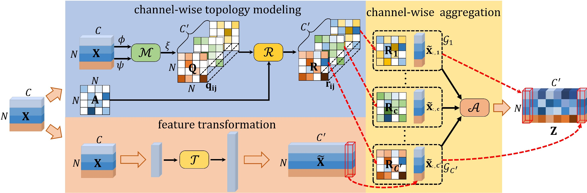

[English](../../../en/model_zoo/recognition/ctrgcn.md)  | 简体中文

# CTR-GCN基于骨骼的行为识别模型

---
## 内容

- [模型简介](#模型简介)
- [数据准备](#数据准备)
- [模型训练](#模型训练)
- [模型测试](#模型测试)
- [模型推理](#模型推理)
- [参考论文](#参考论文)


## 模型简介

[CTR-GCN](https://github.com/Uason-Chen/CTR-GCN.git)是ICCV 2021提出的基于骨骼的行为识别模型，通过将改动应用在具有拓扑结构的人体骨骼数据上的图卷积，使用时空图卷积提取时空特征进行行为识别，提升了基于骨骼的行为识别任务精度。

<div align="center">
 <br />
</div>


## 数据准备

NTU-RGBD数据下载及准备请参考[NTU-RGBD数据准备](../../dataset/ntu-rgbd.md)


## 模型训练

### NTU-RGBD数据集训练

- NTU-RGBD数据集，默认使用单卡训练，启动命令如下：

```bash
# joint modality
python main.py --validate -c configs/recognition/ctrgcn/ctrgcn_ntucs_joint.yaml --seed 1

# bone modality
python main.py --validate -c configs/recognition/ctrgcn/ctrgcn_ntucs_bone.yaml --seed 1

# motion modality
python main.py --validate -c configs/recognition/ctrgcn/ctrgcn_ntucs_motion.yaml --seed 1

# bone motion modality
python main.py --validate -c configs/recognition/ctrgcn/ctrgcn_ntucs_bone_motion.yaml --seed 1
```

- 若使用4卡训练，请线性调整学习率，训练启动命令如下:

```bash
python3.7 -B -m paddle.distributed.launch --gpus="0,1,2,3"  --log_dir=log_ctrgcn  main.py  --validate -c configs/recognition/ctrgcn/ctrgcn_ntucs_joint.yaml
```

- 配置文件`ctrgcn_ntucs_joint.yaml`为NTU-RGB+D数据集按cross-subject划分方式对应的训练配置。


## 模型测试

### NTU-RGB+D数据集模型测试

- 模型测试的启动命令如下：

```bash
# joint modality
python3.7 main.py --test -c configs/recognition/ctrgcn/ctrgcn_ntucs_joint.yaml -w data/CTRGCN_ntucs_joint.pdparams

# bone modality
python3.7 main.py --test -c configs/recognition/ctrgcn/ctrgcn_ntucs_bone.yaml -w data/CTRGCN_ntucs_bone.pdparams

# motion modality
python3.7 main.py --test -c configs/recognition/ctrgcn/ctrgcn_ntucs_motion.yaml -w data/CTRGCN_ntucs_motion.pdparams

# bone motion modality
python3.7 main.py --test -c configs/recognition/ctrgcn/ctrgcn_ntucs_bone_motion.yaml -w data/CTRGCN_ntucs_bone_motion.pdparams
```

- 通过`-c`参数指定配置文件，通过`-w`指定权重存放路径进行模型测试。

模型在NTU-RGB+D数据集上实验精度如下:

| split | modality | Top-1 | checkpoints |
| :----: | :----: | :----: | :----: |
| cross-subject | joint | 89.93 | [CTRGCN_ntucs_joint.pdparams](https://videotag.bj.bcebos.com/PaddleVideo-release2.3/CTRGCN_ntucs_joint.pdparams) |
| cross-subject | bone | 85.24 | [CTRGCN_ntucs_bone.pdparams](https://videotag.bj.bcebos.com/PaddleVideo-release2.3/CTRGCN_ntucs_bone.pdparams) |
| cross-subject | motion | 85.33 | [CTRGCN_ntucs_motion.pdparams](https://videotag.bj.bcebos.com/PaddleVideo-release2.3/CTRGCN_ntucs_motion.pdparams) |
| cross-subject | bone motion | 84.53 | [CTRGCN_ntucs_bone_motion.pdparams](https://videotag.bj.bcebos.com/PaddleVideo-release2.3/CTRGCN_ntucs_bone_motion.pdparams) |


## 模型推理

### 导出inference模型

```bash
python3.7 tools/export_model.py -c configs/recognition/ctrgcn/ctrgcn_ntucs_joint.yaml \
                                -p data/CTRGCN_ntucs_joint.pdparams \
                                -o inference/CTRGCN
```

上述命令将生成预测所需的模型结构文件`CTRGCN_joint.pdmodel`和模型权重文件`CTRGCN_joint.pdiparams`。

- 各参数含义可参考[模型推理方法](https://github.com/PaddlePaddle/PaddleVideo/blob/release/2.0/docs/zh-CN/start.md#2-%E6%A8%A1%E5%9E%8B%E6%8E%A8%E7%90%86)

### 使用预测引擎推理

```bash
python3.7 tools/predict.py --input_file data/example_NTU-RGB-D_sketeton.npy \
                           --config configs/recognition/ctrgcn/ctrgcn_ntucs_joint.yaml \
                           --model_file inference/CTRGCN_joint/CTRGCN_joint.pdmodel \
                           --params_file inference/CTRGCN_joint/CTRGCN_joint.pdiparams \
                           --use_gpu=True \
                           --use_tensorrt=False
```

输出示例如下:

```
Current video file: data/example_NTU-RGB-D_sketeton.npy
        top-1 class: 4
        top-1 score: 0.999988317489624
```

可以看到，使用在NTU-RGBD数据集上训练好的ST-GCN模型对`data/example_NTU-RGB-D_sketeton.npy`进行预测，输出的top1类别id为`4`，置信度为0.999988317489624。


## 参考论文

- [Channel-wise Topology Refinement Graph Convolution for Skeleton-Based Action Recognition](https://arxiv.org/abs/2107.12213), Chen, Yuxin and Zhang, Ziqi and Yuan, Chunfeng and Li, Bing and Deng, Ying and Hu, Weiming
