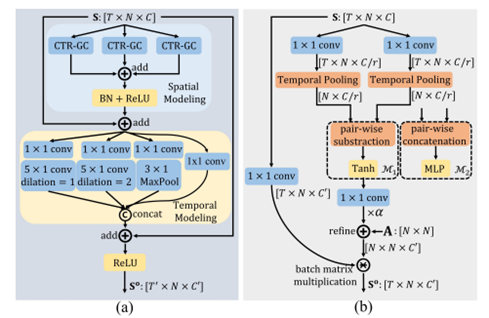

[English](../../../en/model_zoo/recognition/ctrgcn_light.md)  | 简体中文

# CTRGCN_light (CTR-GCN的轻量化模型系列)

---
## 内容

- [模型简介](#模型简介)
- [数据准备](#数据准备)
- [模型训练](#模型训练)
- [模型测试](#模型测试)
- [模型推理](#模型推理)
- [参考论文](#参考论文)


## 模型简介

[CTR-GCN](https://github.com/Uason-Chen/CTR-GCN.git)是ICCV 2021提出的基于骨骼的行为识别模型，通过将改动应用在具有拓扑结构的人体骨骼数据上的图卷积，使用时空图卷积提取时空特征进行行为识别，提升了基于骨骼的行为识别任务精度。

<div align="center">
 <br />
</div>

**我们认为琐碎的结构是不利于GPU并行加速和会带来结构的复杂性（导致推理模型结构文件体积过大）。** 基于CTRGCN，在inference模型小于10M条件下，我们提出轻量化模型系列CTRGCN_light，该系列包含CTRGCN_lightV1和CTRGCN_lightV2两种模型。相比CTRGCN，整个CTRGCN_light系列做出的相同轻量化操作为：第一、将下图(a)中的时序建模模块每个分支的小的1x1卷积抽取出来，合并成一个大的1x1卷积，然后在前向传播中以内存划分为代价来为每个分支分配相应的1x1卷积输出；第二、将下图(a)中的空间建模模块num_subset个CTR-GC块合并成一个CTR-GC块，并将图(b)原CTR-GC中用于特征映射、相同输入的1x1卷积合并在一起，即进行模块融合和卷积融合来减少琐碎结构，但均是以前向传播中内存划分为代价。

<div align="center">
 <br />
</div>

## 数据准备

NTU-RGBD数据下载及准备请参考[NTU-RGBD数据准备](../../dataset/ntu-rgbd.md)


## 模型训练

### NTU-RGBD数据集训练

- NTU-RGBD数据集，默认使用单卡训练，启动命令如下：

```bash
# joint modality for CTRGCN_lightV1
python main.py --validate -c configs/recognition/ctrgcn/ctrgcn_light_v1_ntucs_joint.yaml --seed 1

# joint modality for CTRGCN_lightV2
python main.py --validate -c configs/recognition/ctrgcn/ctrgcn_light_v2_ntucs_joint.yaml --seed 1
```

- 若使用4卡训练，请线性调整学习率，训练启动命令如下:

```bash
# for CTRGCN_lightV1
python3.7 -B -m paddle.distributed.launch --gpus="0,1,2,3"  --log_dir=log_ctrgcn_light_v1  main.py  --validate -c configs/recognition/ctrgcn/ctrgcn_light_v1_ntucs_joint.yaml

# for CTRGCN_lightV2
python3.7 -B -m paddle.distributed.launch --gpus="0,1,2,3"  --log_dir=log_ctrgcn_light_v2  main.py  --validate -c configs/recognition/ctrgcn/ctrgcn_light_v2_ntucs_joint.yaml
```

- 配置文件`ctrgcn_light_v1_ntucs_joint.yaml`为NTU-RGB+D数据集按cross-subject划分方式对应的训练配置。

## 模型测试

### NTU-RGB+D数据集模型测试

- 模型测试的启动命令如下：

```bash
# joint modality for CTRGCN_lightV1
python3.7 main.py --test -c configs/recognition/ctrgcn/ctrgcn_light_v1_ntucs_joint.yaml -w data/CTRGCN_lightV1_ntucs_joint.pdparams

# joint modality for CTRGCN_lightV2
python3.7 main.py --test -c configs/recognition/ctrgcn/ctrgcn_light_v2_ntucs_joint.yaml -w data/CTRGCN_lightV2_ntucs_joint.pdparams
```

- 通过`-c`参数指定配置文件，通过`-w`指定权重存放路径进行模型测试。

joint模态，X-sub评测标准下，模型在NTU-RGB+D数据集上实验精度（对于CTRGCN_light系列取3次平均）和推理速度（在AIStudio至尊卡上测速）如下:
| 模型 | Top-1(%) | 正常导出的推理模型大小 |GPU推理速度(ms)(越低越好)|CPU推理速度(ms)(越低越好)| checkpoints|
| -------- | -------- | -------- |-------- | -------- |-------- |
| CTRGCN  | 89.93     | 约14.5MB     | 31.4189 | 302.6343 |[CTRGCN_ntucs_joint.pdparams](https://videotag.bj.bcebos.com/PaddleVideo-release2.3/CTRGCN_ntucs_joint.pdparams) |
| CTRGCN_lightV1 | 91.126(±0.272) | 约9.6MB | 15.3605 | 238.6627 |[CTRGCN_lighjtV1_ntucs_joint.pdparams](https://aistudio.baidu.com/aistudio/datasetdetail/173887) |
| CTRGCN_lightV2 | 91.042(±0.153) | 约9.8MB | 18.233 | 177.4101 |[CTRGCN_lighjtV2_ntucs_joint.pdparams](https://aistudio.baidu.com/aistudio/datasetdetail/173887)|
| CTRGCN_lightV2_dml | 91.187 | 约9.8MB | 18.233 | 177.4101 |[CTRGCN_lighjtV2_ntucs_joint_dml.pdparams](https://aistudio.baidu.com/aistudio/datasetdetail/173887)|


## 模型推理

### 导出inference模型

```bash
# for CTRGCN_lightV1
python3.7 tools/export_model.py -c configs/recognition/ctrgcn/ctrgcn_light_v1_ntucs_joint.yaml \
                                -p data/CTRGCN_lightV1_ntucs_joint.pdparams \
                                -o inference/CTRGCN_lightV1
                                
# for CTRGCN_lightV2
python3.7 tools/export_model.py -c configs/recognition/ctrgcn/ctrgcn_light_v2_ntucs_joint.yaml \
                                -p data/CTRGCN_lightV2_ntucs_joint.pdparams \
                                -o inference/CTRGCN_lightV2
```

上述命令将生成预测所需的模型结构文件`CTRGCN_lightV2_joint.pdmodel`和模型权重文件`CTRGCN_lightV2_joint.pdiparams`。

- 各参数含义可参考[模型推理方法](https://github.com/PaddlePaddle/PaddleVideo/blob/release/2.0/docs/zh-CN/start.md#2-%E6%A8%A1%E5%9E%8B%E6%8E%A8%E7%90%86)

### 使用预测引擎推理

```bash
# for CTRGCN_lightV2
python3.7 tools/predict.py --input_file data/example_NTU-RGB-D_sketeton.npy \
                           --config configs/recognition/ctrgcn/ctrgcn_light_v2_ntucs_joint.yaml \
                           --model_file inference/CTRGCN_lightV2/CTRGCN_lightV2_joint.pdmodel \
                           --params_file inference/CTRGCN_lightV2/CTRGCN_lightV2_joint.pdiparams \
                           --use_gpu=True \
                           --use_tensorrt=False
```

输出示例如下:

```
Current video file: data/example_NTU-RGB-D_sketeton.npy
        top-1 class: 58
        top-1 score: 0.6479401
```

可以看到，使用在NTU-RGBD数据集上训练好的CTRGCN_lightV2模型对`data/example_NTU-RGB-D_sketeton.npy`进行预测，输出的top1类别id为`58`，置信度为0.6479401。


## 参考论文

- [Channel-wise Topology Refinement Graph Convolution for Skeleton-Based Action Recognition](https://arxiv.org/abs/2107.12213), Chen, Yuxin and Zhang, Ziqi and Yuan, Chunfeng and Li, Bing and Deng, Ying and Hu, Weiming

