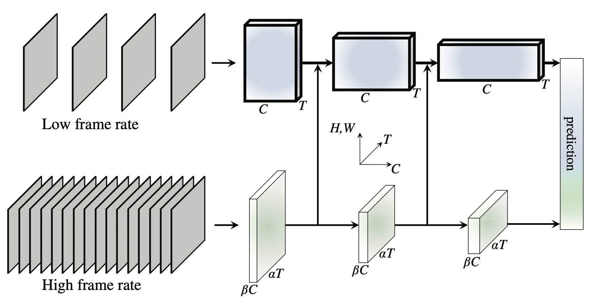

简体中文 | [English](../../../en/model_zoo/recognition/slowfast.md)

# SlowFast视频分类模型

---
## 内容

- [模型简介](#模型简介)
- [数据准备](#数据准备)
- [模型训练](#模型训练)
- [模型测试](#模型测试)
- [参考论文](#参考论文)


## 模型简介

SlowFast是视频分类领域的高精度模型，使用slow和fast两个分支。slow分支以稀疏采样得到的帧作为输入，捕捉视频中的表观信息。fast分支以高频采样得到的帧作为输入，捕获视频中的运动信息，最终将两个分支的特征拼接得到预测结果。

<p align="center">
 <br />
SlowFast Overview
</p>

详细内容请参考ICCV 2019论文[SlowFast Networks for Video Recognition](https://arxiv.org/abs/1812.03982)


## 数据准备

SlowFast模型的训练数据采用Kinetics400数据集，数据下载及准备请参考[Kinetics-400数据准备](../../dataset/k400.md)


## 模型训练

数据准备完成后，可通过如下方式启动训练：

```bash
export CUDA_VISIBLE_DEVICES=0,1,2,3,4,5,6,7

python -B -m paddle.distributed.launch --gpus="0,1,2,3,4,5,6,7" --log_dir=log_slowfast  main.py --validate -c configs/recognition/slowfast/slowfast.yaml 
```

- 从头开始训练，使用上述启动命令行或者脚本程序即可启动训练，不需要用到预训练模型。

- 建议使用多卡训练方式，单卡由于batch\_size减小，精度可能会有损失。


### 训练资源要求

*  8卡V100，总batch\_size=64，单卡batch\_size=8，单卡显存占用约9G。
*  训练速度相较原始实现提速100%，详细参考[benchmark](https://github.com/PaddlePaddle/PaddleVideo/blob/main/docs/zh-CN/benchmark.md#实验结果)


## 模型测试

可通过如下命令进行模型测试:

```bash
python -B -m paddle.distributed.launch --gpus="0,1,2,3,4,5,6,7" --log_dir=log_slowfast_test main.py --test -c  configs/recognition/slowfast/slowfast.yaml -w output/SlowFast/SlowFast_epoch_000196.pdparams
```

- 通过 `-w`参数指定待测试模型文件的路径，您可以下载我们训练好的模型进行测试[SlowFast.pdparams](https://videotag.bj.bcebos.com/PaddleVideo/SlowFast/SlowFast.pdparams)

- 使用```multi_crop```的方式进行评估，因此评估有一定耗时，建议使用多卡评估，加快评估速度。若使用默认方式进行多卡评估，耗时约4小时。

- 模型最终的评估精度会打印在日志文件中。

若使用单卡评估，启动方式如下：

```bash
python -B main.py --test -c  configs/recognition/slowfast/slowfast.yaml -w output/SlowFast/SlowFast_epoch_000196.pdparams
```


在Kinetics400数据集下评估精度如下:

| Acc1 | Acc5 |
| :---: | :---: |
| 74.35 | 91.33 |

- 由于Kinetics400数据集部分源文件已缺失，无法下载，我们使用的数据集比官方数据少~5%，因此精度相比于论文公布的结果有一定损失。相同数据下，精度已与原实现对齐。


## 参考论文

- [SlowFast Networks for Video Recognition](https://arxiv.org/abs/1812.03982), Feichtenhofer C, Fan H, Malik J, et al. 
