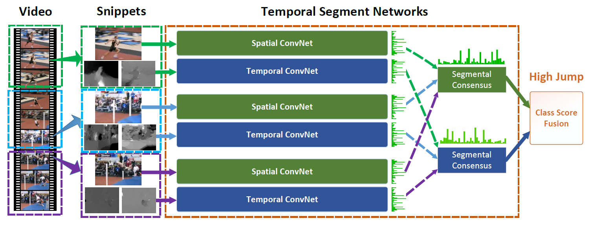

简体中文 | [English](../../../en/model_zoo/recognition/tsn.md)

# TSN

## 内容

- [模型简介](#模型简介)
- [数据准备](#数据准备)
- [模型训练](#模型训练)
- [模型测试](#模型测试)
- [模型推理](#模型推理)
- [实现细节](#实现细节)
- [参考论文](#参考论文)

## 模型简介

Temporal Segment Network (TSN) 是视频分类领域经典的基于2D-CNN的解决方案。该方法主要解决视频的长时间行为识别问题，通过稀疏采样视频帧的方式代替稠密采样，既能捕获视频的全局信息，也能去除冗余，降低计算量。核心思想是将每帧的特征做平均融合作为视频的整体特征，再输入分类器进行分类。本代码实现的模型为**基于单路RGB图像**的TSN网络，Backbone采用ResNet-50结构。

<div align="center">
 <br />
</div>

详细内容请参考ECCV 2016年的论文[Temporal Segment Networks: Towards Good Practices for Deep Action Recognition](https://arxiv.org/abs/1608.00859)

## 数据准备

PaddleVide提供了在Kinetics-400数据集上训练和测试练脚本。Kinetics-400数据下载及准备请参考[Kinetics-400数据准备](../../dataset/k400.md)

## 模型训练

### Kinetics-400数据集训练

#### 下载并添加预训练模型

1. 加载在ImageNet1000上训练好的ResNet50权重作为Backbone初始化参数[ResNet50_pretrain.pdparams](https://videotag.bj.bcebos.com/PaddleVideo/PretrainModel/ResNet50_pretrain.pdparams)，也可以通过命令行下载

   ```bash
   wget https://videotag.bj.bcebos.com/PaddleVideo/PretrainModel/ResNet50_pretrain.pdparams
   ```

2. 打开`PaddleVideo/configs/recognition/tsn/tsn_k400_frames.yaml`，将下载好的权重路径填写到下方`pretrained:`之后

   ```yaml
   MODEL:
       framework: "Recognizer2D"
       backbone:
           name: "ResNet"
           pretrained: 将路径填写到此处
   ```

#### 开始训练

- Kinetics-400数据集使用8卡训练，frames格式数据的训练启动命令如下

  ```bash
  python3.7 -B -m paddle.distributed.launch --gpus="0,1,2,3,4,5,6,7" --log_dir=log_tsn main.py  --validate -c configs/recognition/tsn/tsn_k400_frames.yaml
  ```

## 模型测试

由于TSN模型测试模式的采样方式是速度稍慢但精度高一些的**TenCrop**，与训练过程中验证模式采用的**CenterCrop**不同，所以训练日志中记录的验证指标`topk Acc`不代表最终的测试分数，因此在训练完成之后可以用测试模式对最好的模型进行测试获取最终的指标，命令如下：

```bash
python3.7 -B -m paddle.distributed.launch --gpus="0,1,2,3,4,5,6,7" --log_dir=log_tsn main.py  --test -c configs/recognition/tsn/tsn_k400_frames.yaml -w "output/TSN/TSN_best.pdparams"
```

当测试配置采用如下参数时，在Kinetics-400的validation数据集上的测试指标如下：

| backbone | Sampling method | Training Strategy | num_seg | target_size | Top-1 | checkpoints                                                  |
| :------: | :-------------: | :---------------: | :-----: | :---------: | :---: | ------------------------------------------------------------ |
| ResNet50 |     TenCrop     |       NCHW        |   3    |     224     | 69.81 | [TSN_k400.pdparams](https://videotag.bj.bcebos.com/PaddleVideo-release2.2/TSN_k400.pdparams) |
| ResNet50 |     TenCrop     |       NCHW        |   8    |     224     | 71.70 | [TSN_k400_8.pdparams](https://videotag.bj.bcebos.com/PaddleVideo-release2.2/TSN_k400_8.pdparams) |
## 模型推理

### 导出inference模型

```bash
python3.7 tools/export_model.py -c configs/recognition/tsn/tsn_k400_frames.yaml \
                                -p data/TSN_k400.pdparams \
                                -o inference/TSN
```

上述命令将生成预测所需的模型结构文件`TSN.pdmodel`和模型权重文件`TSN.pdiparams`。

各参数含义可参考[模型推理方法](https://github.com/PaddlePaddle/PaddleVideo/blob/release/2.0/docs/zh-CN/start.md#2-模型推理)

### 使用预测引擎推理

```bash
python3.7 tools/predict.py --input_file data/example.avi \
                           --config configs/recognition/tsn/tsn_k400_frames.yaml \
                           --model_file inference/TSN/TSN.pdmodel \
                           --params_file inference/TSN/TSN.pdiparams \
                           --use_gpu=True \
                           --use_tensorrt=False
```
- **注意**：对于在计算时会合并N和T的模型（比如TSN、TSM），当`use_tensorrt=True`时，需要指定`batch_size`参数为batch_size*num_seg。

    ```bash
    python3.7 tools/predict.py --input_file data/example.avi \
                               --config configs/recognition/tsn/tsn_k400_frames.yaml \
                               --model_file inference/TSN/TSN.pdmodel \
                               --params_file inference/TSN/TSN.pdiparams \
                               --batch_size 3 \
                               --use_gpu=True \
                               --use_tensorrt=True
    ```
## 实现细节

**数据处理：**

- 模型读取Kinetics-400数据集中的`mp4`数据，首先将每条视频数据划分成`seg_num`段，然后均匀地从每段中抽取1帧图像，得到稀疏采样的`seg_num`张视频帧，再对这`seg_num`帧图像做同样的随机数据增强，包括多尺度的随机裁剪、随机左右翻转、数据归一化等，最后缩放至`target_size`

**训练策略：**

- 采用Momentum优化算法训练，momentum=0.9
- 采用L2_Decay，权重衰减系数为1e-4
- 采用全局梯度裁剪，裁剪系数为40.0
- 总epoch数为100，学习率在epoch达到40、80进行0.1倍的衰减
- Dropout_ratio=0.4

**参数初始化**

- TSN模型的卷积层采用Paddle默认的[KaimingNormal](https://www.paddlepaddle.org.cn/documentation/docs/zh/develop/api/paddle/nn/initializer/KaimingNormal_cn.html#kaimingnormal)和[Constant](https://www.paddlepaddle.org.cn/documentation/docs/zh/develop/api/paddle/nn/initializer/Constant_cn.html#constant)初始化方法，以Normal(mean=0, std=0.01)的正态分布来初始化FC层的权重，以常数0来初始化FC层的偏置

## 参考论文

- [Temporal Segment Networks: Towards Good Practices for Deep Action Recognition](https://arxiv.org/abs/1608.00859), Limin Wang, Yuanjun Xiong, Zhe Wang, Yu Qiao, Dahua Lin, Xiaoou Tang, Luc Van Gool
