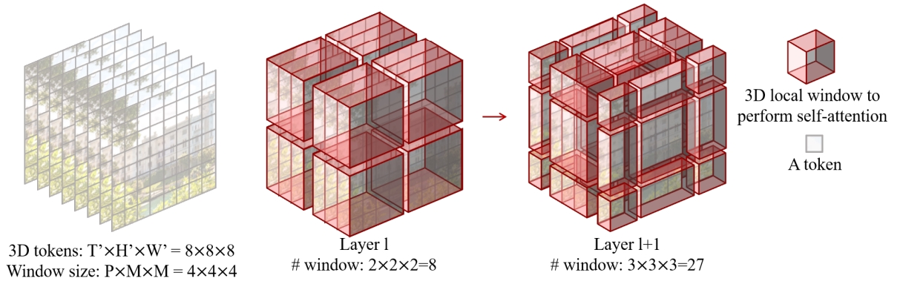

[English](../../../en/model_zoo/recognition/videoswin.md) | 简体中文

# Video-Swin-Transformer视频分类模型

## 内容

- [模型简介](#模型简介)
- [数据准备](#数据准备)
- [模型训练](#模型训练)
- [模型测试](#模型测试)
- [模型推理](#模型推理)
- [参考论文](#参考论文)


## 模型简介

Video-Swin-Transformer是基于Swin Transformer的视频分类模型，其利用了Swin Transformer的多尺度建模和高效局部注意力特性，目前在Kinetics-400数据集上达到了SOTA精度，超过了同为transformer结构的TimeSformer模型。




- **注：运行VideoSwin模型，请安装PaddlePaddle==2.3.1及以上版本**

```bash
python3.7 -m pip install paddlepaddle-gpu==2.3.1 -i https://pypi.tuna.tsinghua.edu.cn/simple
```

## 数据准备

K400数据下载及准备请参考[Kinetics-400数据准备](../../dataset/k400.md)


## 模型训练

### Kinetics-400数据集训练

下面以VideoSwin_base模型在Kinetics-400数据集进行训练为例

#### 下载并添加预训练模型

1. 下载图像预训练模型[swin_base_patch4_window7_224.pdparams](https://videotag.bj.bcebos.com/PaddleVideo-release2.2/swin_base_patch4_window7_224.pdparams)作为Backbone初始化参数，或通过wget命令下载

   ```bash
   wget https://videotag.bj.bcebos.com/PaddleVideo-release2.2/swin_base_patch4_window7_224.pdparams # ImageNet pretrained model for VideoSwin_base

   # wget https://videotag.bj.bcebos.com/PaddleVideo-release2.2/swin_small_patch4_window7_224.pdparams # Imagenet pretrained model for VideoSwin_small
   ```

2. 打开`configs/recognition/videoswin/videoswin_base_k400_videos.yaml`，将下载好的权重存放路径填写到下方`pretrained:`之后

    ```yaml
    MODEL:
        framework: "RecognizerTransformer"
        backbone:
            name: "SwinTransformer3D"
            pretrained: 将路径填写到此处
    ```

#### 开始训练

- Kinetics400数据集使用8卡训练，训练方式的启动命令如下:

    ```bash
    # videos数据格式
    python3.7 -u -B -m paddle.distributed.launch --gpus="0,1,2,3,4,5,6,7"  --log_dir=log_videoswin_base main.py --validate -c configs/recognition/videoswin/videoswin_base_k400_videos.yaml
    ```

- 开启amp混合精度训练，可加速训练过程，其训练启动命令如下：

    ```bash
    export FLAGS_conv_workspace_size_limit=800 # MB
    export FLAGS_cudnn_exhaustive_search=1
    export FLAGS_cudnn_batchnorm_spatial_persistent=1
    # videos数据格式
    python3.7 -u -B -m paddle.distributed.launch --gpus="0,1,2,3,4,5,6,7"  --log_dir=log_videoswin_base main.py --amp --validate -c configs/recognition/videoswin/videoswin_base_k400_videos.yaml
    ```

- 另外您可以自定义修改参数配置，以达到在不同的数据集上进行训练/测试的目的，建议配置文件的命名方式为`模型_数据集名称_文件格式_数据格式_采样方式.yaml`，参数用法请参考[config](../../contribute/config.md)。


## 模型测试

- Video-Swin-Transformer模型在训练时同步进行验证，您可以通过在训练日志中查找关键字`best`获取模型测试精度，日志示例如下:

  ```log
  Already save the best model (top1 acc)0.7258
  ```

- 由于Video-Swin-Transformer模型测试模式的采样方式是速度稍慢但精度高一些的**UniformCrop**，与训练过程中验证模式采用的**CenterCrop**不同，所以训练日志中记录的验证指标`topk Acc`不代表最终的测试分数，因此在训练完成之后可以用测试模式对指定的模型进行测试获取最终的指标，命令如下：

  ```bash
  python3.7 -B -m paddle.distributed.launch --gpus="0,1,2,3,4,5,6,7"  --log_dir=log_videoswin_base main.py --test -c configs/recognition/videoswin/videoswin_base_k400_videos.yaml -w "output/VideoSwin_base/VideoSwin_base_best.pdparams"
  ```

  当测试配置采用如下参数时，在Kinetics-400的validation数据集上的测试指标如下：

   |        backbone        | Sampling method | num_seg | target_size | Top-1 |                                                        checkpoints                                                         | pretrain model |
   | :--------------------: | :-------------: | :-----: | :---------: | :---- | :------------------------------------------------------------------------------------------------------------------------: | :----: |
   | Swin-Transformer_base  |   UniformCrop   |   32    |     224     | 82.40 |  [SwinTransformer_k400_base.pdparams](https://videotag.bj.bcebos.com/PaddleVideo-release2.2/VideoSwin_base_k400.pdparams)  | [swin_base_patch4_window7_224.pdparams](https://videotag.bj.bcebos.com/PaddleVideo-release2.2/swin_base_patch4_window7_224.pdparams) |
   | Swin-Transformer_small |   UniformCrop   |   32    |     224     | 80.18 | [SwinTransformer_k400_small.pdparams](https://videotag.bj.bcebos.com/PaddleVideo-release2.2/VideoSwin_small_k400.pdparams) | [swin_small_patch4_window7_224.pdparams](https://videotag.bj.bcebos.com/PaddleVideo-release2.2/swin_small_patch4_window7_224.pdparams) |

## 模型推理

### 导出inference模型

```bash
python3.7 tools/export_model.py -c configs/recognition/videoswin/videoswin_base_k400_videos.yaml \
                                -p data/VideoSwin_base_k400.pdparams \
                                -o inference/VideoSwin_base
```

上述命令将生成预测所需的模型结构文件`VideoSwin_base.pdmodel`和模型权重文件`VideoSwin_base.pdiparams`。

- 各参数含义可参考[模型推理方法](../../usage.md#5-模型推理)

### 使用预测引擎推理

```bash
python3.7 tools/predict.py --input_file data/example.avi \
                           --config configs/recognition/videoswin/videoswin_base_k400_videos.yaml \
                           --model_file inference/VideoSwin_base/VideoSwin_base.pdmodel \
                           --params_file inference/VideoSwin_base/VideoSwin_base.pdiparams \
                           --use_gpu=True \
                           --use_tensorrt=False
```

输出示例如下:

```log
Current video file: data/example.avi
        top-1 class: 5
        top-1 score: 0.9999829530715942
```

可以看到，使用在Kinetics-400上训练好的Video-Swin-Transformer模型对`data/example.avi`进行预测，输出的top1类别id为`5`，置信度为0.99。通过查阅类别id与名称对应表`data/k400/Kinetics-400_label_list.txt`，可知预测类别名称为`archery`。

## 参考论文

- [Video Swin Transformer](https://arxiv.org/pdf/2106.13230.pdf), Ze Liu, Jia Ning, Yue Cao, Yixuan Wei
