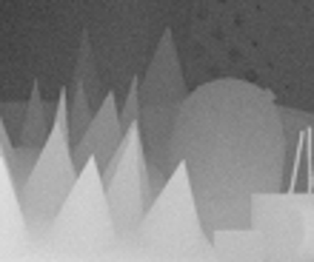

简体中文 | [English](../../../en/model_zoo/resolution/wafp.md)

# WAFP-Net模型

## 内容

- [模型简介](#模型简介)
- [数据准备](#数据准备)
- [模型训练](#模型训练)
- [模型测试](#模型测试)
- [模型推理](#模型推理)
- [参考论文](#参考论文)

在开始使用之前，您需要按照以下命令安装额外的依赖包：
```bash
python -m pip install scipy
python -m pip install h5py
```

## 模型简介

本模型以百度机器人与自动驾驶实验室的**IEEE Transactions on Multimedia 2021论文 [WAFP-Net: Weighted Attention Fusion based Progressive Residual Learning for Depth Map Super-resolution](https://ieeexplore.ieee.org/document/9563214/)** 为参考，
复现了基于自适应融合注意力的深度图超分辨率模型，其针对真实场景存在的两种图像退化方式（间隔采样和带噪声的双三次采样），提出了一种自适应的融合注意力机制，在保持模型参数量优势的情况下，在多个数据集上取得了SOTA的精度。


## 数据准备

### 混合数据集
本文档所使用的数据融合了Middlebury dataset/ MPI Sintel dataset 和 synthetic New Tsukuba dataset 共三个数据集
1. 准备raw图片数据

    下载2个压缩包：https://videotag.bj.bcebos.com/Data/WAFP_data.zip，https://videotag.bj.bcebos.com/Data/WAFP_test_data.zip
    解压并将`data_all`文件夹（含133张深度图）和`test_data`文件夹（含4个测试数据）放置成以下位置：

    ```shell
    data/
    └── depthSR/
        ├── data_all/
        │   ├── alley_1_1.png
        │   ├── ...
        │   └── ...
        ├── test_data/
        │   ├── cones_x4.mat
        │   ├── teddy_x4.mat
        │   ├── tskuba_x4.mat
        │   └── venus_x4.mat
        ├── val.list
        ├── generate_train_noise.m
        └── modcrop.m
    ```

2. 执行`generate_train_noise.m`脚本，生成训练数据`train_depth_x4_noise.h5`，并用`ls`命令生成`val.list`路径文件。
    ```shell
    cd data/depthSR/
    generate_train_noise.m
    ls test_data > test.list
    cd ../../
    ```

3. 将`train_depth_x4_noise.h5`、`test_data`、`test.list`三者的路径填写到`wafp.yaml`的对应位置：
    ```yaml
    DATASET: #DATASET field
    batch_size: 64 #Mandatory, bacth size
    valid_batch_size: 1
    test_batch_size: 1
    num_workers: 1 #Mandatory, XXX the number of subprocess on each GPU.
    train:
        format: "HDF5Dataset"
        file_path: "data/depthSR/train_depth_x4_noise.h5"  # path of train_depth_x4_noise.h5
    valid:
        format: "MatDataset"
        data_prefix: "data/depthSR/test_data"  # path of test_data
        file_path: "data/depthSR/test.list"  # path of test.list
    test:
        format: "MatDataset"
        data_prefix: "data/sintel/test_data"  # path of test_data
        file_path: "data/sintel/test.list"  # path of test.list
    ```

## 模型训练

#### 开始训练

- 混合数据集使用单卡训练，训练方式的启动命令如下：

    ```bash
    python3.7 main.py -c configs/resolution/wafp/wafp.yaml --seed 42
    ```

## 模型测试

- 训练好的模型下载地址：[WAFP.pdparams](https://videotag.bj.bcebos.com/PaddleVideo-release2.3/WAFP_best.pdparams)

- 测试命令如下：

  ```bash
  python3.7 main.py --test -c configs/resolution/wafp/wafp.yaml -w "output/WAFP/WAFP_epoch_00080.pdparams"
  ```

    在我们给定的测试数据集上的测试指标如下：

  | version |  RMSE   |  SSIM   |
  | :------ | :-----: | :-----: |
  | ours    |  2.5479 |  0.9808 |

## 模型推理

### 导出inference模型

```bash
python3.7 tools/export_model.py -c configs/resolution/wafp/wafp.yaml -p data/WAFP.pdparams -o inference/WAFP
```

上述命令将生成预测所需的模型结构文件`WAFP.pdmodel`和模型权重文件`WAFP.pdiparams`以及`WAFP.pdiparams.info`文件，均存放在`inference/WAFP/`目录下

上述bash命令中各个参数含义可参考[模型推理方法](https://github.com/PaddlePaddle/PaddleVideo/blob/release/2.0/docs/zh-CN/start.md#2-%E6%A8%A1%E5%9E%8B%E6%8E%A8%E7%90%86)

### 使用预测引擎推理

```bash
python3.7 tools/predict.py --input_file data/depthSR/test_data/cones_x4.mat \
--config configs/resolution/wafp/wafp.yaml \
--model_file inference/WAFP/WAFP.pdmodel \
--params_file inference/WAFP/WAFP.pdiparams \
--use_gpu=True \
--use_tensorrt=False
```

推理结束会默认以伪彩的方式保存下模型输出得到的深度图。

以下是输入的深度图(example.mat)和预测的深度图：




## 参考论文

- [WAFP-Net: Weighted Attention Fusion based Progressive Residual Learning for Depth Map Super-resolution](https://ieeexplore.ieee.org/document/9563214/), Xibin Song, Dingfu Zhou, Wei Li∗, Yuchao Dai, Liu Liu, Hongdong Li, Ruigang Yang and Liangjun Zhang
