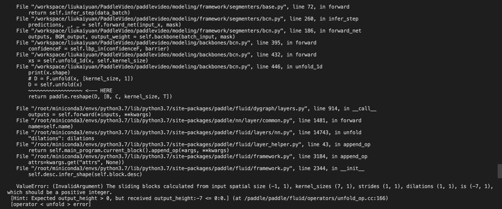

[English](../../../en/model_zoo/segmentation/bcn.md) | 简体中文

# BCN 视频动作分割模型

---
## 内容

- [模型简介](#模型简介)
- [数据准备](#数据准备)
- [模型训练和测试](#模型训练和测试)
- [模型推理](#模型推理)
- [参考论文](#参考论文)

## 模型简介

BCN模型是在视频动作分割模型MS-TCN上的改进，发表在2020年的ECCV上。我们对官方实现的pytorch代码进行复现，在PaddleVideo获得了近似的结果。

<p align="center">
 <br />
BCN Overview
</p>

## 数据准备

BCN的训练数据可以选择50salads、breakfast、GTEA三个数据集，数据下载及准备请参考[视频动作分割数据集](../../dataset/SegmentationDataset.md)

## 模型训练和测试

BCN是两阶段模型，需要先训练barrier generation module(bgm)，然后将bgm与主模型共同训练。
以下所有**DS**应替换为**breakfast/50salads/gtea**, **SP**在50salads为**1-5**，在其他两个数据集中为**1-4**。
例如，
```bash
python main.py --validate -c configs/segmentation/bcn/bgm/[DS]/full/split[SP].yaml
```
可以替换为：
```bash
python main.py --validate -c configs/segmentation/bcn/bgm/gtea/full/split1.yaml
```

### 1. 训练full-resolution barrier generation module，并测试

```bash
export CUDA_VISIBLE_DEVICES=3
python main.py --validate -c configs/segmentation/bcn/bgm/[DS]/full/split[SP].yaml
python main.py --test  -c configs/segmentation/bcn/bgm/[DS]/full/split[SP].yaml \
                       -w output/BCN/[DS]/split[SP]/BcnBgmFull/BcnBgmFull_epoch_00001.pdparams
```

### 2. 训练resized-resolution barrier generation module，并测试

```bash
export CUDA_VISIBLE_DEVICES=3
python main.py --validate -c configs/segmentation/bcn/bgm/[DS]/resized/split[SP].yaml
python main.py --test  -c configs/segmentation/bcn/bgm/[DS]/resized/split[SP].yaml \
                       -w output/BCN/[DS]/split[SP]/BcnBgmResized/BcnBgmResized_epoch_00001.pdparams
```

### 3. 训练BCN，并测试

```bash
export CUDA_VISIBLE_DEVICES=3
python3.7 main.py --validate  -c configs/segmentation/bcn/model/[DS]/split[SP].yaml
python3.7 main.py --test  -c configs/segmentation/bcn/model/[DS]/split[SP].yaml \
                          -w output/BCN/[DS]/split[SP]/BcnModel/BcnModel_epoch_00001.pdparams
```

metric保存在:
```
output/BCN/[DS]/split[SP]/BcnModel/metric.csv
```

### 复现结果

- 从头开始训练，使用上述启动命令行或者脚本程序即可启动训练，不需要用到预训练模型，视频动作分割模型通常为全卷积网络，由于视频的长度不一，故视频动作分割模型的scr字段通常设为1，即不需要批量训练，目前也仅支持**单样本**训练

- pytorch的复现来源于官方提供的[代码库](https://github.com/MCG-NJU/BCN)

在Breakfast数据集下评估精度如下:

| Model | Acc | Edit | F1@0.1 | F1@0.25 | F1@0.5 |
| :---: | :---: | :---: | :---: | :---: | :---: |
| paper | 70.4% | 66.2% | 68.7% | 65.5% | 55.0% |
| pytorch | 70.9% | 66.7% | 68.5% | 65.9% | 55.8% |
| paddle | 70.8% | 66.4% | 68.9% | 65.9% | 56.0% |

在50salads数据集下评估精度如下:

| Model | Acc | Edit | F1@0.1 | F1@0.25 | F1@0.5 |
| :---: | :---: | :---: | :---: | :---: | :---: |
| paper | 84.4% | 74.3% | 82.1% | 81.3% | 74.0% |
| pytorch | 84.5% | 76.8% | 83.3% | 81.3% | 73.5% |
| paddle | 85.0% | 75.4% | 83.0% | 81.5% | 73.8% |

在GTEA数据集下评估精度如下:

| Model | Acc | Edit | F1@0.1 | F1@0.25 | F1@0.5 |
| :---: | :---: | :---: | :---: | :---: | :---: |
| paper | 79.8% | 84.4% | 88.5% | 87.1% | 77.3% |
| pytorch | 78.8% | 82.8% | 87.3% | 85.0% | 75.1% |
| paddle | 78.9% | 82.6% | 88.9% | 86.4% | 73.8% |


## 模型推理

### 1. 导出动态full-resolution barrier generation module

```bash
python3.7 tools/export_model.py \
    -c configs/segmentation/bcn/bgm/[DS]/full/split[SP].yaml \
    --p output/BCN/[DS]/split[SP]/BcnBgmFull/BcnBgmFull_best.pdparams \
    -o ./inference
```

### 2. 使用预测引擎推理full-resolution barrier generation module, 以gtea/features/S1_Cheese_C1.npy为例

```bash
python3.7 tools/predict.py --input_file data/gtea/features/S1_Cheese_C1.npy  
                           --config configs/segmentation/bcn/bgm/gtea/full/split1.yaml  
                           --model_file inference/BcnBgmFull.pdmodel  
                           --params_file inference/BcnBgmFull.pdiparams                            --use_gpu=True  
                           --use_tensorrt=False
```

### 3. 导出动态resized-resolution barrier generation module

```bash
python3.7 tools/export_model.py \
    -c configs/segmentation/bcn/bgm/[DS]/resized/split[SP].yaml \
    --p output/BCN/[DS]/split[SP]/BcnBgmResized/BcnBgmResized_best.pdparams \
    -o ./inference
```

### 4. 使用预测引擎推理resized-resolution barrier generation module, 以gtea/features/S1_Cheese_C1.npy为例

```bash
python3.7 tools/predict.py --input_file data/gtea/features/S1_Cheese_C1.npy  
                           --config configs/segmentation/bcn/bgm/gtea/resized/split1.yaml  
                           --model_file inference/BcnBgmResized.pdmodel  
                           --params_file inference/BcnBgmResized.pdiparams                            --use_gpu=True  
                           --use_tensorrt=False
```

### 5. 导出动态bcn

暂无

由于BCN使用了unfold函数，在生成静态模型时，输入会包含可变维度-1，unfold暂时无法处理shape包含-1的输入。

<p align="center">
 <br />
BCN Error
</p>

- 各参数含义可参考[模型推理方法](https://github.com/PaddlePaddle/PaddleVideo/blob/release/2.0/docs/zh-CN/start.md#2-%E6%A8%A1%E5%9E%8B%E6%8E%A8%E7%90%86)

## 参考论文

- [Boundary-Aware Cascade Networks for Temporal Action Segmentation](https://github.com/MCG-NJU/BCN/blob/master/demo/ECCV20-BCN.pdf), Zhenzhi Wang, Ziteng Gao, Limin Wang, Zhifeng Li, Gangshan Wu
