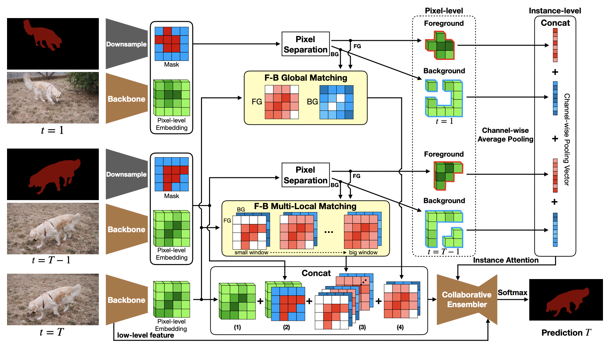

[English](../../../en/model_zoo/segmentation/cfbi.md) | 简体中文

# CFBI视频分割模型

---
## 内容

- [模型简介](#模型简介)
- [数据准备](#数据准备)
- [模型测试](#模型测试)
- [参考论文](#参考论文)


## 模型简介

CFBI是百度在ECCV 2020提出的视频目标分割模型，该模型基于前背景整合的协作式方法，将前景目标对象与背景对象的嵌入特征进行对比，从而提升视频分割的效果。给定参考帧（第一帧）和前一帧的图像和目标分割，模型会预测出当前帧的分割。

<div align="center">
 <br />
</div>


## 数据准备

DAVIS数据下载及准备请参考[DAVIS数据准备](../../../../applications/Ma-Net/dataloaders/DAVIS2017_cn.md)


## 模型测试

- 测试启动脚本如下：

```bash
python3.7 main.py --test -c configs/segmentation/cfbip_davis.yaml -w CFBIp_davis.pdparams
```

- 通过`-c`参数指定配置文件，通过`-w`指定权重存放路径进行模型测试。

- 运行上述命令，会将结果保存在配置文件中指定的`result_root`下，获取数值评估指标，请使用[davis2017-evaluation工具](https://github.com/davisvideochallenge/davis2017-evaluation)。

DAVIS数据集测试精度:

| J&F-Mean | J-Mean | J-Recall | J-Decay | F-Mean | F-Recall | F-Decay | checkpoints |
| :------: | :-----: | :----: | :----: | :----: | :----: | :----: | :----: |
| 0.823 | 0.793 | 0.885 | 0.083 | 0.852 | 0.932 | 0.100 | [CFBIp_r101_davis.pdparams](https://videotag.bj.bcebos.com/PaddleVideo-release2.2/CFBIp_r101_davis.pdparams) |


## 参考论文

- [Collaborative Video Object Segmentation by Foreground-Background Integration](https://arxiv.org/abs/2003.08333), Zongxin Yang, Yunchao Wei, Yi Yang
