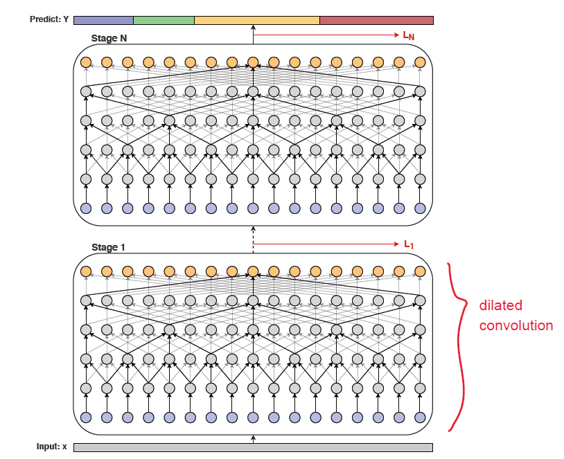

[English](../../../en/model_zoo/segmentation/mstcn.md) | 简体中文

# MS-TCN 视频动作分割模型

---
## 内容

- [模型简介](#模型简介)
- [数据准备](#数据准备)
- [模型训练](#模型训练)
- [模型测试](#模型测试)
- [模型推理](#模型推理)
- [参考论文](#参考论文)

## 模型简介

MS-TCN模型是视频动作分割模型的经典的模型，发表在2019年的CVPR上。我们对官方实现的pytorch代码进行一些优化，在PaddleVideo获得了更高精度的结果。

<p align="center">
 <br />
MS-TCN Overview
</p>

## 数据准备

MS-TCN的训练数据可以选择50salads、breakfast、gtea三个数据集，数据下载及准备请参考[视频动作分割数据集](../../dataset/SegmentationDataset.md)

## 模型训练

数据准备完毕后，可以通过如下方式启动训练：

```bash
# gtea数据集
export CUDA_VISIBLE_DEVICES=3
python3.7 main.py  --validate -c configs/segmentation/ms_tcn/ms_tcn_gtea.yaml
```

- 从头开始训练，使用上述启动命令行或者脚本程序即可启动训练，不需要用到预训练模型，视频动作分割模型通常为全卷积网络，由于视频的长度不一，故视频动作分割模型的scr字段通常设为1，即不需要批量训练，目前也仅支持**单样本**训练

## 模型测试

可通过如下方式进行模型测试：

```bash
python main.py  --test -c configs/segmentation/ms_tcn/ms_tcn_gtea.yaml --weights=./output/MSTCN/MSTCN_epoch_00011.pdparams
```

- 指标的具体实现是参考MS-TCN作者[evel.py](https://github.com/yabufarha/ms-tcn/blob/master/eval.py)提供的测试脚本，计算Acc、Edit和F1分数。

在Breakfast数据集下评估精度如下:

| Model | Acc | Edit | F1@0.1 | F1@0.25 | F1@0.5 |
| :---: | :---: | :---: | :---: | :---: | :---: |
| paper | 66.3% | 61.7% | 48.1% | 48.1% | 37.9% |
| paddle | 65.2% | 61.5% | 53.7% | 49.2% | 38.8% |

在50salads数据集下评估精度如下:

| Model | Acc | Edit | F1@0.1 | F1@0.25 | F1@0.5 |
| :---: | :---: | :---: | :---: | :---: | :---: |
| paper | 80.7% | 67.9% | 76.3% | 74.0% | 64.5% |
| paddle | 81.1% | 71.5% | 77.9% | 75.5% | 66.5% |

在gtea数据集下评估精度如下:

| Model | Acc | Edit | F1@0.1 | F1@0.25 | F1@0.5 |
| :---: | :---: | :---: | :---: | :---: | :---: |
| paper | 79.2% | 81.4% | 87.5% | 85.4% | 74.6% |
| paddle | 76.3% | 82.7% | 87.7% | 83.7% | 71.4% |


## 模型推理

### 导出inference模型

```bash
python3.7 tools/export_model.py \
    -c configs/segmentation/ms_tcn/ms_tcn_gtea.yaml \
    --p ./output/MSTCN/MSTCN_epoch_00011.pdparams \
    -o ./inference
```

- 各参数含义可参考[模型推理方法](https://github.com/PaddlePaddle/PaddleVideo/blob/release/2.0/docs/zh-CN/start.md#2-%E6%A8%A1%E5%9E%8B%E6%8E%A8%E7%90%86)

### 使用预测引擎推理

```bash
python3.7 tools/predict.py --input_file data/gtea/splits/test.split1.bundle \
                           --config configs/segmentation/ms_tcn/ms_tcn_gtea.yaml \
                           --model_file inference/MSTCN.pdmodel \
                           --params_file inference/MSTCN.pdiparams \
                           --use_gpu=True \
                           --use_tensorrt=False
```

## 参考论文

- [MS-TCN: Multi-Stage Temporal Convolutional Network for Action Segmentation](https://arxiv.org/pdf/1903.01945.pdf), Y. Abu Farha and J. Gall.
