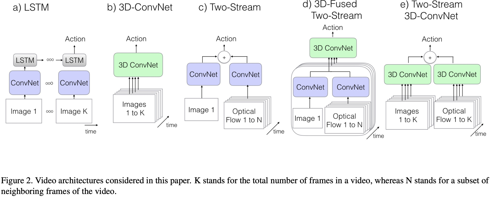
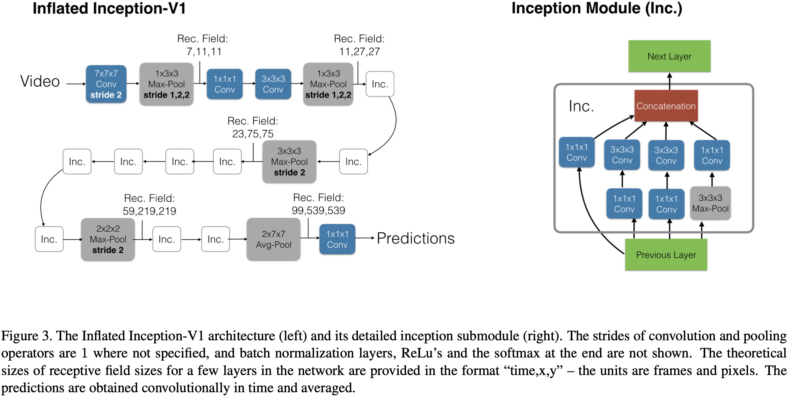
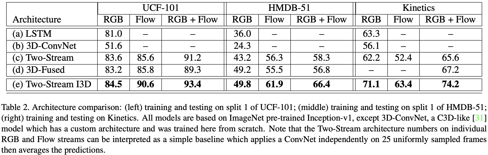
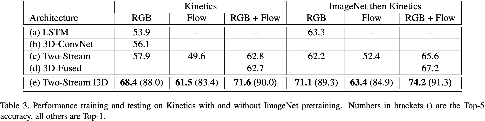

# I3D

## 简介
本文提出了一种基于 2D-ConvNet 扩展的双流膨胀模型 I3D，作者将图像分类的 2D 卷积网络的滤波器和池化核扩展到 3D 中，使得从视频中学习无缝时空特征提取器成为可能。

## 重点贡献
* 提出了 Kinetics 数据集
* 提出了双流 3D 卷积模型

## kinetics数据集
Kinetics 数据集有 400 个人体动作类别，每个类别有 400 多个视频片段，这些数据来自真实有挑战的 YouTube 视频。数据集包括的动作大类别有：
1. 单人动作：绘画、饮酒、笑
2. 人与人之间的动作：拥抱、亲吻、握手
3. 人与物之间的动作：打开礼物、洗碗、除草
4. 需要细分的动作，比如不同类型的游泳
5. 侧重于物体的信息，比如不同类型的乐器

## 动机
图像领域有一个超大规模的 ImageNet 数据集，很多图像任务采用的都是 ImageNet 预训练模型，并且取得了不错了效果。在视频领域中，如果我们有一个超大规模的数据集，将在该数据集上预训练好的的动作分类模型应用到其他时序任务或不同的数据集上是否会有类似性能的提升。为了验证这个猜想，作者将在 Kinetics 上的预训练模型应用到 HMDB-51 和 UCF-101 这种小的数据集上。实验结果表明，性能总是会得到提升，提升的程度与模型的结构有关。

基于此发现，作者提出了 I3D，基于 InceptionV1 的 I3D 模型在经过 Kinetics 预训练后，其性能远远超过了当时最先进的水平。

## 主要工作
1. 在 Kinetics 数据集上做模型预训练，将预训练模型应用到 HMDB-51 和 UCF101 数据集上，验证大规模视频数据的有效性；
2. 基于 2D-ConvNet，提出了新的行为识别模型 I3D；

## 行为识别方法分析
当前，行为识别模型主要的不同点：
1. 卷积和层运算使用的是 2D 核还是 3D 核；
2. 网络的输入仅仅包含的是 RGB 视频还是也包括预计算的光流；
3. 在 2D-ConvNet 情况下，帧之间的信息如何传播；

## 模型分析
作者比较和研究了一些模型，这些模型有的基于 2D-ConvNet，有的基于 3D-ConvNet。之前基于 3D-ConvNet 的模型由于可用的训练数据少，网络结构相对较浅。于是本文将非常深的 2D-ConvNet 图像分类网络膨胀为 3D-ConvNet 的时空特征提取网络，同时将其作为 two-stream 框架的主干网络。由于之前的 2D-ConvNet 网络本身比较深，又可以使用 2D-ConvNet 的参数初始化相应 3D-ConvNet 的网络，因此可以解决之前训练数据不足的问题。

这里作者分析五种网络结构，如下图所示。

 网络结构 

  

### The Old I: ConvNet+LSTM
将图像分类模型应用到视频分析上的一个直接想法是，把视频中的每帧看作一张独立的图像，提取每张图像后，对整个视频求均值。但这样做完全忽略了视频中的时序信息，一个比较合理的方法是在网络的末端添加一个 LSTM 层，用于学习视频帧之间的时序关系。因此 ConvNet+LSTM 的文章在 InceptionV1 的最后一个 average-pooling 后面加了一个包含 512 个隐含节点的 LSTM，最后接了一个用于分类的全连接层。

### The Old 2 ：3D ConvNets
3D-ConvNets 是建模视频任务一个很自然的想法，与标准的卷积网络相比，增加了一个时空维度。由于时空维度的增加，使得 3D-ConvNets 比 2D-ConvNets 有更多的参数，增加了网络训练的困难。此外，网络结构是 3D 的，无法直接复用 2D 模型的参数。

### The Old III: Two-Stream Networks
ConvNet+LSTM 的模型结构仅仅捕获高层信息的变化，对于帧和帧之间在底层动作信息的捕获是不够的，并且底层动作信息在行为识别中是非常重要的。于是一些研究人员提出了 Two-Stream 网络，Two-Stream 分为两路，一路用于提取 RGB 信息，一路用于提取光流信息；这样的网络设计对空间维度和时间维度的提取都比较好。这种方法比较容器训练和测试，并且在公开数据集上取得了比较不错的效果。

> Two-Stream 中的两个模型是分开训练的。

### The New: Two-Stream Inflated 3D ConvNets
#### 1 inflating 2D ConvNets into 3D
把在 ImageNet 上表现好的 2D 模型直接扩展为 3D 模型，具体做法是将 2D 结构中的二维卷积核与池化核扩展一维，由之前的  变成 。

#### Bootstrapping 3D filters from 2D Filters
作者将一帧图像沿着时间轴复制 N 次，将其变为一个 boring video。为了保证在这个 boring video 上做卷积操作后池化激活与原始图像经过卷积操作后的池化激活相同，这里用到的方法是将 2D 卷积核  在时间维度上重复 N 次，得到 ，之后再除以 N 的方式，确保滤波器的响应是相同的。

#### Pacing receptive field growth in space,time and network depth
将 2D-ConvNet 扩展到 3D-ConvNet 后，如何设置时间维度上的 kernel。目前几乎所有的图像相关的模型都平等的看待空间维度中的水平和垂直两个方向，两个方向上的 kernel 是相等的。当加入时间维度后，再使用完全对称的感受野并不是最好的选择，应该考虑帧速率和图像尺寸。
* 如果时间维度比空间维度增长过快，可能会影响物体边缘信息，从而破坏物体的特征检测；
* 如果时间维度比空间维度增长过慢，可能无法很好的捕捉场景的动态信息，从而影响对动作的检测；

因此，作者对 InceptinV1 进行扩展时，大多数保持了对称特征，如第一个卷积核由  变成了 ，stride 也从原来的 (2,2) 变成了 (2,2,2)；只对少数做了改变，如前面两个 max-pool，并不是 ，而是 ，这样能够比较好的保留时间维度的信息，以及最后的 avg-pool 不是 而是  。

 网络扩展 

  

#### Two 3D Streams
虽然，3D-ConvNet 已经能够比较好的提取视频中的动作特征，但带有光流的 two-stream 结构对动作识别依然有巨大的帮助。因此作者将 3D-ConvNet 设计成 two-stream 形式，训练时左右两个网络分开训练，预测时对两个网络的预测结果做均值。

## 实验结果
在 UCF-101，HMDB-51 或 Kinetics 上进行训练和测试时的分类准确度。

 实验结果1 

  

从 ImageNet 预训练或没有进行预训练模型在 Kinetics 上的表现。

 实验结果2 

  

## 参考
[Quo Vadis, Action Recognition? A New Model and the Kinetics Dataset](https://arxiv.org/abs/1705.07750)
