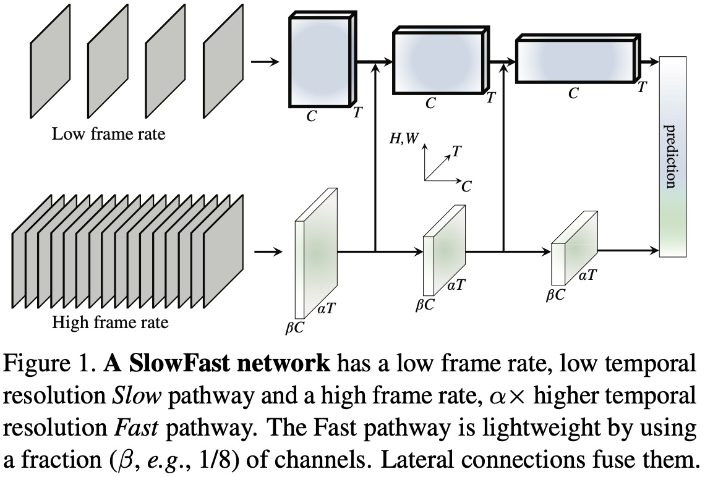
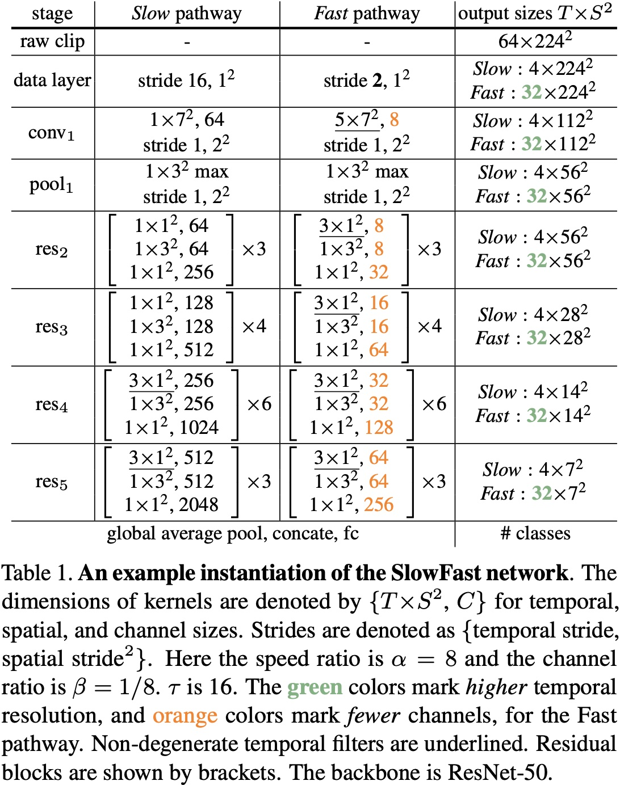

# SlowFast

## 背景
SlowFast 由 Facebook FAIR 的何恺明团队提出，用于视频识别。SlowFast 包含两条路径：
* Slow pathway
* Fast pathway

Slow pathway 运行低帧率，用于捕捉空间语义信息；Fast pathway 运行高帧率，获取精确的时间运动信息。通过降低通道数量，Fast pathway 分支可以变成轻量的网络，同时也能够学到视频中有用的时域信息。SlowFast 在没有任何预训练的情况下，在 Kinetics 数据集上的准确率达到了 79.0%。

## 动机
SlowFast 受到灵长类视觉系统中视网膜神经节细胞的生物学研究的启发。研究发现，这些细胞中约80%的都是P-cell，约15～20% 是 M-cell。M-cell 以较高的时间频率工作，能够对快速的时间变化作出响应，但是对空间细节和颜色不敏感。P-cell 则提供良好的空间细节和颜色信息，但时间分辨率较低，对刺激反应比较慢。

SlowFast 与此相似：
* SlowFast 有两条路径，分别处理低帧率和高帧率；
* Fast pathway 用于捕捉快速变化的动作，单涉及到的细节信息较少，与M-cell类似；
* Fast pathway 是轻量的，与M-cell的占比类似。

## 简介
在图像识别领域，对称处理图像 I(x,y) 中两个空间维度 x 和 y 是常见的做法，自然图像的统计也证明了其合理性。这是由于自然图像具有第一近似各向同性（所有方向具有相同的可能性）和平移不变性。但对于视频信号 I(x,y,t)来说，并不是所有的时空方向都有相同的可能性。因此不能像时空卷积那样对称地处理空间和时间。此时需要将网络结构分开，分别处理空间结构和时间事件。

视觉内容的类别空间语义变化通常比较缓慢。比如，挥手不会在这个动作进行期间改变“手”的类别；一个人从走路变为跑步，识别结果也一直是“人”。因此类别语义的识别（以及颜色、纹理、光照等）可以以较慢的速度刷新。另一方面，正在执行的动作比其主体识别变化的速度要快得多，如拍手、挥手、摇摆、走路或跳跃。因此需要用较快的帧率刷新（高时间分辨率），来对快速变化的动作进行建模。

## 思路
基于上述想法作者提出了一种用于视频识别的双路径模型 SlowFast 。

<p align="center">
 <br />
网络结构
</p>


如上图所示，一条路径用于捕获图像或稀疏帧提供的语义信息，以低帧率运行，刷新速度慢。另一条路径用于捕获快速变化的动作，刷新速度快、时间分辨率高，该路径是轻量级的，仅占整体计算量的20%。这是由于这条路径通道较少，处理空间信息的能力较差，但空间信息可以由第一个路径以简洁的方式来处理。

依据两条路径运行的帧率高低不同，作者将第一条路径称为“Slow pathway”；第二条路径称为“Fast pathway”；两条路径通过横向连接进行融合。

## SlowFast
SlowFast 的两个分支以不同的速率运行，作者通过使用两个分支模拟生物学上的大小细胞。

### Slow Pathway
Slow pathway 可以是任意在视频片段上做时空卷积的模型，如时空残差网络，C3D，I3D，Non-local网络等。Slow pathway 的关键之处在于对视频帧进行采样时，时间步长 <a href="https://www.codecogs.com/eqnedit.php?latex=\tau" target="_blank"></a> 较大，也就是说，只处理 <a href="https://www.codecogs.com/eqnedit.php?latex=\tau" target="_blank"></a> 帧中的一帧。这里，作者建议 <a href="https://www.codecogs.com/eqnedit.php?latex=\tau" target="_blank"></a> 的取值为 16，对于 30fps 的视频，差不多每秒采样 2 帧。如果 Slow pathway 采样的帧数是 T，那么原始视频片段的长度为 <a href="https://www.codecogs.com/eqnedit.php?latex=T\times&space;\tau" target="_blank"></a>。

### Fast Pathway
#### 高帧率
Fast pathway 的目的为了在时间维度上有良好的特征表示，Fast pathway 的时间步长 <a href="https://www.codecogs.com/eqnedit.php?latex=\frac{\tau}{\alpha}" target="_blank"></a> 较小，其中 <a href="https://www.codecogs.com/eqnedit.php?latex=\alpha&space;>&space;1" target="_blank">&space;1" title="\alpha > 1" /></a> 是 Slow pathway 和 Fast pathway 之间帧率比，作者建议 <a href="https://www.codecogs.com/eqnedit.php?latex=\alpha" target="_blank"></a> 的取值为 8。由于两条路径在同一个视频上进行操作，因此 Fast pathway 采样到的帧数量为 <a href="https://www.codecogs.com/eqnedit.php?latex=\alpha&space;T" target="_blank"></a>，比 Slow pathway 密集 <a href="https://www.codecogs.com/eqnedit.php?latex=\alpha" target="_blank"></a> 倍。

#### 高时间分辨率特征
Fast pathway 具有高输入分辨率，同时整个网络结构会运行高分辨率特征。在最后的分类全局池化层之前作者没有采用时间下采样层，因此在特征张量在时间维度上一直保持在 <a href="https://www.codecogs.com/eqnedit.php?latex=\alpha&space;T" target="_blank"></a> 帧。

#### 低通道容量
Fast pathway 是一个与 Slow pathway 相似的卷积网络，但通道数只有 Slow pathway 的 <a href="https://www.codecogs.com/eqnedit.php?latex=\beta" target="_blank"></a> 倍，其中 <a href="https://www.codecogs.com/eqnedit.php?latex=\beta&space;<&space;1" target="_blank"></a>，作者建议 <a href="https://www.codecogs.com/eqnedit.php?latex=\beta" target="_blank"></a> 的取值为 <a href="https://www.codecogs.com/eqnedit.php?latex=\frac{1}{8}" target="_blank"></a>。这是的 Fast pathway 比 Slow pathway 的计算更高效。

低通道容量可以理解为表示空间语义信息的能力较弱。由于 Fast pathway 的通道数更少，因此 Fast pathway 的空间建模能力应该弱于 Slow pathway。但 SlowFast 的实验结果表明这反而是有利的，它弱化了空间建模能力，却增强了时间建模能力。

### 横向连接
作者通过横向连接对两条路径的信息进行融合，使得 Slow pathway 知道 Fast pathway 在学习什么。作者在两条路径中的每个“阶段”上使用一个横向连接，由于两条路径的时间维度不同，因此在进行横向连接时需要通过变换对两条路径的维度进行匹配。最后，将两条路径的输出进行全局平均池化，并将池化后的特征拼接在一起作为全连接分类器层的输入。

### 实例化
SlowFast 模型的思想是通用的，可以用不同的主干网络来实现。如下图所示是一个 SlowFast 实例化的例子，其中黄色是通道数量，绿色是时序帧分辨率。

<p align="center">
 <br />
实例化
</p>

作者用<a href="https://www.codecogs.com/eqnedit.php?latex=T\times&space;S^2" target="_blank"></a>表示时空尺度，其中 T 是时间长度，S 是正方形裁剪区域的宽和高。

#### Slow Pathway
Slow pathway 是一个具有时间步长的 3D ResNet，网络时间维度的输入帧数 T = 4，从 64 帧视频片段中稀疏采样得到，时间步长 <a href="https://www.codecogs.com/eqnedit.php?latex=\tau=16" target="_blank"></a>。作者没有采用时间下采样在实例化中，由于当输入步长较大时，这样做是有害的。

Slow pathway 与 C3D/I3D 模型不同，从 conv_1 到 res_3 的滤波器本质上都是2D卷积核，只有 res_4 和 res_5 使用的是非退化时间卷积。之所以采用这种设计是由于作者通过实验发现，在早期层使用时间卷积会降低准确率。作者认为是由于当物体快速移动且时间步长较大时，在一个时间感受野内的相关性就很小，除非空间感受野也足够地大。

#### Fast Pathway
Fast pathway 的时间分辨率较高，通道容量较低。Fast pathway 的每个模块中都使用了非退化时间的卷积，并且没有使用时间下采样层。之所以这样设计是因为作者发现 Fast pathway 的时间卷积有很好的时间分辨率，可以捕捉细节动作。

#### 横向连接
横向连接是从 Fast pathway 到 Slow pathway，在融合之前需要保证两个维度是匹配的，Slow pathway 的特征维度是 <a href="https://www.codecogs.com/eqnedit.php?latex=\left\{&space;T,S^2,C&space;\right\}" target="_blank"></a>，Fast pathway 的特征维度是 <a href="https://www.codecogs.com/eqnedit.php?latex=\left\{&space;\alpha&space;T,S^2,\beta&space;C&space;\right\}" target="_blank"></a>，在连接方案上作者进行了如下实验：
* Time-to-channel：对<a href="https://www.codecogs.com/eqnedit.php?latex=\alpha&space;T,&space;S^2,&space;\beta&space;C" target="_blank"></a>进行变形和转置，得到 <a href="https://www.codecogs.com/eqnedit.php?latex=\left\{&space;T,S^2,\alpha&space;\beta&space;C&space;\right\}" target="_blank"></a>，也就是说将所有的 <a href="https://www.codecogs.com/eqnedit.php?latex=\alpha" target="_blank"></a> 帧放入一帧的多个通道内。
* Time-strided sampling：每 <a href="https://www.codecogs.com/eqnedit.php?latex=\alpha" target="_blank"></a> 帧，采样一帧，所以 <a href="https://www.codecogs.com/eqnedit.php?latex={\alpha&space;T,&space;S^2,&space;\beta&space;C}" target="_blank"></a> 就变成了 <a href="https://www.codecogs.com/eqnedit.php?latex=\left\{&space;T,S^2,\beta&space;C&space;\right\}" target="_blank"></a> 。
* Time-strided convolution：使用 3D 卷积，卷积核大小是 <a href="https://www.codecogs.com/eqnedit.php?latex=5&space;\times&space;1^2" target="_blank"></a>，输出通道数为 <a href="https://www.codecogs.com/eqnedit.php?latex=2\beta&space;C" target="_blank"></a>，步长为<a href="https://www.codecogs.com/eqnedit.php?latex=\alpha" target="_blank"></a>。

## PaddleVideo
PaddleVideo 关于采样的核心代码
```python
class PackOutput(object):
    """
    In slowfast model, we want to get slow pathway from fast pathway based on
    alpha factor.
    Args:
        alpha(int): temporal length of fast/slow
    """
    def __init__(self, alpha):
        self.alpha = alpha

    def __call__(self, results):
        fast_pathway = results['imgs']

        # sample num points between start and end
        slow_idx_start = 0
        slow_idx_end = fast_pathway.shape[0] - 1
        slow_idx_num = fast_pathway.shape[0] // self.alpha   # slow 的采样数量
        # 在区间[slow_idx_start, slow_idx_end] 内均匀采样
        slow_idxs_select = np.linspace(slow_idx_start, slow_idx_end,
                                       slow_idx_num).astype("int64")
        slow_pathway = fast_pathway[slow_idxs_select]  # 取出采样到的图片

        # T H W C -> C T H W.
        slow_pathway = slow_pathway.transpose(3, 0, 1, 2)   # 对维度做转换
        fast_pathway = fast_pathway.transpose(3, 0, 1, 2)

        # slow + fast
        frames_list = [slow_pathway, fast_pathway]
        results['imgs'] = frames_list
        return results
```

PaddleVideo 中关于特征融合的核心代码
```python
class FuseFastToSlow(paddle.nn.Layer):
    """
    Fuses the information from the Fast pathway to the Slow pathway. Given the
    tensors from Slow pathway and Fast pathway, fuse information from Fast to
    Slow, then return the fused tensors from Slow and Fast pathway in order.
    """
    def __init__(self,
                 dim_in,
                 fusion_conv_channel_ratio,
                 fusion_kernel,
                 alpha,
                 eps=1e-5,
                 norm_module=paddle.nn.BatchNorm3D):
        """
        Args:
            dim_in (int): the channel dimension of the input.
            fusion_conv_channel_ratio (int): channel ratio for the convolution
                used to fuse from Fast pathway to Slow pathway.
            fusion_kernel (int): kernel size of the convolution used to fuse
                from Fast pathway to Slow pathway.
            alpha (int): the frame rate ratio between the Fast and Slow pathway.
            eps (float): epsilon for batch norm.
        """
        super(FuseFastToSlow, self).__init__()
        fan = (dim_in * fusion_conv_channel_ratio) * (fusion_kernel * 1 * 1)
        initializer_tmp = get_conv_init(fan)

        self._conv_f2s = paddle.nn.Conv3D(
            in_channels=dim_in,
            out_channels=dim_in * fusion_conv_channel_ratio,
            kernel_size=[fusion_kernel, 1, 1],
            stride=[alpha, 1, 1],
            padding=[fusion_kernel // 2, 0, 0],
            weight_attr=paddle.ParamAttr(initializer=initializer_tmp),
            bias_attr=False)
        self._bn = norm_module(num_features=dim_in * fusion_conv_channel_ratio,
                               epsilon=eps,
                               weight_attr=get_bn_param_attr(),
                               bias_attr=get_bn_param_attr(bn_weight=0.0))

    def forward(self, x):
        x_s = x[0]
        x_f = x[1]
        fuse = self._conv_f2s(x_f)
        fuse = self._bn(fuse)
        fuse = F.relu(fuse)
        x_s_fuse = paddle.concat(x=[x_s, fuse], axis=1, name=None)

        return [x_s_fuse, x_f]
```


## 参考
[SlowFast Networks for Video Recognition](https://arxiv.org/abs/1812.03982)
