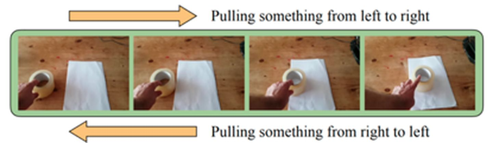
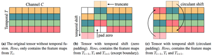
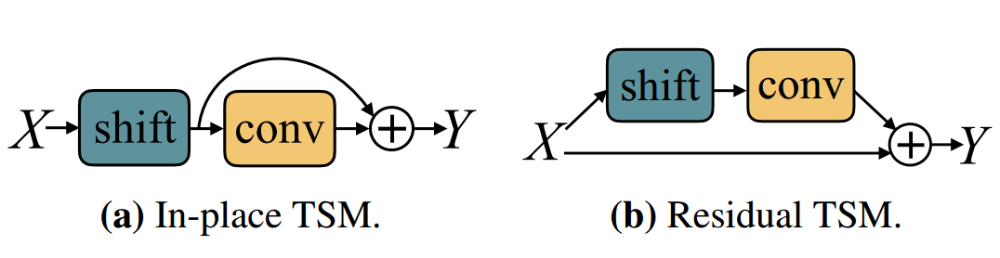
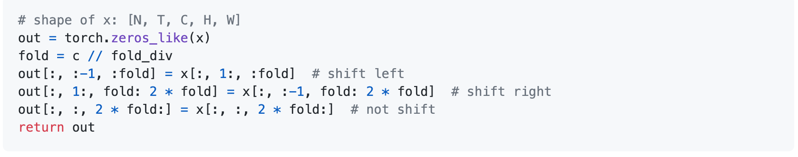
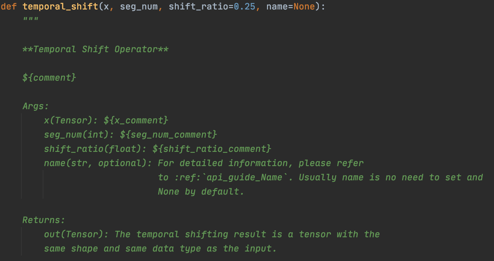

# TSM模型原理及PaddleVideo实践
# 1. 背景与动机
目前互联网视频数据日益增多，用户观看短视频、小视频的时长也迅速增长，如何对海量的视频资源快速准确地分析、处理、归类是一个亟待解决的问题。视频理解技术可以多维度解析视频内容，理解视频语义，自动分类打标签，极大节省人工审核效率，节约成本；同时实现精准用户推荐，提升体验效果。
本文将给大家介绍视频理解领域的经典模型**TSM (Temporal Shift Module)**, TSM是由**MIT**和**IBM Watson AI Lab**的`Ji Lin，Chuang Gan和SongHan`等人提出的通过时间位移模拟3D建模达到效果和性能的平衡，提高视频理解能力的模块。

跟TSM最相关的视频理解模型当属Limin Wang等人在ECCV2016上发表的Temporal Segment Network (TSN)了。TSN模型从视频中采样N帧图像并通过最简单直接地对N帧图像分类结果进行平均的方式进行时序信息融合，取得了当时State-of-the-art的性能，并得到大规模的应用。考虑到TSN模型对时序信息的建模不够充分，以I3D，S3D, P3D等为代表的一系列工作通过3D卷积进行端到端联合时空建模，这一系列工作尽管能捕获时空特征，但是相比TSN，由2D卷积到3D卷积不可避免地引入了额外计算量。TSM巧妙的通过时间维度特征map移位的想法，理论上用零额外计算开销达到了不同帧之间特征融合联合建模的目的。

论文传送门: [Temporal Shift Module for Efficient VideoUnderstanding](https://arxiv.org/pdf/1811.08383v2.pdf)

先看一下下图的例子：如果图片分别从左往右播放和从右往左播放，测试者会给出不同但是正确的理解结果，说明对视频的理解强依赖于视频的时序关系，你猜对了！这就是TSM提出的动机，即捕捉视频的时间信息。

  

看起来好像很有意思，我们下面继续深入解析一下TSM的核心模块。

# 2. TSM关键技术介绍

在传统的图片分析的基础上，视频分析需要研究者补充关于时间信息（temporal information）的建模结构。目前，2D CNN和3D CNN是视频理解中最常用的两个方法：使用2D CNN 模型运算量少但会丧失部分时间信息；而使用3D CNN虽然效果好但运算量极大。面对这样的情况，MIT和IBM Watson AI Lab的Ji Lin，Chuang Gan和Song Han等人提出了Temporal Shift Module (TSM)模块。他们将时间位移模块嵌入2D CNN，从而可以在不添加任何额外的计算量和参数的情况下，轻松地达到与3D CNN效果相当的视频理解能力。

  

上图中矩阵的行和列分别表示特征图中的temporal和channel维度。在TSM模块中，将一部分的channel在temporal维度上向前位移一步，一部分的channel在temporal维度上向后位移一步，位移后的空缺补零。通过这种方式在特征图中引入temporal维度上的上下文交互，通过通道移动操作可以使得在当前帧中包含了前后两帧的通道信息，这样再进行2D卷积操作就能像3D卷积一样直接提取视频的时空信息，
提高了模型在时间维度上的建模能力。在此基础上，研发人员将模块进一步细分为适合在线视频使用的TSM模块和适合离线视频使用的TSM模块。

  

双向（bi-direction）的TSM模块可获取过去和未来的时空信息，适合高吞吐量的离线视频使用；而单向（uni-direction）的TSM模块仅可比对现在和过去的时空信息，适用于低延迟在线视频的识别。
此外，论文中作者还考虑了TSM模块插入的位置，对比了两种TSM插入方式：**Residual tsm** 和 **In-place tsm**，作者发现使用**Residual tsm**方式会比 **In-place tsm** 的方式效果更好，文中作者解释为**In-place tsm** 会影响模型对空间信息的提取。

  

好了，TSM模块基本原理搞清楚了是不是**So Easy ！！！**，接下来问题来了，代码该如何实现呢？

# 3. 关键代码解析

原理搞清楚了，下面来看看代码如何实现，首先我们来看看torch版本如何实现的，呃呃呃...，不好意思torch框架并未提供TSM的API，我们只能自己动手啦，具体实现代码如下图所示：

  

这意味着你只需要在TSN的代码基础上添加4行代码就能将准确率在Something-Something这样的数据集上**翻上一倍！！！**  是不是简单高效的模型 ？不得不向大佬低头！

But...，

飞桨框架充分考虑到广大用户的需求已经为各位童鞋实现了TSM的OP

  

所以各位童鞋再也不用自己实现了，**直接调用就可以啦！！！,直接调用就可以啦！！！，直接调用就可以啦！！！**，重要的事情讲三遍，

是不是以为事情到这里就结束啦 ？ 唉! **Too young Too simple !!!**

我们在此基础上还对其进行了性能优化，在降低显存消耗的同时，可以提速5倍以上，详细信息可以参考[加速文档](./accelerate.md)

下面我们来看看使用飞桨如何实现TSM：

`import paddle.nn.functional as F`

`shifts = F.temporal_shift(inputs, self.num_seg,1.0 / self.num_seg)`

两行代码就可以实现TSM了，是不是很简单？

# Reference
[1] Lin Ji , Gan Chuang , Han Song . TSM: Temporal Shift Module for Efficient Video Understanding. arXiv:1811.08383,2018.

[2] Limin Wang, Yuanjun Xiong, Zhe Wang, Yu Qiao, Dahua Lin, Xiaoo Tang,and Luc Van Gool. Temporal segment networks for action recognition in videos? In Proceedings of the European Conference on Computer Vision,pages 20–36. Springer, 2016.
