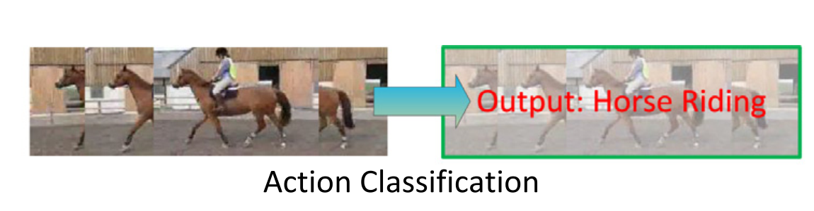
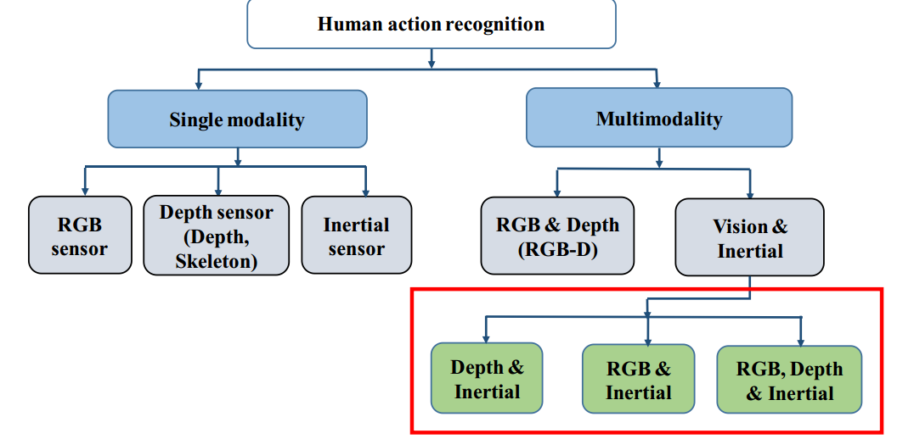
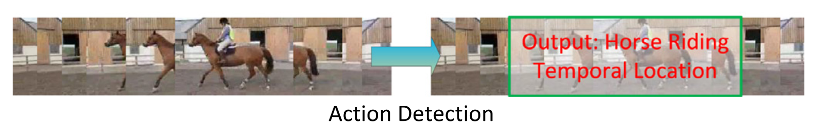
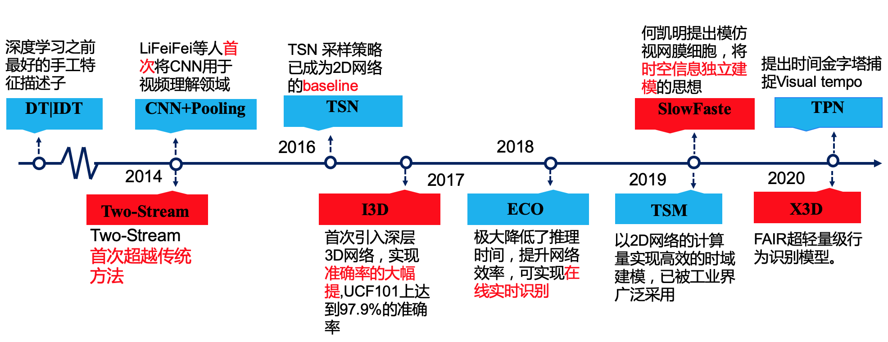

# 视频分类和动作识别介绍

## 广泛的应用场景
视频分类在多个领域上都有广泛的应用，如短视频、推荐、搜索、电视台、广告，安防，监控等领域。

## 多种细分任务
与图像任务相似，视频任务也可以分为分类（识别）和检测任务两大类，结合不同的场景还可以对这两类任务具体进行细分：

+ Task1：修剪视频识别(Trimmed Action Recognition)。输入一段只包含一个动作的修剪视频，输出视频分类，如下图所示：

  
 行为分类

  从使用的数据模态上区分，分类任务还可以继续细分为基于单模态数据的分类和基于多模态数据的分类，基于RGB图像的分类和基于人体骨架的分类等等，如下图所示：

  

    
 多种模态
  

从视频的视角上分还可以分为第一人称视角的行为识别和第三人称视角的行为识别，单一视角的识别和多视角融合的识别，有兴趣的用户可自行查阅相关文献。

+ Task2：未修剪视频分类(Untrimmed Video Classification)。与修剪视频识别不同的是，未修剪的视频中通常含有多个动作，而且视频很长。有许多动作或许都不是我们所关注的。通过对输入的长视频进行全局分析，然后软分类到多个类别。

+ Task3：时序行为提名(Temporal Action Proposal)。类似于图像目标检测任务中的候选框提取。在一段长视频中通常含有很多动作，任务是从视频中找出可能含有动作的视频段。

+ Task4：时序行为定位(Temporal Action Localization)。相比于上面的时序行为提名而言，时序行为定位和我们常说的目标检测一致，要求从视频中找到可能存在行为的视频段，并且给视频段分类，如下图所示：
 

  
 行为检测

+ Task5：密集行为描述(Dense-Captioning Events)。之所以称为密集行为描述，主要是因为该任务要求在时序行为定位(检测)的基础上进行视频行为描述。也就是说，该任务需要将一段**未修剪的视频**进行**时序行为定位**得到许多包含行为的视频段后，并对该视频段进行**行为描述**。

## 数据集简介

### 视频分类数据集

模型的训练和验证离不开全面、大量以及具有较好标注的数据集。随着视频行为识别研究的不断深入，越来越多的数据集应用于这一领域的研究。典型的数据集如下：
+ KTH数据集[1](#1)

KTH数据集是一个早期的小型行为识别数据集，包括599段视频6类动作（走、跳、跑、击拳、挥手、拍手）背景相对静止，除了镜头的拉近拉远，摄像机的运动比较轻微。由于该数据集比较小，当训练较大型的3D网络时很容易过拟合，因此当前的大部分研究训练过程多数不基于此数据集。
+ UCF10数据集[2](#2)

UCF101是一个中型数据集视频主要来自于YouTube，包含13320段视频，共101类动作，每类动作由25个人完成，每个人做4-7组动作。在Kinetics数据集发布之前UCF101和HMDB51数据集在很长的一段时间里被作为benchmark用于评估行为识别方法的效果。
+ HMDB51数据集[3](#3)

Brown university大学提出的HMDB51数据集于2011年发布，视频多数来源于电影，还有一部分来自公共数据库以及YouTube等网络视频库。数据库包含有6849段样本，分为51类，每类至少包含有101段样本。
+ Kinetics数据集[4](#4)

Kinetics是当前最为重要的一个大型行为识别数据集，该数据集在2017年由Google的Deepmind团队提出，视频数据同样来自于YouTube,总共400个类别(现已经扩充到700类)，30多万段视频数据(Kinetics-700已经扩充到了60多万段视频)，每段视频持续10秒左右。动作类别主要分为三大类：“人”，“人与动物”，“人与人互动”。Kinetics数据集可以训练3D-Resnet达到152层而不发生过拟合,解决了之前训练数据集过小难以训练深层3D网络的困境。当前Kinetics已经取代了UCF101和HMDB51成为了行为识别领域的benchmark。当前，大多数研究都采用此数据集进行效果评估和预训练。
+ Something-Something数据集[5](#5)

SomethingV1包含108499段标注视频(V2已经扩展到了220847)，每一个时长都在2到6秒之间。这些视频包含了174种类别的动作，与前面的数据集不同此数据集的识别需要更强的时间信息,因此在检验模型时域建模能力方面此数据集具有很重要的参考价值。
除了以上的主流数据集外目前还有复杂动作识别的Charades[6](#6)数据集、Breakfast Action[7](#7)数据集、以及百万级别的体育视频数据集Sports 1M[8](#8)。

### 检测任务数据集

+ THUMOS 2014

来自于THUMOS Challenge 2014,。它的训练集为UCF101数据集，验证集和测试集分别包括1010和1574个未分割的视频片段。在行为检测任务中只有20类动作的未分割视频是有时序行为片段标注的，包括200个验证集(3007个行为片段)和213个测试集视频(包含3358个行为片段)。

+ MEXaction2

MEXaction2数据集中包含两类动作：骑马和斗牛。该数据集由三个部分组成：YouTube视频，UCF101中的骑马视频以及INA视频。其中YouTube视频片段和UCF101中的骑马视频是分割好的短视频片段，被用于训练集。而INA视频为多段长的未分割的视频，时长共计77小时，且被分为训练，验证和测试集三部分。训练集中共有1336个行为片段，验证集中有310个行为片段，测试集中有329个行为片断。且MEXaction2数据集的特点是其中的未分割视频长度都非常长，被标注的行为片段仅占视频总长的很低比例。

+ ActivityNet

目前最大的数据库，同样包含分类和检测两个任务。这个数据集仅提供视频的youtube链接，而不能直接下载视频，所以还需要用python中的youtube下载工具来自动下载。该数据集包含200个动作类别，20000（训练+验证+测试集）左右的视频，视频时长共计约700小时.

## 经典模型简介
如图所示，动作识别框架主要包括三个步骤:特征提取、运动表示和分类。其中，如何提取视频的时空特征是行为识别和视频分类的核心问题。
 

  
行为识别框架

依据使用方法的不同可以总体上将行为识别（视频分类）方法概括为基于手工特征方法阶段和基于深度学习方法阶段。基于手工特征的方法阶段比较典型的运动描述子有DTP和IDT，这也是深度学习应用于这一领域之前为大家所公认的最为优秀的运动描述子，感兴趣的读者可以自行查阅文末的相关参考文献。从2014年起，深度学习的方法逐渐开始应用于视频分类领域，目前基于深度学习的方法已经成为了学术界的研究热点，并且在实际的应用效果上看也远远超越了手工设计的运动特征。从2014年至今围绕着如何表征运动特征这一问题，学术界提出了许多经典的网络结构，如下图所示：
 

  
典型的方法

目前Paddlevideo模型库中已经囊括了TSN[9](#9) ，TSM[10](#10)，slowfast[11](#11)等经典的行为识别网络，我们后续会陆续对视频领域的经典模型和论文进行详细解析，敬请期待！

## 相关比赛介绍
+ [ActivityNet](http://activity-net.org/challenges/2020/challenge.html)

ActivityNet是一个大规模行为识别竞赛，自2016年开始，每年与CVPR同时进行，到今年为止已经连续举办了4届。它侧重于从用户产生的视频中识别出日常生活，高层次，面向目标的活动，视频取自互联网视频门户Youtube。目前，ActivityNet比赛已经成为了行为识别领域影响力最大的比赛。

## Reference

[1] Schuldt C, Laptev I, Caputo B.Recognizing Human Actions: A Local SVM Approach Proceedings of International Conference on Pattern Recognition. Piscataway, NJ: IEEE, 2004:23-26

 

[2] Soomro K, Zamir A R, Shah M. UCF101: A Dataset of 101 Human Actions Classes From Videos in The Wild. arXiv:1212.0402,2012.

 

[3] Kuehne H, Jhuang H, Garrote E, et al. HMDB: a large video database for human motion recognition Proceedings of IEEE International Conference on Computer Vision. Piscataway, NJ: IEEE, 2011:2556-2563.

 

[4] Carreira J , Zisserman A . Quo Vadis, Action Recognition? A New Model and the Kinetics Dataset Proceedings of IEEE Conference on Computer Vision and Pattern Recognition. Piscataway, NJ: IEEE, 2017:6299-6308.

 

[5] Goyal R, Kahou S E, Michalski V. The “something something” video database for learning and evaluating visual common sense. arXiv:1706.04261,2017.

 

[6] Sigurdsson G A , Varol Gül, Wang Xiaolong, et al. Hollywood in Homes: Crowdsourcing Data Collection for Activity Understanding. arXiv: 604.01753,2016

 

[7] Kuehne H, Arslan A, Serre T. The Language of Actions Recovering the Syntax and Semantics of Goal-Directed Human Activities  Proceedings of IEEE Conference on Computer Vision and Pattern Recognition. Piscataway, NJ: IEEE, 2014.

 

[8] Karpathy A , Toderici G , Shetty S , et al. Large-Scale Video Classification with Convolutional Neural Networks Proceedings of IEEE Conference on Computer Vision and Pattern Recognition. Piscataway, NJ: IEEE, 2014:1725-1732.

 

[9] Limin Wang, Yuanjun Xiong, Zhe Wang, Yu Qiao, Dahua Lin, Xiaoo Tang,and Luc Van Gool. Temporal segment networks for action recognition in videos? In Proceedings of the European Conference on Computer Vision,pages 20–36. Springer, 2016.

 

[10] Lin Ji , Gan Chuang , Han Song . TSM: Temporal Shift Module for Efficient Video Understanding. arXiv:1811.08383,2018.

 

[11] Feichtenhofer C , Fan Haoqi , Malik J , et al. SlowFast Networks for Video Recognition. arXiv:1812.03982,2018.

